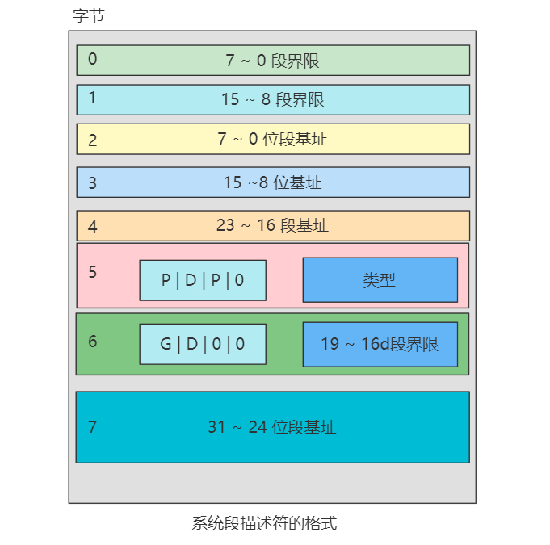
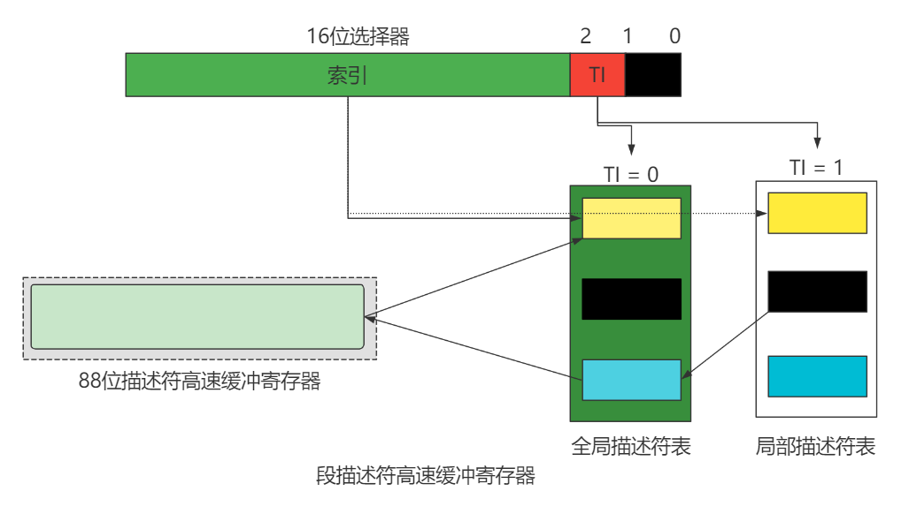
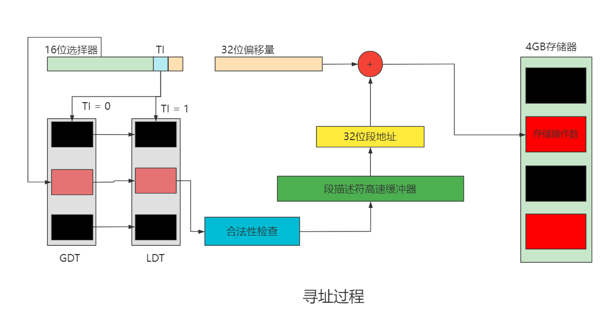
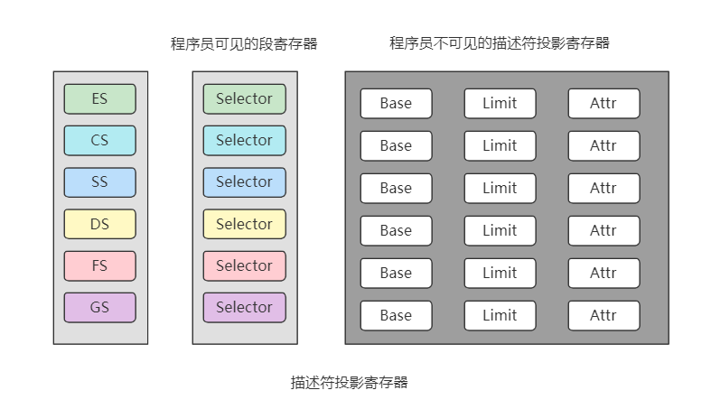
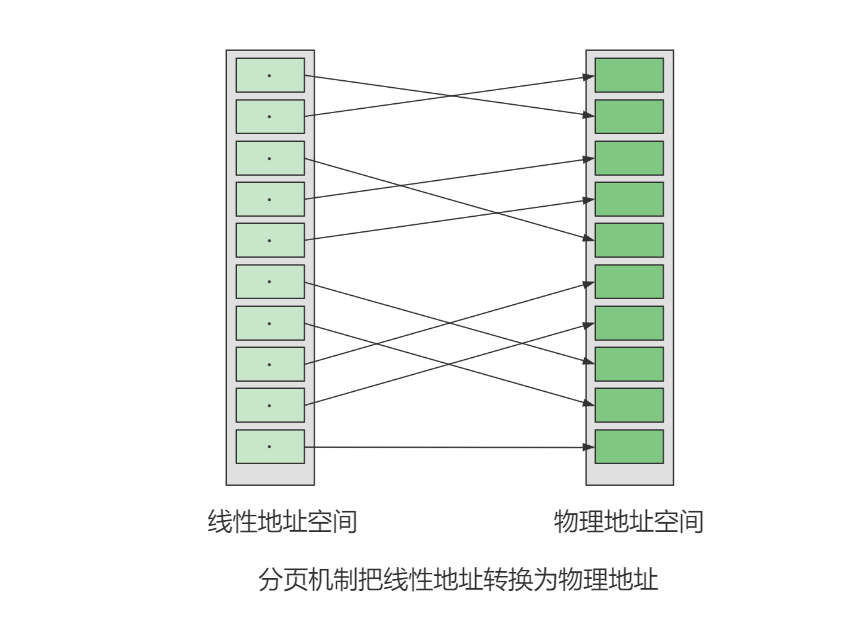
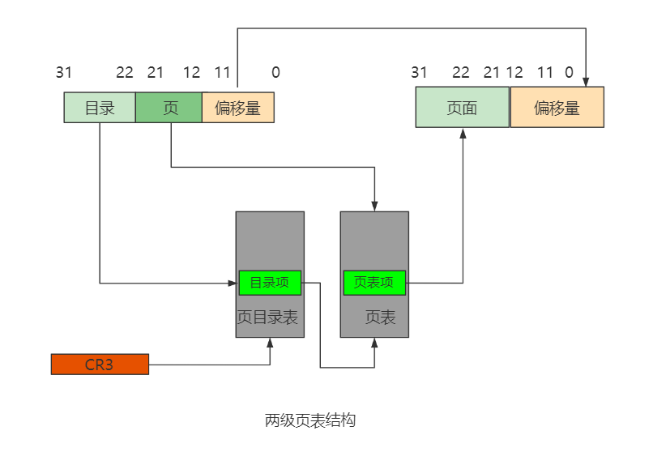
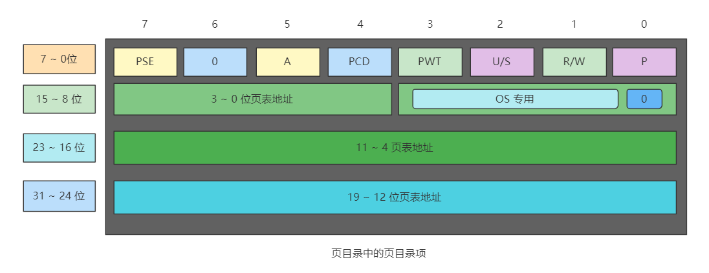
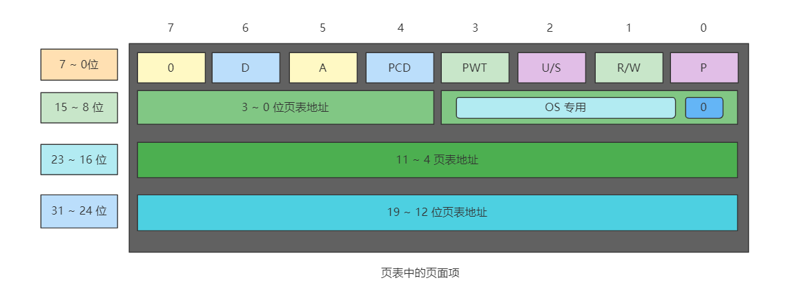

# Linux详解内存地址

##  内存地址 

在任何一台计算机上，都存在一个程序能产生的内存地址的集合。当程序执行这样一条指令时： 

- MOVE 
- REG
- ADDR 

**它把地址为ADDR(假设为 10000)的内存单元的内容复制到 REG 中，地址 ADDR 可以通过索引、基址寄存器、段寄存器和其他方式产生。** 

在 8086 的实模式下，把某一段寄存器左移 4 位，然后与地址 ADDR 相加后被直接送到内 存总线上，这个相加后的地址就是内存单元的物理地址，而程序中的这个地址就叫逻辑地址(或叫虚地址)。在 80386 的保护模式下，这个逻辑地址不是被直接送到内存总线，而是被送 到内存管理单元(MMU)。MMU 由一个或一组芯片组成，其功能是把逻辑地址映射为物理地址， 即进行地址转换。 

 当使用 80386 时，必须区分以下 3 种不同的地址：

1、逻辑地址 

机器语言指令仍用这种地址指定一个操作数的地址或一条指令的地址。这种寻址方式在Intel 的分段结构中表现得尤为具体，它使得 MS-DOS 或 Windows 程序员把程序分为若干段。 每个逻辑地址都由一个段和偏移量组成。   

2、线性地址 

线性地址是一个 32 位的无符号整数，可以表达高达 2^32（4GB）的地址。通常用 16 进制 表示线性地址，其取值范围为 0x00000000～0xffffffff。 

3、物理地址

物理地址是内存单元的实际地址，用于芯片级内存单元寻址。物理地址也由 32 位无符号整数表示。  

## MMU

MMU 是一种硬件电路，它包含两个部件，一个是分段部件，一个是分页部件，把它们分别叫做分段机制和分页机制，以利于从逻辑的角度来理 解硬件的实现机制。

分段机制把一个逻辑地址转换为线性地址；接着，分页机制把一个线性 地址转换为物理地址， 

##  段机制 

在 80386 的段机制中，逻辑地址由两部分组成，即段部分(选择符)及偏移部分。 段是形成逻辑地址到线性地址转换的基础。 

- 段的基地址（Base Address）：在线性地址空间中段的起始地址。  
- 段的界限（Limit）：表示在逻辑地址中，段内可以使用的最大偏移量。  
- 段的属性（Attribute）： 表示段的特性。 

**段的界限定义逻辑地址空间中段的大小。段内在偏移量从 0 到 limit 范围内的逻辑地址， 对应于从 Base 到 Base+Limit 范围内的线性地址。在一个段内，偏移量大于段界限的逻辑地址将没有意义，使用这样的逻辑地址，系统将产生异常。** 

如果要对一个段进行访问，系统会根据段的属性检查访问者是否具有访问权限，如果没有，则产生异常。例如，在 80386 中，如果要在只读段中进行写入，80386 将根据该段的属性检测到这是一种违规操作，则产 生异常。  

### 解析

表示一个段如何从逻辑地址空间，重新定位到线性地址空间。图的左侧表示逻辑地址空间，定义了 A、B 及 C 三个段，段容量分别为 LimitA、LimitB及 LimitC。图中虚线把逻 辑地址空间中的段 A、B 及 C 与线性地址空间区域连接起来表示了这种转换。 

段的基地址，界限及保护属性，存储在段的描述符表中，逻辑—线性地址转换过程中要对描述符进行访问。 

##  描述符的概念 

所谓描述符(Descriptor)，就是描述段的属性的一个 8 字节存储单元。在实模式下， 段的属性不外乎是代码段、堆栈段、数据段、段的起始地址、段的长度等，而在保护模式下 则复杂一些。80386 将它们结合在一起用一个 8 字节的数表示，称为描述符。 一个段描述符指出了段的 32 位基地址和 20 位段界限(即段长)。  

 第5个字节是存取权字节：

 

第7位P位(Present)是存在位，表示段描述符描述的这个段是否在内存中，如果在内存中。P=1；如果不在内存中，P=0。DPL(Descriptor Privilege Level)，就是描述符特权级，它占两位，其值为 0～3， 用来确定这个段的特权级即保护等级。 S位(System)表示这个段是系统段还是用户段。如果S=0，则为系统段，如果 S=1，则为用户程序的代码段、数据段或堆栈段。 

类型占3位，第3位为E位，表示段是否可执行。当E=0时，为数据段描述符，这时的第2位 ED 表示扩展方向。当ED=0时，为向地址增大的方向扩展，这时存取数据段中的数据 的偏移量必须小于或等于段界限，当 ED=1 时，表示向地址减少的方向扩展，这时偏移量必须大于界限。当表示数据段时，第1位(W)是可写位，当W=0时，数据段不能写，W=1时，数据段可写入。 

当段为代码段时，第3位E=1，这时第 2 位为一致位(C)。当C=1 时，如果当前特权级低于描述符特权级，并且当前特权级保持不变，那么代码段只能执行。所谓当前特权级(Current Privilege Level)，就是当前正在执行的任务的特权级。第1位为可读位R，当 R=0 时，代码段不能读，当 R=1时可读。 

存取权字节的第0位A位是访问位，用于请求分段不分页的系统中，每当该段被访问时， 将A置1。对于分页系统，则A被忽略未用。 

##  系统段描述符 

 系统段描述符的格式:

系统段的类型为16种，在这16种类型中，保留类型和有关 286 的类型不予考虑。 门也是一种描述符,有调用门、任务门、中断门和陷阱门 4 种门描述符。 

| 类型号 |         定义          | 类型号 |         定义          |
| :----: | :-------------------: | :----: | :-------------------: |
|   0    | 未定义(Intel公司保留) |   8    | 未定义(Intel公司保留) |
|   1    |     有效的286TSS      |   9    |     有效的386TSS      |
|   2    |          LDT          |   A    |       386TSS忙        |
|   3    |       286TSS忙        |   B    | 未定义(Intel公司保留) |
|   4    |       286调用门       |   C    |       386调用门       |
|   5    |        任务门         |   D    | 未定义(Intel公司保留) |
|   6    |       286中断门       |   E    |       386中断门       |
|   7    |       286陷阱门       |   F    |       386陷阱门       |

##  描述符表 

各种各样的用户描述符和系统描述符，都放在对应的全局描述符表、局部描述符表和中断描述符表中。  描述符表(即段表)定义了386系统的所有段的情况。所有的描述符表本身都占据一个 字节为8的倍数的存储器空间，空间大小在8个字节(至少含一个描述符)到 64K字节(至多含8K)个描述符之间。  

###  全局描述符表(GDT) 

全局描述符表GDT(Global Descriptor Table)，除了任务门，中断门和陷阱门描述符外，包含着系统中所有任务都共用的那些段的描述符。它的第一个8字节位置没有使用。  

###  中断描述符表(IDT)

中断描述符表IDT(Interrupt Descriptor Table)，包含 256个门描述符。IDT中只能包含任务门、中断门和陷阱门描述符，虽然IDT表最长也可以为64K字节，但只能存取2K字节以内的描述符，即256个描述符，这个数字是为了和 8086 保持兼容。 

###  局部描述符表(LDT)

局部描述符表LDT(Local Descriptor Table)，包含了与一个给定任务有关的描述符， 每个任务各自有一个的 LDT。有了LDT，就可以使给定任务的代码、数据与别的任务相隔离。 每一个任务的局部描述符表LDT本身也用一个描述符来表示，称为LDT描述符，它包含了有关局部描述符表的信息，被放在全局描述符表GDT 中。 

##  选择符与描述符表寄存器 

在实模式下，段寄存器存储的是真实的段地址，在保护模式下，16 位的段寄存器无法放下32位的段地址，因此，它们被称为选择符，即段寄存器的作用是用来选择描述符。   

选择符有3个域：第15~3位这13位是索引域，表示的数据为0~8129，用于 指向全局描述符表中相应的描述符。第 2 位为选择域，如果 TI=1，就从局部描述符表中选择 相应的描述符，如果TI=0，就从全局描述符表中选择描述符。第 1、0 位是特权级，表示选 择符的特权级，被称为请求者特权级RPL(Requestor Privilege Level)。只有请求者特权级 RPL 高于(数字低于)或等于相应的描述符特权级 DPL，描述符才能被存取，这就可以实 现一定程度的保护。 

实模式下是直接在段寄存器中放置段基地址，现在则是通过它来存取相应的 描述符来获得段基地址和其他信息，这样以来，存取速度会不会变慢呢？

*为了解决这个问题， 386 的每一个段选择符都有一个程序员不可见(也就是说程序员不能直接操纵)的 88 位宽的 段描述符高速缓冲寄存器与之对应。无论什么时候改变了段寄存器的内容，只要特权级合理， 描述符表中的相应的 8 字节描述符就会自动从描述符表中取出来，装入高速缓冲寄存器中(还有 24 位其他内容)。一旦装入，以后对那个段的访问就都使用高速缓冲寄存器的描述符信息， 而不会再重新从表中去取，这就大大加快了执行的时间。* 

在没有分页操作时，寻址一个存储器操作数的步骤:

1.在段选择符中装入16位数，同时给出 32 位地址偏移量(比如在 ESI、EDI 中等) 

2.根据段选择符中的索引值、TI及RPL值，再根据相应描述符表寄存器中的段地址和 段界限，进行一系列合法性检查(如特权级检查、界限检查)，该段无问题，就取出相应的描述符放入段描述符高速缓冲寄存器中。   

3.将描述符中的 32 位段基地址和放在 ESI、EDI 等中的32位有效地址相加，就形成 了32位物理地址。 

**注意：在保护模式下，32 位段基地址不必向左移4位，而是直接和偏移量相加形成 32 位物理地址(只要不溢出)。这样做的好处是：段不必再定位在被16整除的地址上，也不必左移4位再相加。 **

##  描述符投影寄存器 

为了避免在每次存储器访问时，都要访问描述符表，读出描述符并对段进行译码以得到 描述符本身的各种信息，每个段寄存器都有与之相联系的描述符投影寄存器。在这些寄存器 中，容纳有由段寄存器中的选择符确定的段的描述符信息。段寄存器对编程人员是可见的， 而与之相联系的容纳描述符的寄存器，则对编程人员是不可见的，故称之为投影寄存器。 

##  Linux中的段 

Intel 微处理器的段机制是从 8086 开始提出的， 那时引入的段机制解决了从CPU内部16位地址到20位实地址的转换。为了保持这种兼容性，386 仍然使用段机制，但比以前复杂得多。因此，Linux内核的设计并没有全部采用 Intel 所提供的段方案，仅仅有限度地使用 了一下分段机制。这不仅简化了 Linux 内核的设计，而且为把 Linux 移植到其他平台创造了 条件，因为很多 RISC 处理器并不支持段机制。   

##  分页机制 

分页机制在段机制之后进行，以完成线性—物理地址的转换过程。段机制把逻辑地址转换为线性地址，分页机制进一步把该线性地址再转换为物理地址。 

分页机制由CR0中的PG位启用。如PG=1，启用分页机制，并使用本节要描述的机制， 把线性地址转换为物理地址。如PG=0，禁用分页机制，直接把段机制产生的线性地址当作物理地址使用。分页机制管理的对象是固定大小的存储块，称之为页(page)。分页机制把整 个线性地址空间及整个物理地址空间都看成由页组成，在线性地址空间中的任何一页，可以映射为物理地址空间中的任何一页(把物理空间中的一页叫做一个页面或页框(page  frame))。 

##  分页机构 

分页是将程序分成若干相同大小的页，每页4K个字节。如果不允许分页(CR0 的最高位置 0)，那么经过段机制转化而来的 32 位线性地址就是物理地址。但如果允许分页(CR0 的最高位置 1)，就要将 32 位线性地址通过一个两级表格结构转化成物理地址。 

###  两级页表结构 

在80386中页表共含1M个表项，每个表项占4个字节。如果把所有的页表项存储在一 个表中，则该表最大将占4M字节连续的物理存储空间。为避免使页表占有如此巨额的物理存储器资源，故对页表采用了两级表的结构，而且对线性地址的高 20 位的线性—物理地址转化 也分为两部完成，每一步各使用其中的10位。 

两级表结构的第一级称为页目录，存储在一个4K字节的页面中。页目录表共有1K个表项，每个表项为4个字节，并指向第二级表。线性地址的最高 10 位(即位 31～位 22)用来 产生第一级的索引，由索引得到的表项中，指定并选择了1K个二级表中的一个表。 

两级表结构的第二级称为页表，也刚好存储在一个4K字节的页面中，包含1K个字节的表项，每个表项包含一个页的物理基地址。第二级页表由线性地址的中间10位(即位 21~位 12)进行索引，以获得包含页的物理地址的页表项，这个物理地址的高20位与线性地址的低12位形成了最后的物理地址，也就是页转化过程输出的物理地址。

###  页目录项 

页目录表，最多可包含1024个页目录项，每个页目录项为4个字节。 

1、第31~12位是20位页表地址，由于页表地址的低12位总为0，所以用高20位指出32位页表地址就可以了。因此，一个页目录最多包含1024个页表地址。 

2、第0位是存在位，如果P=1，表示页表地址指向的该页在内存中，如果P=0，表示不在内存中。 

3、第1位是读/写位，第2位是用户/管理员位，这两位为页目录项提供硬件保护。当特权级为3的进程要想访问页面时，需要通过页保护检查，而特权级为0的进程就可以绕过页保护。 

4、第3位是PWT(Page Write-Through)位，表示是否采用写透方式，写透方式就是既写内存(RAM)也写高速缓存,该位为1表示采用写透方式。 

5、第4位是PCD(Page Cache Disable)位，表示是否启用高速缓存，该位为1表示启用高速缓存。  

| U/S  | R/W  | 允许级别3 | 允许级别0 |
| :--: | :--: | :-------: | :-------: |
|  0   |  0   |    无     |   读/写   |
|  0   |  1   |    无     |   读/写   |
|  1   |  0   |   只读    |   读/写   |
|  1   |  1   |   读/写   |   读/写   |

6、第5位是访问位，当对页目录项进行访问时，A位=1。 

7、第7位是Page Size标志，只适用于页目录项。如果置为1，页目录项指的是4MB 的 页面。

8、第9~11位由操作系统专用，Linux也没有做特殊之用。 

###  页面项 

80386的每个页目录项指向一个页表，页表最多含有1024个页面项，每项4个字节，包含页面的起始地址和有关该页面的信息。页面的起始地址也是4K的整数倍，所以页面的低12位也留作它用。 

###  线性地址到物理地址的转换 

当访问一个操作单元时，如何由分段结构确定的32位线性地址通过分页操作转化成32位物理地址呢？ 

1、第一步，CR3 包含着页目录的起始地址，用 32 位线性地址的最高10位 A31~A22 作为页目录的页目录项的索引，将它乘以4，与CR3中的页目录的起始地址相加，形成相应页表的地址。  

2、第二步，从指定的地址中取出32位页目录项，它的低12位为 0，这32位是页表的起始地址。用32位线性地址中的 A21~A12 位作为页表中的页面的索引，将它乘以 4，与页表的起 始地址相加，形成32位页面地址。  

3、第三步，将A11~A0作为相对于页面地址的偏移量，与32位页面地址相加，形成32位物理地址。 

###  扩展分页  

 从奔腾处理器开始，Intel 微处理器引进了扩展分页，它允许页的大小为4MB。 在扩展分页的情况下，分页机制把32位线性地址分成两个域：最高10位的目录域和其余22位的偏移量。  

###  页面高速缓存 

由于在分页情况下，每次存储器访问都要存取两级页表，这就大大降低了访问速度。 所以，为了提高速度，在386 中设置一个最近存取页面的高速缓存硬件机制，它自动保持 32 项处理器最近使用的页面地址，因此，可以覆盖128K字节的存储器地址。当进行存储器访问时，先检查要访问的页面是否在高速缓存中，如果在，就不必经过两级访问了，如果不在，再进行两级访问。平均来说，页面高速缓存大约有 98%的命中率，也就是说每次访问存储器时，只有2%的情况必须访问两级分页机构。这就大大加快了速度 

##  Linux中的分页机制 

Linux 的分段机制使得所有的进程都使用相同的段寄存器值，这就使得内存管理变得简单，也就是说，所有的进程都使用同样的线性地址空间(0～4GB)。  

Linux 设计目标之一就是能够把自己移植到绝大多数流行的处理器平台。但是，许多RISC处理器支持的段功能非常有限。 为了保持可移植性，Linux 采用三级分页模式而不是两级，这是因为许多处理器(如康柏的 Alpha，Sun 的 UltraSPARC，Intel 的 Itanium)都采用 64 位结构的处理器，在这种情况下，两级分页就不适合了，必须采用三级分页。

Linux 定义了 3 种类型的页表。  

- 总目录 PGD（Page Global Directory） 
- 中间目录 PMD（Page Middle Derectory）  
- 页表 PT（Page Table） 

