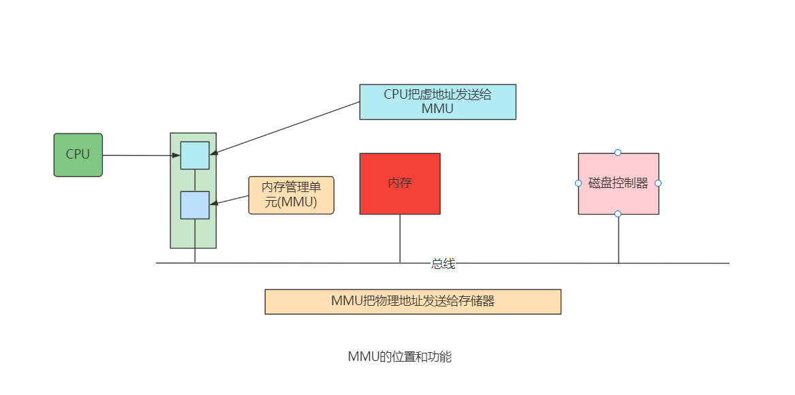
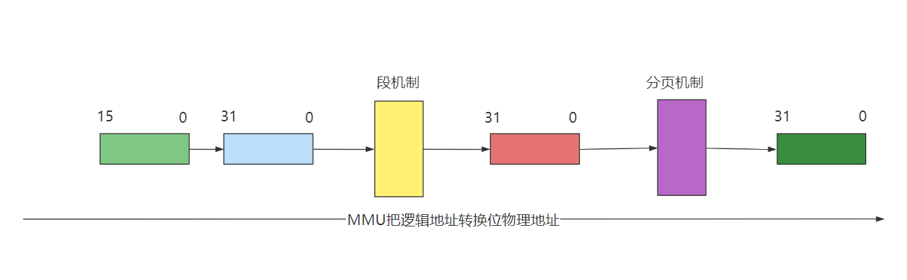
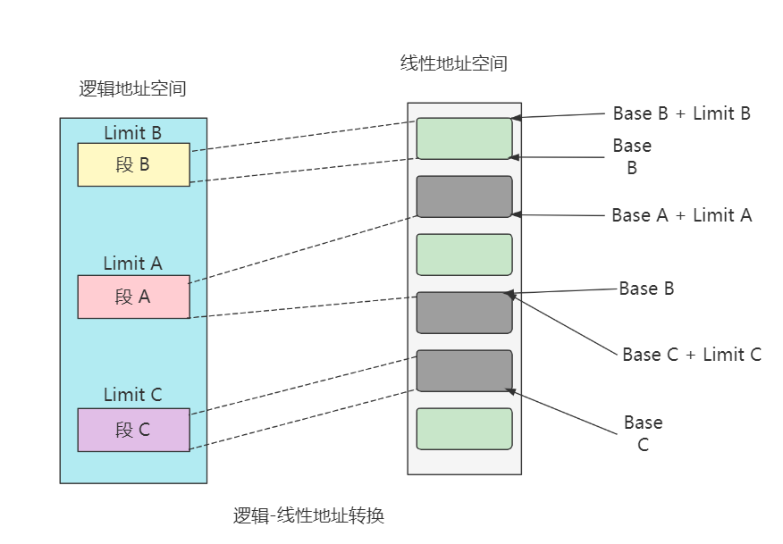
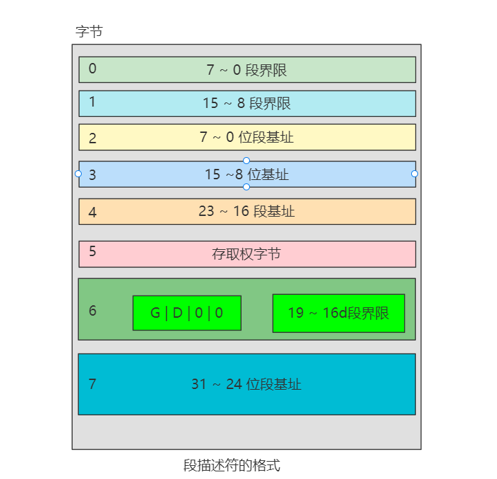

# Linux详解内存地址

##  内存地址 

在任何一台计算机上，都存在一个程序能产生的内存地址的集合。当程序执行这样一条指令时： 

- MOVE 
- REG
- ADDR 

**它把地址为ADDR(假设为 10000)的内存单元的内容复制到 REG 中，地址 ADDR 可以通过索引、基址寄存器、段寄存器和其他方式产生。** 

在 8086 的实模式下，把某一段寄存器左移 4 位，然后与地址 ADDR 相加后被直接送到内 存总线上，这个相加后的地址就是内存单元的物理地址，而程序中的这个地址就叫逻辑地址(或叫虚地址)。在 80386 的保护模式下，这个逻辑地址不是被直接送到内存总线，而是被送 到内存管理单元(MMU)。MMU 由一个或一组芯片组成，其功能是把逻辑地址映射为物理地址， 即进行地址转换。 

 当使用 80386 时，必须区分以下 3 种不同的地址：

1、逻辑地址 

机器语言指令仍用这种地址指定一个操作数的地址或一条指令的地址。这种寻址方式在Intel 的分段结构中表现得尤为具体，它使得 MS-DOS 或 Windows 程序员把程序分为若干段。 每个逻辑地址都由一个段和偏移量组成。   

2、线性地址 

线性地址是一个 32 位的无符号整数，可以表达高达 2^32（4GB）的地址。通常用 16 进制 表示线性地址，其取值范围为 0x00000000～0xffffffff。 

3、物理地址

物理地址是内存单元的实际地址，用于芯片级内存单元寻址。物理地址也由 32 位无符号整数表示。  

## MMU

MMU 是一种硬件电路，它包含两个部件，一个是分段部件，一个是分页部件，把它们分别叫做分段机制和分页机制，以利于从逻辑的角度来理 解硬件的实现机制。

分段机制把一个逻辑地址转换为线性地址；接着，分页机制把一个线性 地址转换为物理地址， 

##  段机制 

在 80386 的段机制中，逻辑地址由两部分组成，即段部分(选择符)及偏移部分。 段是形成逻辑地址到线性地址转换的基础。 

- 段的基地址（Base Address）：在线性地址空间中段的起始地址。  
- 段的界限（Limit）：表示在逻辑地址中，段内可以使用的最大偏移量。  
- 段的属性（Attribute）： 表示段的特性。 

**段的界限定义逻辑地址空间中段的大小。段内在偏移量从 0 到 limit 范围内的逻辑地址， 对应于从 Base 到 Base+Limit 范围内的线性地址。在一个段内，偏移量大于段界限的逻辑地址将没有意义，使用这样的逻辑地址，系统将产生异常。** 

如果要对一个段进行访问，系统会根据段的属性检查访问者是否具有访问权限，如果没有，则产生异常。例如，在 80386 中，如果要在只读段中进行写入，80386 将根据该段的属性检测到这是一种违规操作，则产 生异常。  

### 解析

表示一个段如何从逻辑地址空间，重新定位到线性地址空间。图的左侧表示逻辑地址空间，定义了 A、B 及 C 三个段，段容量分别为 LimitA、LimitB及 LimitC。图中虚线把逻 辑地址空间中的段 A、B 及 C 与线性地址空间区域连接起来表示了这种转换。 

段的基地址，界限及保护属性，存储在段的描述符表中，逻辑—线性地址转换过程中要对描述符进行访问。 

##  描述符的概念 

所谓描述符(Descriptor)，就是描述段的属性的一个 8 字节存储单元。在实模式下， 段的属性不外乎是代码段、堆栈段、数据段、段的起始地址、段的长度等，而在保护模式下则复杂一些。80386 将它们结合在一起用一个 8 字节的数表示，称为描述符。 一个段描述符指出了段的 32 位基地址和 20 位段界限(即段长)。  

