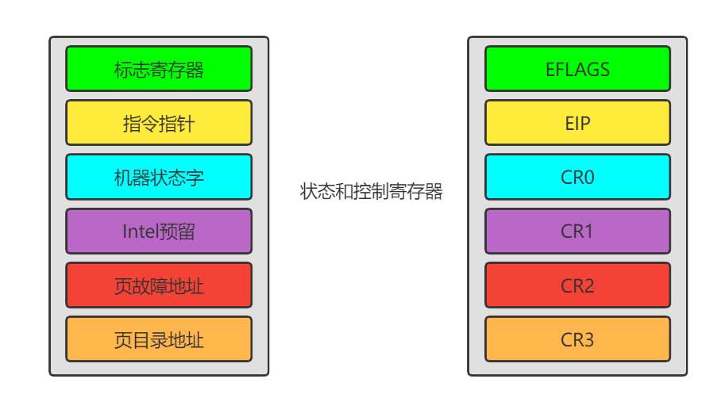

# Linux详解寄存器

## 前言

操作系统的设计者必须在硬件相关的代码与硬件无关的代码之间划出清楚的界限，以便将一个操作系统很容易地移植到不同的平台。 

**在X86系列中，8086和8088是16位的处理器，而从80386开始为 32 位处理器。这种变化看起来是处理器位数的变化，但实质上是处理器体系结构的变化，从寻址方式上说，就是从“实模式”到“保护模式”的变化。**

从80386以后，Intel的CPU 经历了80486、Pentium、 Pentium II、Pentium III 等型号，虽然它们在速度上提高了好几个数量级，功能上也有不少改进，基本上属于同一种系统结构的改进与加强，而无本质的变化。

##  i386的寄存器 

80386作为80X86系列中的一员，必须保证向后兼容，也就是说，既要支持16位的处理 器，又要支持 32 位的处理器。 

###  80386中寄存器变化 

1.把16位的通用寄存器，标志寄存器以及指令指针寄存器扩充为32位的寄存器  

2.段寄存器仍然为16位  

3.增加4个32位的控制寄存器

4.增加4个系统地址寄存器

5.增加8个调式寄存器

6.增加2个测试寄存器。 

##  通用寄存器 

8个通用寄存器是8086寄存器的超集。
|   EAX   |              一般用作累加器              |
| :-----: | :--------------------------------------: |
| **EBX** |       **一般用作基址寄存器(Base)**       |
| **ECX** |         **一般用来计数(Count)**          |
| **EDX** | **一般用作目标变址（Destinatin Index）** |
| **EBP** |    **一般用作堆栈指针(tack Pointer)**    |
| **EBP** |    **一般用作基址指针(Base Pointer)**    |
| **ESI** |     **一般用作源变址(Source Index)**     |
| **EDI** |  **一般用作目标变址(Destinatin Index)**  |

8个通用寄存器中通常保存 32 位数据，但为了进行 16 位的操作并与 16 位机保持兼容， 它们的低位部分被当成8个16 位的寄存器，即AX、BX……DI。

为了支持8位的操作，还进一步把EAX、EBX、ECX、EDX这 4 个寄存器低位部分的16位，再分为8位一组的高位字节和低位字节两部分，作为8个8位寄存器。 8个寄存器分别被命名为 AH、BH、CH、DH 和 AL、 BL、CL、DL。对8位或16位寄存器的操作只影响相应的寄存器。 

##  段寄存器 

 8086中有4个16 位的段寄存器。

|        CS        |     代码段寄存器     |
| :--------------: | :------------------: |
|      **DS**      |   **数据段寄存器**   |
|      **SS**      |   **堆栈段寄存器**   |
| **ES、FS 及 GS** | **附加数据段寄存器** |

在80386中，有6个16位的段寄存器，但是，这些段寄存器中存放的不再是某个段的基地址，而是某个段的选择符(Selector)。因为16位的寄存 器无法存放32位的段基地址，段基地址只好存放在一个叫做描述符表(Descriptor)的表中。 在80386中，把段寄存器叫做选择符。 

##  状态和控制寄存器 

状态和控制寄存器是由标志寄存器(EFLAGS)、指令指针(EIP)和4个控制寄存器组成。

1.指令指针寄存器和标志寄存器：

指令指针寄存器(EIP)中存放下一条将要执行指令的偏移量(offset )，这个偏移量是相对于目前正在运行的代码段寄存器(CS)而言的。偏移量加上当前代码段的基地址，就形成了下一条指令的地址。EIP 中的低16位可以分开来进行访问，给它起名叫指令指针IP寄存器，用于16位寻址。    

标志寄存器(EFLAGS)存放有关处理器的控制标志。标志寄存器中的第 1、3、5、15 位及18～31 位都没有定义。 

 Linux内核代码中常用且重要的几个标志位:

1、第8位TF(Trap Flag)是自陷标志, 当将其置1时则可以进行单步执行。当指令执行完后，就可能产生异常1的自陷。也就是说，在程序的执行过程中，每执行完一条指令，都要由异常 1 处理程序(在Linux内核中叫做 debug())进行检验。当将第 8 位清 0 后，且将断点地址装入调试寄存器 DR0～DR3 时，才会产生异常 1 的自陷。    

2、第12、13位IOPL是输入输出特权级位，这是保护模式下要使用的两个标志位。由于输入输出特权级标志共两位，它的取值范围只可能是 0、1、2和3共4个值，恰好与输入输出特权级0～3 级相对应。 

3、第9位IF(Interrupt Flag)是中断标志位，是用来表示允许或者禁止外部中断。若第位IF被置为 1，则允许 CPU 接收外部中断请求信号；若将IF位清 0，则表示禁止外部中断。在保护模式下，只有当第12、13 位指出当前CPL为最高特权级时，才允许将新值置入标志寄存器(EFLAGS)以改变IF位的值。 

4、第10位DF(Direction Flag)是定向标志。DF位规定了在执行串操作的过程中，对源变址寄存器 ESI或目标变址寄存器EDI是增值还是减值。如果DF为 1，则寄存器减值；若DF为 0，则寄存器值增加。 

5、第14位NT是嵌套任务标志位。在保护模式下常使用这个标志。当80386在发生中断和 执行 CALL 指令时就有可能引起任务切换。若是由于中断或由于执行CALL指令而出现了任务切换，则将NT置为1。若没有任务切换，则将NT位清 0。 

6、第17位VM(Virtual 8086 Mode Flag)是虚拟8086方式标志，是80386新设置的一个标志位。表示80386CPU是在虚拟 8086 环境中运行。如果80386CPU 是在保护模式下运行， 而VM为又被置成1，这时 80386就转换成虚拟8086操作方式，使全部段操作就像是在8086CPU上运行一样。 

##  控制寄存器 

状态和控制寄存器组除了EFLAGS、EIP，还有4个32位的控制寄存器，它们是CR0，CR1、 CR2 和 CR3。 

CR0中包含了6个预定义标志，0 位是保护允许位PE(Protedted Enable)，用于启动保护模式，如果PE位置 1，则保护模式启动，如果PE=0，则在实模式下运行。

1 位是监控协处理位 MP(Moniter Coprocessor)，它与第3位一起决定：当TS=1时操作码 WAIT 是否产生一个“协处理器不能使用”的出错信号。

第 3 位是任务转换位(Task Switch)，当一个任 务转换完成之后，自动将它置 1。随着 TS=1，就不能使用协处理器。

CR0 的第 2 位是模拟协 处理器位 EM (Emulate Coprocessor)，如果 EM=1，则不能使用协处理器，如果 EM=0，则 允许使用协处理器。

第 4 位是微处理器的扩展类型位 ET(Processor Extension Type)，其内保存着处理器扩展类型的信息，如果ET=0，则标识系统使用的是 287 协处理器，如果ET=1， 则表示系统使用的是387 浮点协处理器。

CR0 的第 31 位是分页允许位(Paging Enable)， 它表示芯片上的分页部件是否允许工作。

|  PG   |  PE   |            方式            |
| :---: | :---: | :------------------------: |
| **0** | **0** |    **实模式，8080操作**    |
| **0** | **1** | **保护模式，但不允许分页** |
| **1** | **0** |          **出错**          |
| **1** | **1** |   **允许分页的保护模式**   |

1.CR1是未定义的控制寄存器，供将来的处理器使用。  

2.CR2 是页故障线性地址寄存器，保存最后一次出现页故障的全 32 位线性地址。  

3.CR3 是页目录基址寄存器，保存页目录表的物理地址。页目录表总是放在以 4KB 为单位 的存储器边界上，因此，它的地址的低 12 位总为 0，不起作用，即使写上内容，也不会被理会。  

##  系统地址寄存器 

80386有4个系统地址寄存器，它保存操作系统要保护的信息和地址转换表信息。4个专用寄存器用于引用在保护模式下所需要的表和段。

1、全局描述符表寄存器GDTR(Global Descriptor Table Register )，是48位寄存器， 用来保存全局描述符表(GDT)的32位基地址和16位GDT的界限。 

2、中断描述符表寄存器IDTR(Interrupt Descriptor Table Register)，是48位寄存 器，用来保存中断描述符表(IDT)的32位基地址和16位IDT的界限。 

3、局部描述符表寄存器 LDTR(Global Descriptor Table Register），是16位寄存器， 保存局部描述符表LDT段的选择符。 

4、任务状态寄存器TR(Task State Register)是16位寄存器，用于保存任务状态段TSS段的16 位选择符。 

##  调试寄存器和测试寄存器 

###  调试寄存器 

80386为调试提供了硬件支撑。在80386芯片内有8个32位的调试寄存器DR0~DR7。 

寄存器可以使系统程序设计人员定义4个断点，用来规定指令执行和数据读写的任何组合。

1.DR0~DR3是线性断点地址寄存器，其中保存着4个断点地址。

2.DR4、DR5 是两个备用的调试寄存器，目前尚未定义。

3.DR6是断点状态寄存器，其低序位是指示符位，当允许故障调试并检查出故障而进入异常调试处理程序(debug())时，由硬件把指示符位置1，调试异常处理程序在退出之前必须把这几位清 0。

4.DR7是断点控制寄存器，它的高序半个字又被分为4个字段，用来规定断点字段的长度是1个字节、2个字节、4个字节及 规定将引起断点的访问类型。低序半个字的位字段用于“允许”断点和“允许”所选择的调试条件。   

##  测试寄存器 

 80386 有两个32位的测试寄存器TR6和TR7。

这两个寄存器用于在转换旁路缓冲器 (Translation Lookaside Buffer)中测试随机存储器(RAM)和相联存储器(CAM)。

1.TR6是测试命令寄存器，其内存放测试控制命令。

2.TR7是数据寄存器，其内保存转换旁路缓冲器测试的数据。 
