# 一文玩转Linux(NAT)网络配置

## 📖三种模式简介

 *VMWare提供了三种工作模式，它们是bridged(桥接模式)、NAT(网络地址转换模式)和host-only(主机模式)* 

### 1、 bridged(桥接模式)

*bridged(桥接模式) 是 VMWare 虚拟出来的操作系统就像是局域网中的一台独立的主机，它可以访问网内任何一台机器。在桥接模式下，需要手工为虚拟系统配置IP地址、子网掩码，而且还要和宿主机器处于同一网段，这样虚拟系统才能和宿主机器进行通信。同时，由于这个虚拟系统是局域网中的一个独立的主机系统，那么就可以手工配置它的TCP/IP配置信息，以实现通过局域网的网关或路由器访问互联网。*

**使用桥接模式的虚拟系统和宿主机器的关系，就像连接在同一个Hub上的两台电脑。想让它们相互通讯，需要为虚拟系统配置IP地址和子网掩码，否则就无法通信。** 

#### 适用场景

在局域网内新建一个虚拟服务器，为局域网用户提供网络服务，可选择桥接模式。 

### 2、host-only(主机模式) 

在某些特殊的网络调试环境中，要求将真实环境和虚拟环境隔离开，这时就可采用host-only模式。在host-only模式中，所有的虚拟系统是可以相互通信的，但虚拟系统和真实的网络是被隔离开的。在host-only模式下，虚拟系统的TCP/IP配置信息(如IP地址、网关地址、DNS服务器等)，都是由VMnet1(host-only)虚拟网络的DHCP服务器来动态分配的。 

#### 适用场景

创建一个与网内其他机器相隔离的虚拟系统，进行某些特殊的网络调试工作，可选择host-only模式。 

> 提示:在host-only模式下，虚拟系统和宿主机器系统是可以相互通信的，相当于这两台机器通过双绞线互连。 

### 3、NAT(网络地址转换模式) 

在NAT网络中，会使用到VMnet8虚拟交换机，Host上的VMware Network Adapter VMnet8虚拟网卡被连接到VMnet8交换机上，来与Guest进行通信，但是VMware Network Adapter VMnet8虚拟网卡仅仅是用于和VMnet8网段通信用的，它并不为VMnet8网段提供路由功能，处于虚拟NAT网络下的Guest是使用虚拟的NAT服务器连接的Internet的。 这时候，Guest和Host就可以实现互访了，并且如果Host此时已经连接到了Internet，那么Guest也就可以连上Internet了。

**那么VMware Network Adapter VMnet8虚拟网卡在这里扮演了一个什么角色呢？**

*它仅仅是为Host和NAT虚拟网络下的Guest通信提供一个接口，所以，即便Disable掉这块虚拟网卡，Guest仍然是可以上网的，只是Host无法再访问VMnet8网段而已。 这种方式的时候，主机需要开启vmdhcp和vmnat服务。*

*使用NAT模式，就是让虚拟系统借助NAT(网络地址转换)功能，通过宿主机器所在的网络来访问公网。也就是说，使用NAT模式可以实现在虚拟系统里访问互联网。NAT模式下的虚拟系统的TCP/IP配置信息是由VMnet8(NAT)虚拟网络的DHCP服务器提供的，无法进行手工修改，因此虚拟系统也就无法和本局域网中的其他真实主机进行通讯。采用NAT模式最大的优势是虚拟系统接入互联网非常简单，不需要进行任何其他的配置，只需要宿主机器能访问互联网即可。*

#### 适用场景

 一个新的虚拟系统，在虚拟系统中不用进行任何手工配置就能直接访问互联网，可选择NAT模式。 

> 提示:以上所提到的NAT模式下的VMnet8虚拟网络，host-only模式下的VMnet1虚拟网络，以及bridged模式下的 VMnet0虚拟网络，都是由VMWare虚拟机自动配置而生成的，不需要用户自行设置。VMnet8和VMnet1提供DHCP服务，VMnet0虚拟 网络则不提供

## 🎬三种模式本质区别 

###  VMware的虚拟设备 

*VMnet0：用于虚拟桥接网络下的虚拟交换机*

*VMnet1：用于虚拟Host-Only网络下的虚拟交换机*

*VMnet8：用于虚拟NAT网络下的虚拟交换机*

*VMware Network Adepter VMnet1：Host用于与Host-Only虚拟网络进行通信的虚拟网卡*

*VMware Network Adepter VMnet8：Host用于与NAT虚拟网络进行通信的虚拟网卡*

> 安装了VMware虚拟机后，会在网络连接对话框中多出两个虚拟网卡。


###  1、桥接网络模式 

桥接网络是指本地物理网卡和虚拟网卡通过VMnet0虚拟交换机进行桥接，物理网卡和虚拟网卡在拓扑图上处于同等地位(虚拟网卡既不是Adepter VMnet1也不是Adepter VMnet8)。这里的VMnet0相当于一个交换机，最终通过这个虚拟交换机使其两端在一个网段中。

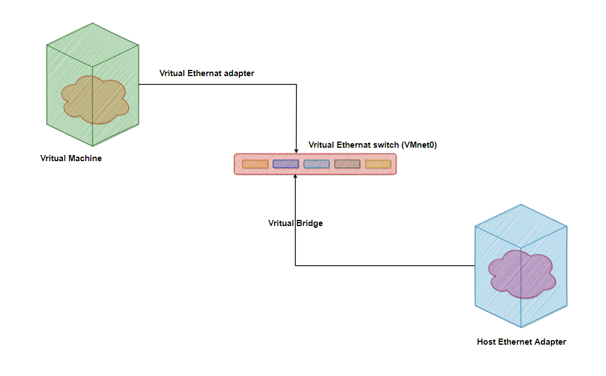

那么物理网卡和虚拟网卡就相当于处于同一个网段，虚拟交换机就相当于一台现实网络中的交换机。所以两个网卡的IP地址也要设置为同一网段。如果使虚拟机使用桥接模式连接网络，在运行cmd命令后产看两个IP，可以发现IPv4的IP 和虚拟机处于一个网段。物理网卡和虚拟网卡的IP地址处于同一个网段，子网掩码、网关、DNS等参数都相同。两个网卡在拓扑结构中是相对独立的。

*桥接网络模式是VMware虚拟机中最简单直接的模式。安装虚拟机时它为默认选项。在桥接模式下，虚拟机和宿主计算机处于同等地位，虚拟机就像是一台真实主机一样存在于局域网中。因此在桥接模式下，我们就要像对待其他真实计算机一样为其配置IP、网关、子网掩码等等。*

当可以自由分配局域网IP时，使用桥接模式就可以虚拟出一台真实存在的主机。


### 2、NAT模式 

*在NAT网络中，会用到VMware Network Adepter VMnet8虚拟网卡，主机上的VMware Network Adepter VMnet8虚拟网卡被直接连接到VMnet8虚拟交换机上与虚拟网卡进行通信。VMware Network Adepter VMnet8虚拟网卡的作用仅限于和VMnet8网段进行通信，它不给VMnet8网段提供路由功能，所以虚拟机虚拟一个NAT服务器，使虚拟网卡可以连接到Internet。在这种情况下，我们就可以使用端口映射功能，让访问主机80端口的请求映射到虚拟机的80端口上。*

VMware Network Adepter VMnet8虚拟网卡的IP地址是在安装VMware时由系统指定生成的，我们不要修改这个数值，否则会使主机和虚拟机无法通信。
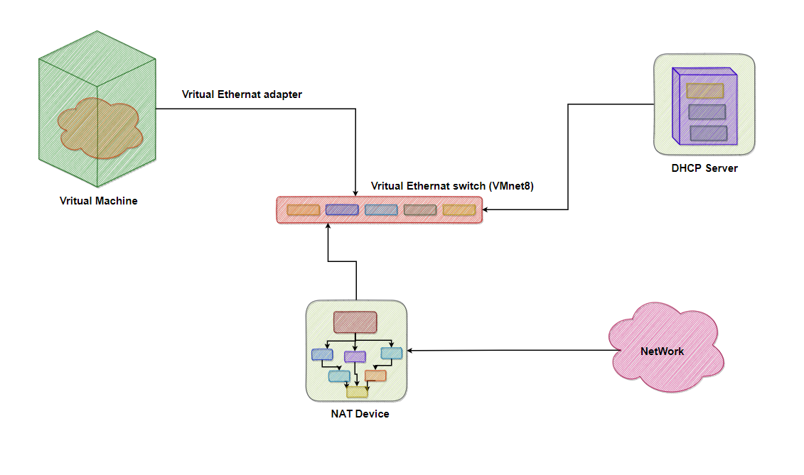


虚拟出来的网段和NAT模式虚拟网卡的网段是一样的，都为192.168.111.X，包括NAT服务器的IP地址也是这个网段。在安装VMware之后同样会生成一个虚拟DHCP服务器，为NAT服务器分配IP地址。当主机和虚拟机进行通信的时候就会调用VMware Network Adepter VMnet8虚拟网卡，因为他们都在一个网段，所以通信就不成问题了。实际上，VMware Network Adepter VMnet8虚拟网卡的作用就是为主机和虚拟机的通信提供一个接口，即使主机的物理网卡被关闭，虚拟机仍然可以连接到Internet，但是主机和虚拟机之间就不能互访了。

*在NAT模式下，宿主计算机相当于一台开启了DHCP功能的路由器，而虚拟机则是内网中的一台真实主机，通过路由器(宿主计算机)DHCP动态获得网络参数。因此在NAT模式下，虚拟机可以访问外部网络，反之则不行，因为虚拟机属于内网。使用NAT模式的方便之处在于，我们不需要做任何网络设置，只要宿主计算机可以连接到外部网络，虚拟机也可以。*

NAT模式通常也是大学校园网Vmware最普遍采用的连接模式，因为一般只能拥有一个外部IP。很显然，在这种情况下，非常适合使用NAT模式。


### 3、host-only模式 

在Host-Only模式下，虚拟网络是一个全封闭的网络，它唯一能够访问的就是主机。其实Host-Only网络和NAT网络很相似，不同的地方就是 Host-Only网络没有NAT服务，所以虚拟网络不能连接到Internet。主机和虚拟机之间的通信是通过VMware Network Adepter VMnet1虚拟网卡来实现的。
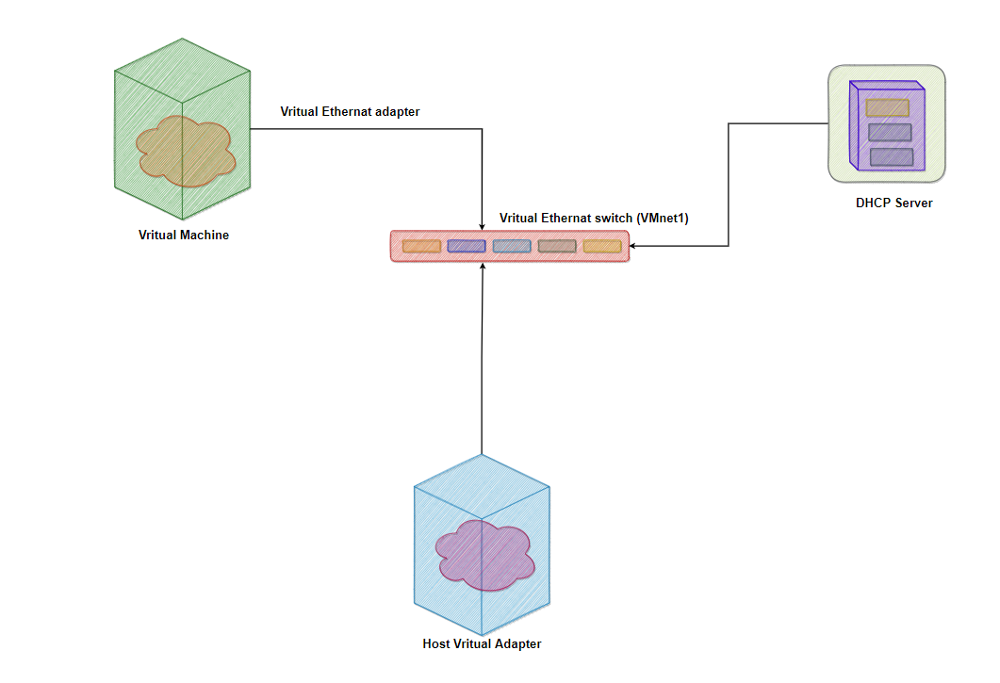

同NAT一样，VMware Network Adepter VMnet1虚拟网卡的IP地址也是VMware系统指定的，同时生成的虚拟DHCP服务器和虚拟网卡的IP地址位于同一网段，但和物理网卡的IP地址不在同一网段。Host-Only的宗旨就是建立一个与外界隔绝的内部网络，来提高内网的安全性。这个功能或许对普通用户来说没有多大意义，但大型服务商会常常利用这个功能。

*如果想为VMnet1网段提供路由功能，那就需要使用RRAS，而不能使用XP或2000的ICS，因为ICS会把内网的IP地址改为 192.168.0.1，但虚拟机是不会给VMnet1虚拟网卡分配这个地址的，那么主机和虚拟机之间就不能通信了。*

在Host-only模式下，相当于虚拟机通过双绞线和宿主计算机直连，而宿主计算机不提供任何路由服务。因此在Host-only模式下，虚拟机可以和宿主计算机互相访问，但是虚拟机无法访问外部网络。当要组成一个与物理网络相隔离的虚拟网络时，无疑非常适合使用Host-only模式。


## ✍配置NAT网络

### 前置工作

1、首先打开已经配置好的虚拟机，使用管理员账号(root)进行登录，然后通过 IP A 查看IP地址，通过第三方工具方便操作。

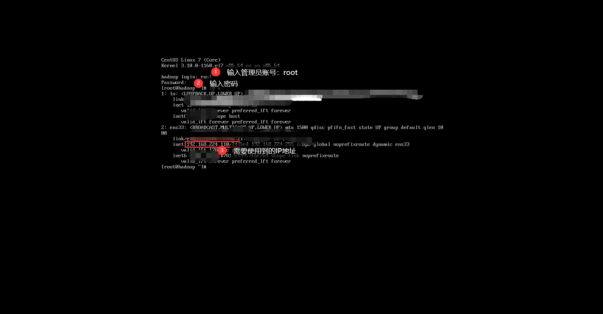

2、连接第三方工具

安装包上传至百度网盘[**Xshell7下载链接**](https://pan.baidu.com/s/1VW8CjO63RsYHXsgQLWgADg)
**提取码：Xs07** 

> 提取安装包文件后，自行安装即可

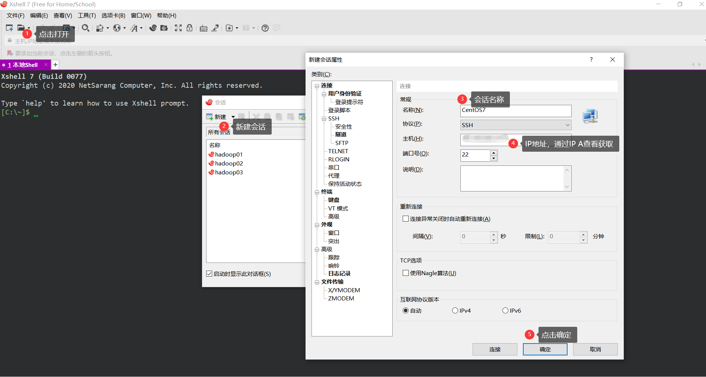

3、使用root管理员用户登录Xshell

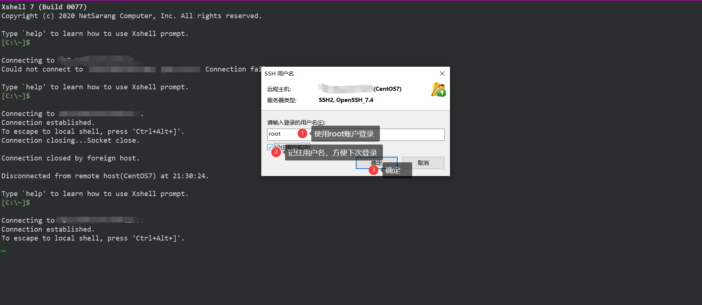

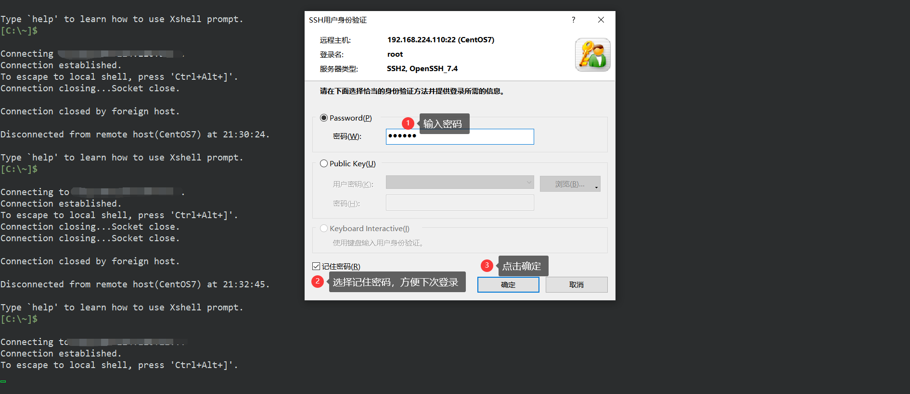

==初次登录，提示SSH，选择接受即可==

4、修改主机名，之前配置时对主机名进行过修改，所以主机名为hadoop

```shell
# 查看主机名
hostname
```

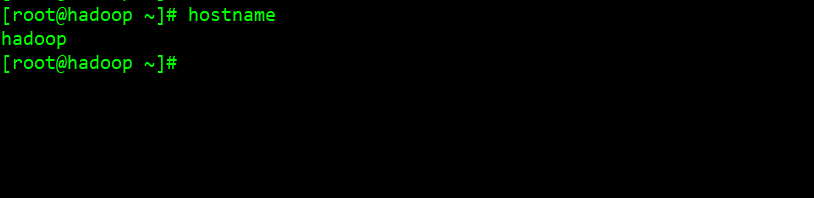

```shell
# 修改主机名
vi /ect/hostname
```

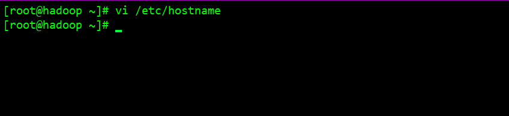5、更改/etc/sysconfig下的network文件，在提示符下输入 vi /etc/sysconfig/network，然后把HOSTNAME后面的值更改为想要设置的主机名。 

```shell
vi /etc/sysconfig/network
```


6、 更改/etc下的hosts文件，在提示符下输入 vi /etc/hosts，然后添加主机名映射

```shell
# 添加主机名映射
vi /etc/hosts
```

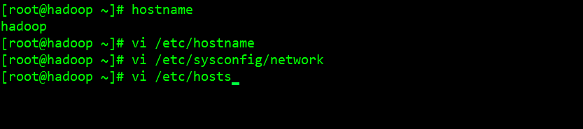

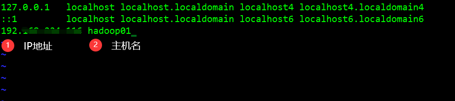

7、为普通用户赋予root权限

```shell
# 赋予root权限
vi /etc/sudoers
```

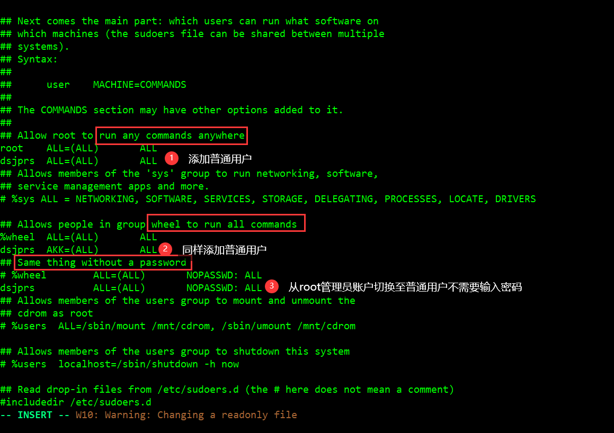

==注意：使用 `wq!`强制退出保存==

8、 关闭selinux

SELinux一共有3种状态，分别是Enforcing，Permissive和Disabled状态。第一种是默认状态，表示强制启用，第二种是宽容的意思，即大部分规则都放行。第三种是禁用，即不设置任何规则。只能通过setenforce命令来设置前面两种状态，而如果想修改为disable状态，需要修改配置文件，同时重启系统。

 Enforcing状态的值是1，表示目前为开启状态，关闭permissive状态是0，因此设置为permissive 0，命令就是：setenforce 0 

```sh
# 查看selinux当前状态
getenforce
```

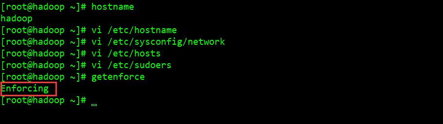

 ```shell
# 关闭selinux开启状态
setenforce 0 
# 但是上面那中修改方式重启后就会失效，只是临时生效。
 ```

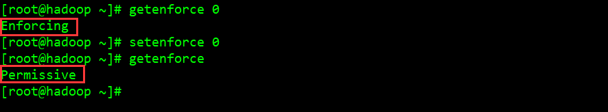

 通过修改设置文件，让配置永久生效 

```shell
# 将selinux永久关闭
vi /etc/selinux/config 
```

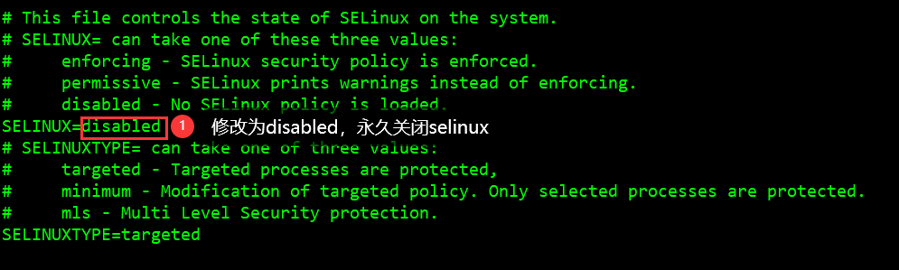 将它后面的值修改为permissive或者disabled，这样即使重启电脑以后，它默认的状态都会是permissve或disabled状态，而不会恢复到enforcing状态，设置后需要对虚拟进行重启。 

9、关闭防火墙(此教程以CentOS7准，CentOS6关闭方式稍微有些差别)

防火墙守护 firewalld 服务引入了一个信任级别的概念来管理与之相关联的连接与接口。它支持 ipv4 与 ipv6，并支持网桥，采用 firewall-cmd (command) 或 firewall-config (gui) 来动态的管理 kernel netfilter 的临时或永久的接口规则，并实时生效而无需重启服务。

安装步骤

```shell
# 配置好网络的情况下可通过yum命令进行安装
yum install firewalld

# 如果需要图形界面的话，则再安装
yum install firewall-config
```

参数详解

```shell
Firewall 能将不同的网络连接归类到不同的信任级别，Zone 提供了以下几个级别:
drop: 丢弃所有进入的包，而不给出任何响应
block: 拒绝所有外部发起的连接，允许内部发起的连接
public: 允许指定的进入连接
external: 同上，对伪装的进入连接，一般用于路由转发
dmz: 允许受限制的进入连接
work: 允许受信任的计算机被限制的进入连接，类似 workgroup
home: 同上，类似 homegroup
internal: 同上，范围针对所有互联网用户
trusted: 信任所有连接

过滤规则:
source: 根据源地址过滤
interface: 根据网卡过滤
service: 根据服务名过滤
port: 根据端口过滤
icmp-block: icmp 报文过滤，按照 icmp 类型配置
masquerade: ip 地址伪装
forward-port: 端口转发
rule: 自定义规则

其中，过滤规则的优先级遵循如下顺序
1.source
2.interface
3.firewalld.conf

# 防火墙帮助命令
firewall-cmd --help
```

**查看防火墙状态**

```shell
# 查看防火墙状态
systemctl status firewalld

# 两种方式都可进行查看
systemctl status firewalld.service
```

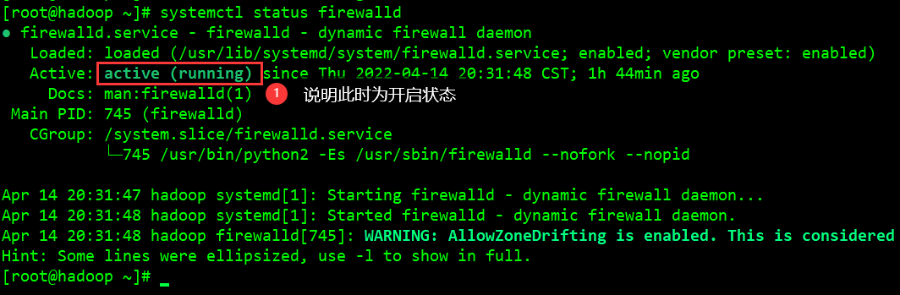

10、临时关闭防火墙

```shell
# 关闭防火墙
systemctl stop firewalld

# 两种方式都可
systemctl stop firewalld.service
```

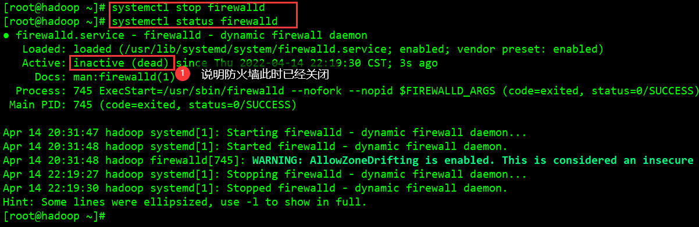

11、永久关闭防火墙

```shell
# 永久关闭防火墙
systemctl disable firewalld

# 两种方式都可
systemctl disable firewalld.service
```

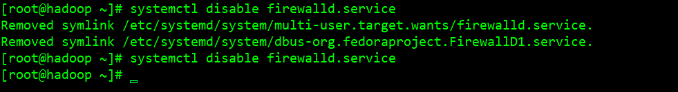

防火墙的相关命令

```shell
# 查看防火墙状态，两种方式都可进行查看
systemctl status firewalld
systemctl status firewalld.service

# 关闭防火墙，两种方式都可
systemctl stop firewalld
systemctl stop firewalld.service

# 永久关闭防火墙，两种方式都可
systemctl disable firewalld
systemctl disable firewalld.service

# 设置开机自启
systemctl enable firewalld.service

# 重启防火墙
firewall-cmd--reload

========================================================================
# CentOS6防火墙相关命令
# 查看防火状态
service  iptables status

# 暂时关闭防火墙
service  iptables stop

# 永久关闭防火墙
chkconfig iptables off

# 重启防火墙
service iptables restart  

# 查看已开放的端口(默认不开放任何端口)
firewall-cmd --list-ports

# 查看打开的端口
/etc/init.d/iptables status

# 开启端口(80为例)
# firewall-cmd --zone=public(作用域) --add-port=80/tcp(端口和访问类型) --permanent(permanent永久生效，没有此参数重启后失效)

firewall-cmd --zone=public --add-port=80/tcp --permanent

# 删除端口号(80为例)
firewall-cmd --zone= public --remove-port=80/tcp --permanent

========================================================================
# 打开某端口(以8080为例)
# 开启端口
iptables-A INPUT-p tcp--dport8080-j ACCEPT

# 保存并重启防火墙
/etc/rc.d/init.d/iptables save/etc/init.d/iptables restart

# 打开49152~65534之间的端口
iptables-A INPUT-p tcp--dport49152:65534-j ACCEPT

#同样，对设置进行保存，并重启防火墙。

# 其他打开方式，通过修改/etc/sysconfig/iptables文件的方式开启端口，如下
vi/etc/sysconfig/iptables

# 然后在文件中增加一行
-A RH -Firewall-1 -INPUT  -m state -state NEW -m tcp -p tcp -dport 80 -j ACCEPT

# 参数说明:
# –A 参数就看成是添加一条规则
# –p 指定是什么协议，我们常用的tcp 协议，当然也有udp，例如53端口的DNS
# –dport 就是目标端口，当数据从外部进入服务器为目标端口
# –sport 数据从服务器出去，则为数据源端口使用
# –j 就是指定是 ACCEPT -接收 或者 DROP 不接收

# 查看版本
firewall-cmd --version

# 查看帮助
firewall-cmd --help

# 查看区域信息
firewall-cmd --get-active-zones

# 查看指定接口所属区域信息
firewall-cmd --get-zone-of-interface=eth0

# 拒绝所有包
firewall-cmd --panic-on

# 取消拒绝状态
firewall-cmd --panic-off

# 查看是否拒绝
firewall-cmd --query-panic

# 将接口添加到区域(默认接口都在public)
firewall-cmd --zone=public --add-interface=eth0(永久生效再加上 --permanent 然后reload防火墙)

# 设置默认接口区域
firewall-cmd --set-default-zone=public(立即生效，无需重启)

# 更新防火墙规则
firewall-cmd --reload或firewall-cmd --complete-reload(两者的区别就是第一个无需断开连接，就是firewalld特性之一动态
添加规则，第二个需要断开连接，类似重启服务)

# 查看指定区域所有打开的端口
firewall-cmd --zone=public --list-ports

# 在指定区域打开端口（记得重启防火墙）
firewall-cmd --zone=public --add-port=80/tcp(永久生效再加上 --permanent)

# 说明：
# –zone 作用域
# –add-port=8080/tcp 添加端口，格式为：端口/通讯协议
# –permanent #永久生效，没有此参数重启后失效

```

12、配置NAT网络连接，首先找到已开启的虚拟机，右键点击打开，选择设置

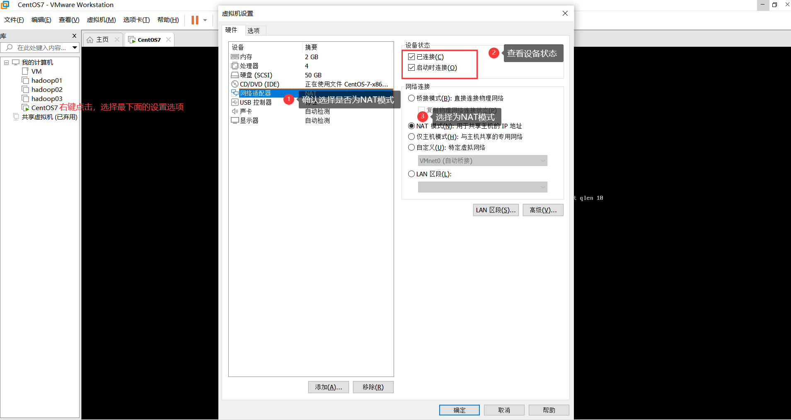

前文已对IP地址进行了配置和设置，本文不做过多的叙述

配置参数详解

```shell
# 物理设备名，eth0为第一块网卡；eth1为第二块网卡
DEVICE=eth0　

# 网卡的MAC地址，48位
HWADDR=00:0C:29:84:0C:21

# 以太网
TYPE=Ethernet　

# 唯一的一个用户标识，相当于身份证号码！如查看磁盘设备的UUID使用blkid命令
UUID=09ae6890-2925-4ca0-9cbc-e937593624f8　

# 控制网卡是否开机启动
ONBOOT=yes　　　　　　　　　　　

# 是否通过networkmanager管理网卡设备
NM_CONTROLLED=yes　　　　　　

# proto取下列值之一：
# none,引导时不使用协议；static,静态分配地址；bootp，使用BOOTP协议；dhcp，使用DHCP协议
BOOTPROTO=dhcp　　　

#IP地址　
IPADDR=192.168.17.128　　　　　　　　
　
# 子网掩码，划分网络位和主机位　　　
NETMASK=255.255.255.0　　　　　　　　

#DNS是把baidu.com变成了baidu服务器IP。DNS就是域名和IP的解析工具
DNS2=192.168.224.2　　　　　　　　　
DNS1=8.8.8.8

#  网关地址，路由器的地址
GATEWAY=192.168.224.2　　

# MAC地址
HWADDR=00:0C:29:84:0C:21
```

只需配置以下参数即可

```shell
BOOTPROTO="static"
ONBOOT="yes"
IPADDR=192.168.124.11X
NETMASK=255.255.255.0
GATEWAY=192.168.224.X
DNS1=192.168.224.X
DNS2=8.8.8.8
HWADDR=00:0C:29:84:0C:2X
```

进入到网卡进行进行配置

```shell
# 配置ens33网卡
vi /etc/sysconfig/network-scripts/ifcfg-ens33 
```

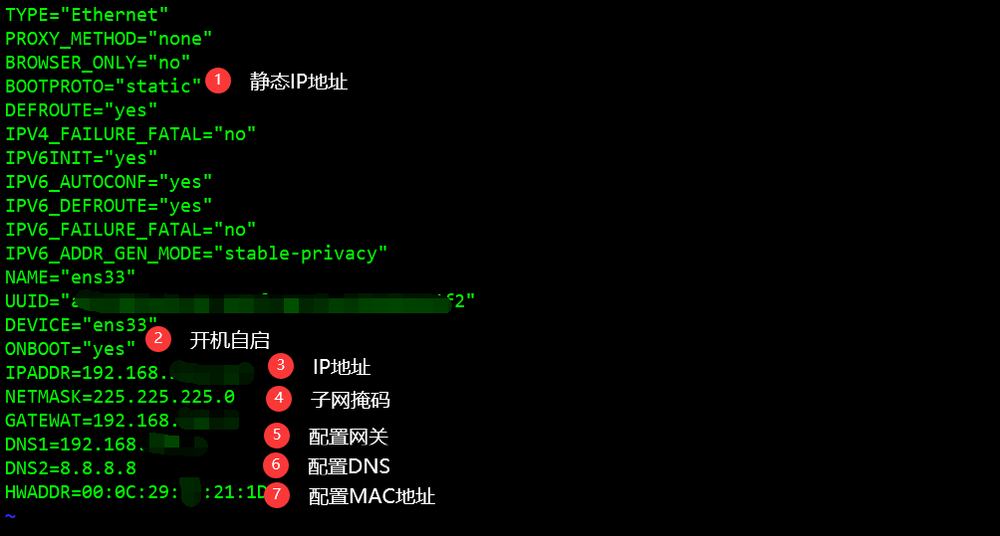

13、重启网络服务

```shell
systemctl restart network
```

14、意外的处理，帮小伙伴们躺坑以下，记录记录。

配置完，就觉得这回能够ping同啦，重启网卡后，ping一下~😅

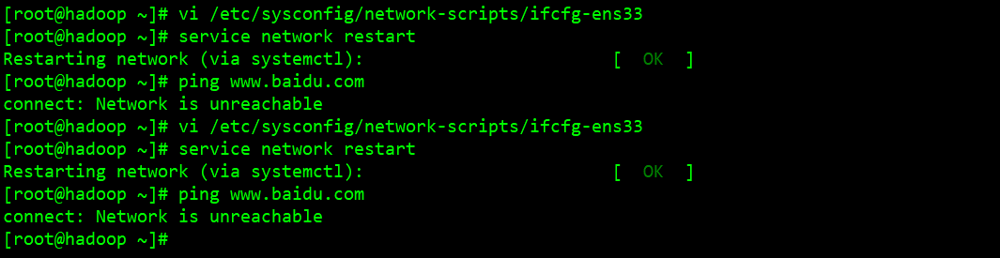

接下来检查了windows上VMnet8配置设置，检查完后问题不出在这。随后将虚拟机关闭，重新生成新的MAC地址，进行更改，发现IP地址不对劲。。查看虚拟网络设置后都是192......110😅，随后进行更换

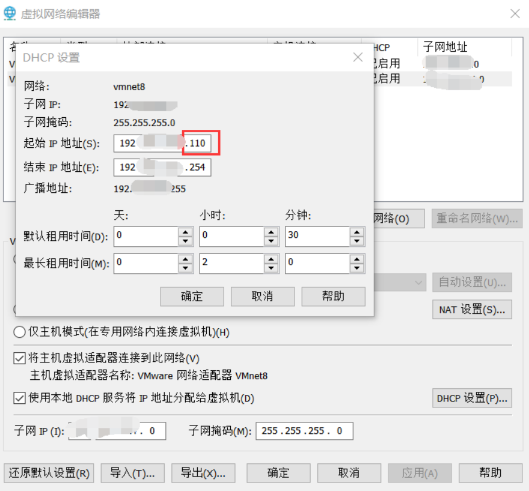

网上查了很多问题解决办法，但是没用，只好排查配置文件，单词是否拼写错误，好家伙！问题就在这🤣

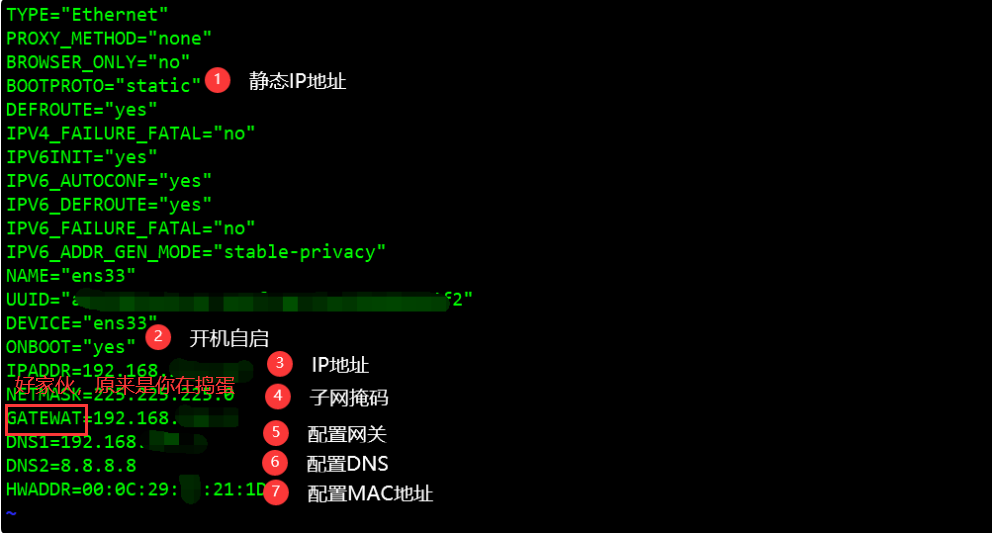

修改配置文件后，重启网络 service network restart ，最后**ping**一下

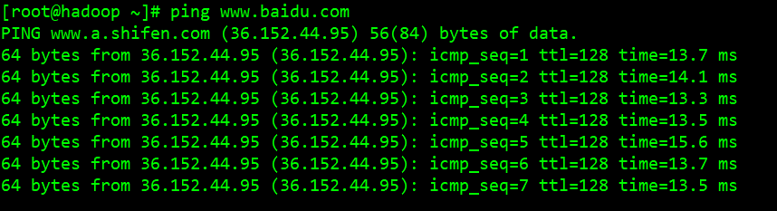

好了，bug也解决啦，接下来说说网络配置时出现问题如何排查：

1.首先需要对windows上VMnet8属性配置进行检查

2.查看虚拟机网络设置，VMnet是否会自动连接，导致NAT设置是否无效，我的处理方式是直接删掉

3.关闭虚拟机，重启生成MAC地址，进行更换，同时也更换一下IP地址，最后重启网络OK

15、查看DNS是否配置好

```shell
# 查看是否配置好DNS
vi /etc/resolv.conf
```

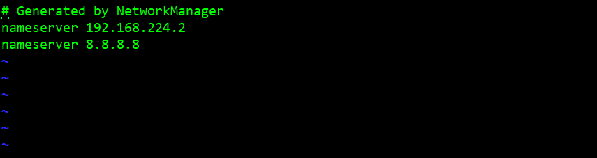

16、配置YUM清华镜像

```shell
# 进入YUM配置文件目录
cd /etc/yum.repos.d

# 复制CentOS-Base.repo为CenOS-Base.repo.back(备份)
cp CentOS-Base.repo  CentOS-Base.repo.back

# 编辑CentOS-Base.repo，添加下文配置文件
vi CentOS-Base.repo 
```

```xml
#CentOS-Base.repo

#The mirror system uses the connecting IP address of the client and thed

#update status of each mirror to pick mirrors that are updated to and

#geographically close to the client.  You should use this for CentOS updates

#unless you are manually picking other mirrors.

#If the mirrorlist= does not work for you, as a fall back you can try the

#remarked out baseurl= line instead.

[base]
name=CentOS-$releasever - Base
baseurl=https://mirrors.tuna.tsinghua.edu.cn/centos/$releasever/os/$basearch/
#mirrorlist=http://mirrorlist.centos.org/?release=$releasever&arch=$basearch&repo=os
enabled=1
gpgcheck=0
gpgkey=file:///etc/pki/rpm-gpg/RPM-GPG-KEY-7

#released updates
[updates]
name=CentOS-$releasever - Updates
baseurl=https://mirrors.tuna.tsinghua.edu.cn/centos/$releasever/updates/$basearch/
#mirrorlist=http://mirrorlist.centos.org/?release=$releasever&arch=$basearch&repo=updates
enabled=1
gpgcheck=0
gpgkey=file:///etc/pki/rpm-gpg/RPM-GPG-KEY-7


#additional packages that may be useful
[extras]
name=CentOS-$releasever - Extras
baseurl=https://mirrors.tuna.tsinghua.edu.cn/centos/$releasever/extras/$basearch/
#mirrorlist=http://mirrorlist.centos.org/?release=$releasever&arch=$basearch&repo=extras
enabled=1
gpgcheck=0
gpgkey=file:///etc/pki/rpm-gpg/RPM-GPG-KEY-7


#additional packages that extend functionality of existing packages
[centosplus]
name=CentOS-$releasever - Plus
baseurl=https://mirrors.tuna.tsinghua.edu.cn/centos/$releasever/centosplus/$basearch/
#mirrorlist=http://mirrorlist.centos.org/?release=$releasever&arch=$basearch&repo=centosplus
gpgcheck=0
enabled=1
gpgkey=file:///etc/pki/rpm-gpg/RPM-GPG-KEY-7
```

清除所以缓存

```shell
yum clean all
```

建立缓存

```shell
yum makecache
```

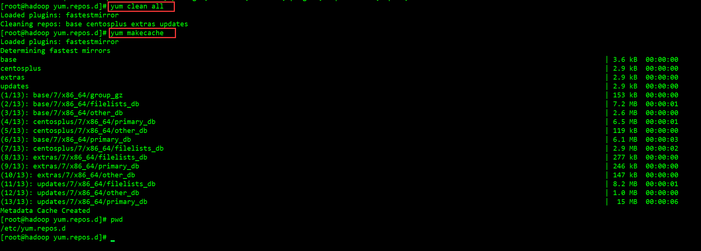

更新

```shell
yum update
```

17、因为使用的是CentOS精简版，所以需要安装下面软件

```shell
#安装命令
yum install -y epel-release

# 安装 net-tool，工具包集合，包含ifconfig等命令
yum install -y net-tools

# 安装vim，编辑器
yum install -y vim

# 时间同步
yum -y install ntpdate 
ntpdate ntp4.aliyun.com
```
