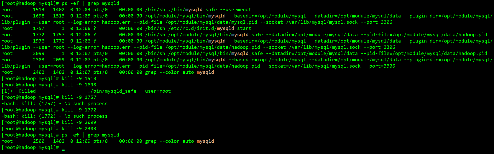

# 一文玩转Linux安装MySQL5.7.36

## MySQL简介

MySQL 是最受欢迎的开源 SQL 数据库管理系统，由 Oracle Corporation 开发、分发和支持。

MySQL 网站 ( http://www.mysql.com/ ) 提供有关 MySQL 软件的最新信息。

## MySQL特点

1、**MySQL 是一个数据库管理系统。**

2、**MySQL 数据库是关系型的。**

3、**MySQL 软件是开源的。**

4、**MySQL 数据库服务器非常快速、可靠、可扩展且易于使用。**

5、**MySQL 服务器在客户端/服务器或嵌入式系统中工作。**

## MySQL历史

MySQL开始的目的是将 `mSQL`使用快速低级 (ISAM) 例程通过数据库系统连接到表。然而，经过一些测试，得出的结论`mSQL` 是不够快或不够灵活，无法满足需求。这为数据库带来了一个新的 SQL 接口，但 API 接口几乎与`mSQL`. 此 API 旨在使为使用而编写的第三方代码能够 `mSQL`轻松移植以与 MySQL 一起使用。

**MySQL 以联合创始人 Monty Widenius 的女儿 My 命名。**MySQL Dolphin（徽标）的名称是“ Sakila ” ，它是从“为海豚命名”竞赛 中用户建议的大量名称中选择的。获奖名称由来自非洲 Eswatini（原斯威士兰）的开源软件开发人员 Ambrose Twebaze 提交。根据 Ambrose 的说法，女性名字 Sakila 源于史瓦帝尼的当地语言 SiSwati。Sakila 也是坦桑尼亚阿鲁沙的一个小镇的名称，靠近安布罗斯的原籍国乌干达。

## MySQL下载

如需下载MySQL各个版本，可通过[MySQL官网下载地址](https://downloads.mysql.com/archives/community/)进行选择


本教程安装mysql-5.7.36-linux-glibc2.12-x86_64.tar.gz，接下来演示下载教程。


本教程安装包已上传至百度网盘，需要的小伙伴可自行提取安装包。

链接：https://pan.baidu.com/s/13JFOFE2wJKiDIwESrXFr5g 
提取码：My80 

## MySQL安装

|                 MySQL版本                  |            Linux镜像             |
| :----------------------------------------: | :------------------------------: |
| mysql-5.7.36-linux-glibc2.12-x86_64.tar.gz | CentOS-7-x86_64-Minimal-2009.iso |

1、检查是否安装mariadb

```shell
# 检查
rpm -qa|grep mariadb

# rpm包安装方式卸载
# 查包名：
rpm -qa|grep -i mysql

#删除命令：
rpm -e –nodeps 包名
 
# yum安装方式下载
# 1.查看已安装的mysql
# 命令：
rpm -qa | grep -i mysql

# 2.卸载mysql
#命令：
yum remove mysql-community-server-5.6.36-2.el7.x86_64

#查看mysql的其它依赖：
rpm -qa | grep -i mysql
 
#卸载依赖
yum remove mysql-libs
yum remove mysql-server
yum remove perl-DBD-MySQL
yum remove mysql
```

2、上传文件并解压

```shell
#(因版本原因，可能需要使用不同的方式进行解压，如果版本为5.x.tar.gz，不需要如此，通过“tar -zxvf 包名 -C 安装路径名”)

#tar.xz文件如何解压?

#xz压缩文件方法或命令:
#xz -z 要压缩的文件


#如果要保留被压缩的文件加上参数 -k ，如果要设置压缩率加入参数 -0 到 -9调节压缩率。如果不设置，默认压缩等级是6.
#xz解压文件方法或命令
#xz -d 要解压的文件

#同样使用 -k 参数来保留被解压缩的文件。
#创建或解压tar.xz文件的方法
#习惯了 tar czvf 或 tar xzvf 的人可能碰到 tar.xz也会想用单一命令搞定解压或压缩。其实不行 tar里面没有征对xz格式的参数比如 z是针对 gzip，j是针对 bzip2。

#创建tar.xz文件：只要先 tar cvf xxx.tar xxx/ 这样创建xxx.tar文件先，然后使用 xz -z xxx.tar 来将 xxx.tar压缩成为 xxx.tar.xz
#解压tar.xz文件：先 xz -d xxx.tar.xz 将 xxx.tar.xz解压成 xxx.tar 然后，再用 tar xvf xxx.tar来解包。

#例子：这种文件其实是两层压缩，外层是.xz压缩方式，内层是.tar压缩方式。
#mysql-8.0.18-linux-glibc2.12-x86_64.tar.xz


#解压过程也分为两层：xz -d mysql-8.0.18-linux-glibc2.12-x86_64.tar.xz，之后就会出现mysql-8.0.18-linux-glibc2.12-x86_64.tar文件

#然后tar xvf mysql-8.0.18-linux-glibc2.12-x86_64.tar即可完成解压.
# 首先通过 xz -d 进行解压
xz -d mysql-8.0.16-linux-glibc2.12-x86_64.tar.xz

# 可以使用tar xf 解压
tar -xf mysql-8.0.16-linux-glibc2.12-x86_64.tar.xz -C /opt/module
========================================================================
# 解压mysql-5.7.36-linux-glibc2.12-x86_64.tar.gz
tar -zxvf mysql-5.7.36-linux-glibc2.12-x86_64.tar.gz -C /opt/module/
```


3、修改mysql文件名

```shell
# 通过mv命令修改解压文件名
mv mysql-5.7.36-linux-glibc2.12-x86_64/ mysql
```


4、删除etc目录下的my.cnf

```shell
#  删除etc目录下的my.cnf（存在的话）
cd /etc
rm -rf my.cnf
```


5、配置my.cnf文件 

```shell
# 编辑文件，
vim /etc/my.cnf
```

```shell
[client]
#character-set-server=utf8
port=3306
socket=/var/lib/mysql/mysql.sock
[mysqld]
#skip-grant-tables
#设置3306端口
port=3306
socket=/var/lib/mysql/mysql.sock
#设置mysql的安装目录
basedir=/opt/module/mysql
#设置mysql数据库的数据的存放目录
datadir=/opt/module/mysql/data
#允许最大连接数
max_connections=200
#服务端使用的字符集默认为8比特编码的latin1字符集
character-set-server=utf8
#创建新表时将使用的默认存储引擎
default-storage-engine=INNODB
user=root
[mysqld_safe]
pid-file=/opt/module/mysql/data/mysql.pid

# 配置以上参数即可，根据自身需要进行配置
========================================================================
# 客户端设置，即客户端默认的连接参数
[client] 

# 默认连接端口
port = 3306 

# 用于本地连接的socket套接字，mysqld守护进程生成了这个文件
socket = /opt/module/mysql/tmp/mysql.sock 

# 服务端基本设置
[mysqld] 

# 基础设置
# Mysql服务的唯一编号 每个mysql服务Id需唯一
server-id = 1 

# MySQL监听端口
port = 3306 

 # MySQL安装根目录
basedir = /opt/module/mysql

 # MySQL数据文件所在位置
datadir =/opt/module/mysql/data

# 临时目录，比如load data infile会用到
tmpdir =/opt/module/mysql/tmp 

# 为MySQL客户端程序和服务器之间的本地通讯指定一个套接字文件
socket = /opt/module/mysql/tmp/mysql.sock 

# pid文件所在目录
pid-file = /opt/module/mysql/log/mysql.pid 

#skip_name_resolve = 1 # 只能用IP地址检查客户端的登录，不用主机名
# 数据库默认字符集,主流字符集支持一些特殊表情符号（特殊表情符占用4个字节）
character-set-server = utf8mb4 

# 事务隔离级别，默认为可重复读，MySQL默认可重复读级别
transaction_isolation = READ-COMMITTED 

# 数据库字符集对应一些排序等规则，注意要和character-set-server对应
collation-server = utf8mb4_general_ci 

# 设置client连接mysql时的字符集,防止乱码
init_connect='SET NAMES utf8mb4' 

# 是否对sql语句大小写敏感，1表示不敏感
lower_case_table_names = 1 

default_authentication_plugin=mysql_native_password
# 最大连接数
max_connections = 400 

# 最大错误连接数
max_connect_errors = 1000 

 # TIMESTAMP如果没有显示声明NOT NULL，允许NULL值
explicit_defaults_for_timestamp = true

# SQL数据包发送的大小，如果有BLOB对象建议修改成1G
max_allowed_packet = 128M 

# MySQL连接闲置超过一定时间后(单位：秒)将会被强行关闭
interactive_timeout = 1800 

# MySQL默认的wait_timeout值为8个小时, interactive_timeout参数需要同时配置才能生效
wait_timeout = 1800 

# 内部内存临时表的最大值 ，设置成128M；比如大数据量的group by ,order by时可能用到临时表；
# 超过了这个值将写入磁盘，系统IO压力增大
tmp_table_size = 16M 
```


6、创建文件夹

```shell
#创建mysql目录并且给root(创建的mysql用户)用户赋权socket=/var/lib/mysql/mysql.sock
mkdir /var/lib/mysql

# root仅仅做演示，本教程未创建mysql用户
chown -R root:root /var/lib/mysql
```

7、安装和初始化数据库

```shell
# 进入mysql解压目录
cd /opt/module/mysql

# 初始化数据库
./bin/mysqld --user=root  --basedir=/opt/module/mysql --datadir=/opt/module/mysql/data/ --initialize
```


初始密码：

```shell
xIstL)wGn4iq
```

9、修改data文件为用户所有

```shell
# root用户的无需此操作，不是root用户则需要进行更改
chown -R root:root data
```

10、 授权my.cnf 

```shell
chown 777 /etc/my.cnf
```

11、配置mysql服务

```shell
# 复制mysql文件到/etc/init.d/mysqld
cp /opt/module/mysql/support-files/mysql.server /etc/init.d/mysqld
```

12、赋予执行权限

```shell
# 赋予执行权限
chmod +x /etc/init.d/mysqld
```

13、添加至系统服务

添加到系统服务(注意当前路径应该在mysql8.0,即support-files的根目录)

```shell
 # 添加服务
 chkconfig --add /etc/init.d/mysqld
./bin/mysqld_safe --user=root &
```

14、检查服务是否生效

```shell
chkconfig  --list mysqld
```

15、配置全局变量

 编辑 / etc/profile 文件 

```shell
# 编辑配置文件
vim /etc/profile

# 配置MYSQL_HOME
MYSQL_HOME=/opt/module/mysql
PATH=$PATH:$MYSQL_HOME/bin
export PATH 
```


16、使环境变量生效

```shell
source /etc/profile
```

17、重启mysql服务

```shell
service mysql start
```

mysql无法启动，显示PID not found!


通过ps -ef 进行查看，然后使用 kill -9 进程号，停止进程



18、重启mysql无法，登录mysql

 **mysql -uroot -p密码 # 输入"初始化数据库"操作时的"临时密码"** 

```shell
# 通过另一种方式显示默认密码， 
cat /root/.mysql_secret
```


19、修改密码

```shell
SET PASSWORD = PASSWORD('123456');
```


20、添加远程访问

```sql
use mysql;
update user set host="%" where user ="root" ;
flush privileges ;
select host, user from user;
```


21、通过远程工具navicat连接

```sql
--创建dsjprs数据库,通过远程工具连接
create database dsjprs;
```


22、查看dsjprs数据库


23、mysql修改密码

```shell
# 查看mysql密码配置规则 
SHOW VARIABLES LIKE 'validate_password%'; 

# 必须修改两个全局参数：
# 1、修改validate_password_policy参数的值
set global validate_password_policy=0;

# 2、配置判断密码的标准就基于密码的长度了 
#validate_password_length参数默认为8，它有最小值的限制，最小值为4，由于要设密码为123456，长度为6,
set global validate_password_length=6;

# 密码策略参数
validate_password_length #固定密码的总长度；
validate_password_dictionary_file #指定密码验证的文件路径；
validate_password_mixed_case_count #整个密码中至少要包含大/小写字母的总个数；
validate_password_number_count #整个密码中至少要包含阿拉伯数字的个数；
validate_password_policy #指定密码的强度验证等级，默认为 MEDIUM；
validate_password_policy 的取值:
LOW：#只验证长度；
MEDIUM：#验证长度、数字、大小写、特殊字符；
STRONG：#验证长度、数字、大小写、特殊字符、字典文件；
validate_password_special_char_count #整个密码中至少要包含特殊字符的个数
========================================================================
validate_password_dictionary_file   #插件用于验证密码强度的字典文件路径。
validate_password_length            #密码最小长度，参数默认为8，它有最小值的限制，最小值为4
validate_password_mixed_case_count # 密码至少要包含的小写字母个数和大写字母个数。
validate_password_number_count     # 密码至少要包含的数字个数。
validate_password_policy            #密码强度检查等级，0/LOW、1/MEDIUM、2/STRONG。有以下取值：
Policy                 Tests Performed                                                                                                        
0 or LOW               Length                                                                                                                      
1 or MEDIUM            Length; numeric, lowercase/uppercase, and special characters                             
2 or STRONG            Length; numeric, lowercase/uppercase, and special characters; dictionary file      
#默认是1，即MEDIUM，所以刚开始设置的密码必须符合长度，且必须含有数字，小写或大写字母，特殊字符。
validate_password_special_char_count #密码至少要包含的特殊字符数。

# mysql密码修改
SET PASSWORD FOR 'root'@'localhost' = PASSWORD('123456');  
```