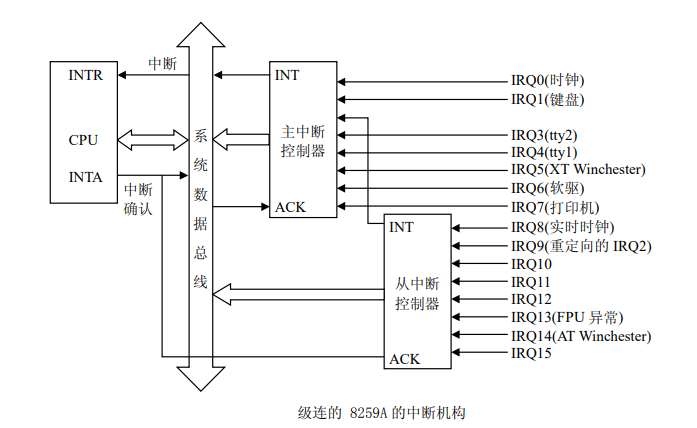
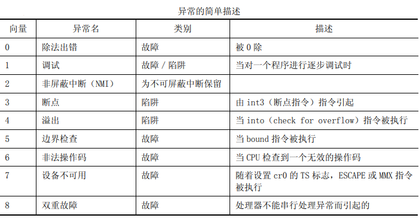
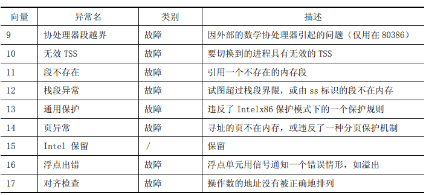
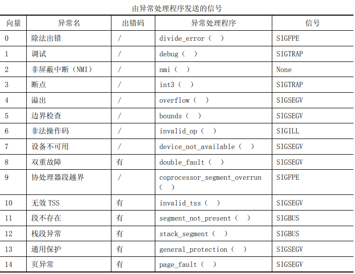
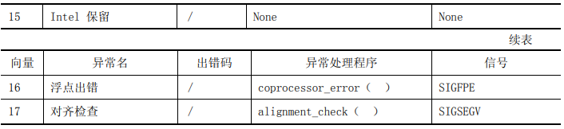
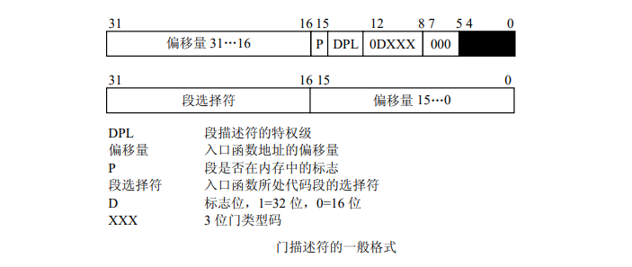
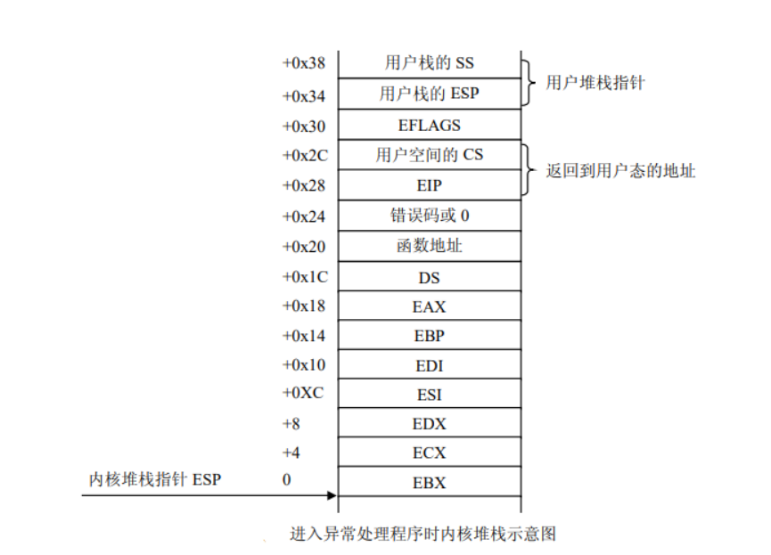
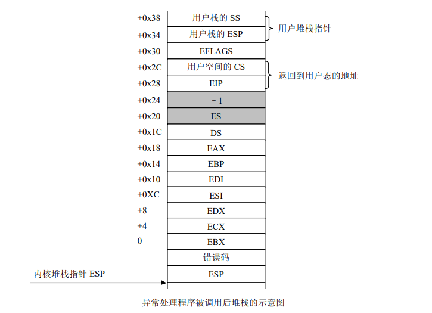

# 详解Linux中断机制

## 中断机制概述

中断控制是计算机发展中一种重要的技术。最初它是为克服对 I/O 接口控制采用程序查询所带来的处理器低效率而产生的。中断控制的主要优点是只有在 I/O 需要服务时才能得到处理器的响应，而不需要处理器不断地进行查询。

**由此，最初的中断全部是对外部设备而言 的，即称为外部中断(或硬件中断)。** 

##  中断基本知识 

###  中断向量 

 Intel x86 系列微机共支持 256 种向量中断，为使处理器较容易地识别每种中断源，将它们从 0～256 编号，即赋予一个中断类型码 n，Intel 把这个 8 位的无符号整数叫做一个向 量，因此，也叫中断向量。 

*有 256 种中断可分为两大类：异常和中断。异常又分为故障(Fault)和陷阱(Trap)，它们的共同特点是既不使用中断控制器，又不能被屏蔽。中断又分为外部可 屏蔽中断(INTR)和外部非屏蔽中断(NMI)，所有 I/O 设备产生的中断请求(IRQ)均引起屏 蔽中断，而紧急的事件(如硬件故障)引起的故障产生非屏蔽中断。* 

###  Linux 对 256 个向量的分配 

- 从 0~31 的向量对应于异常和非屏蔽中断。  
- 从 32~47 的向量(即由 I/O 设备引起的中断)分配给屏蔽中断。  
- 剩余的从 48~255 的向量用来标识软中断。Linux 只用了其中的一个(即 128 或 0x80 向量)用来实现系统调用。
- 当用户态下的进程执行一条 int 0x80 汇编指令时，CPU 就切换到 内核态，并开始执行 system_call（ ）内核函数。   

## 外设可屏蔽中断 

Intel x86 通过两片中断控制器 8259A 来响应 15 个外中断源，每个 8259A 可管理 8 个中 断源。第 1 级(称主片)的第 2 个中断请求输入端，与第 2 级 8259A(称从片)的中断输出 端 INT 相连。把与中断控制器相连的每条线叫做中断线，要使用中断线， 就得进行中断线的申请，就是 IRQ(Interrupt ReQuirement )，也常把申请一条中断线 称为申请一个 IRQ 或者是申请一个中断号。IRQ 线是从 0 开始顺序编号的，因此，第一条 IRQ 线通常表示成 IRQ0。IRQn 的缺省向量是 n+32；如前所述，IRQ 和向量之间的映射可以通过中断控制器端口来修改。 

 中断控制器 8259A 执行如下操作:

- 监视中断线，检查产生的中断请求(IRQ)信号。 

- 如果在中断线上产生了一个中断请求信号。  

  - 把接受到的 IRQ 信号转换成一个对应的向量。  
  - 把这个向量存放在中断控制器的一个 I/O 端口，从而允许 CPU 通过数据总线读此 向量。 

  - 把产生的信号发送到 CPU 的 INTR 引脚——即发出一个中断。  
  - 等待，直到 CPU 确认这个中断信号，然后把它写进可编程中断控制器(PIC)的 一个 I/O 端口；此时，清 INTR 线。  

##  异常及非屏蔽中断 

异常就是 CPU 内部出现的中断，也就是说，在 CPU 执行特定指令时出现的非法情况。非屏蔽中断就是计算机内部硬件出错时引起的异常情况。 

*Intel 把非屏蔽中断作为异常的一种来处理，因此，后面所提到的异常 也包括了非屏蔽中断。在 CPU 执行一个异常处理程序时，就不再为其他异常或可屏蔽中断请 求服务，也就是说，当某个异常被响应后，CPU 清除 eflag 的中 IF 位，禁止任何可屏蔽中断。 但如果又有异常产生，则由 CPU 锁存(CPU 具有缓冲异常的能力)，待这个异常处理完后，才响应被锁存的异常。* 

 **Pentium 模型中异常的向量、名字、类型及简单描述：** 

每个异常都由专门的异常处理程序来处理，它们通常把一个 UNIX 信号发送到引起异常的进程。 

##  中断描述符表 

在实地址模式中，CPU 把内存中从 0 开始的 1K 字节作为一个中断向量表。表中的每个表项占 4 个字节，由两个字节的段地址和两个字节的偏移量组成，这样构成的地址便是相应中断处理程序的入口地址。 

在实模式下，由 4 字节的表项构成的中断向量表显然满足不了要求。这是因为，c除了两个字节的段描述符，偏移量必用 4 字节来表示；d要有反映模 式切换的信息。因此，在实模式下，中断向量表中的表项由 8 个字节组成，中断向量表也改叫做中断描述符表 IDT(Interrupt Descriptor Table)。其中的每个表项叫 做一个门描述符(Gate Descriptor)，“门”的含义是当中断发生时必须先通过这些门，然后才能进入相应的处理程序。 

 其中类型占 3 位，表示门描述符的类型:

1.任务门(Task gate)

其类型码为 101，门中包含了一个进程的 TSS 段选择符，但偏移量部分没有使用，因为 TSS 本身是作为一个段来对待的，因此，任务门不包含某一个入口函数的地址。TSS 是 Intel 所提供 的任务切换机制，但是 Linux 并没有采用任务门来进行任务切换。 

2.中断门(Interrupt gate)

其类型码为 110，中断门包含了一个中断或异常处理程序所在段的选择符和段内偏移量。 当控制权通过中断门进入中断处理程序时，处理器清 IF 标志，即关中断，以避免嵌套中断的  

3.陷阱门(Trap gate) 

其类型码为 111，与中断门类似，其唯一的区别是，控制权通过陷阱门进入处理程序时维持 IF 标志位不变，也就是说，不关中断。 

4.系统门(System gate) 

Linux 内核特别设置的，用来让用户态的进程访问 Intel 的陷阱门，因此，门描述符的 DPL 为 3。通过系统门来激活 4 个 Linux 异常处理程序，它们的向量是 3、4、5 及 128， 也就是说，在用户态下，可以使用 int3、into、bound 及 int0x80 四条汇编指令。 

*在保护模式下，中断描述符表在内存的位置不再限于从地址 0 开始的地方，而是可以放在内存的任何地方。为此，CPU 中增设了一个中断描述符表寄存器 IDTR，用来存放中 断描述符表在内存的起始地址。中断描述符表寄存器 IDTR 是一个 48 位的寄存器，其低 16 位保存中断描述符表的大小，高 32 位保存 IDT 的基址。*

##  相关汇编指令 

1、调用过程指令 CALL  

指令格式：CALL 过程名  

*说明：i386 在取出 CALL 指令之后及执行 CALL 指令之前，使指令指针寄存器 EIP 指向紧 接 CALL 指令的下一条指令。CALL 指令先将 EIP 值压入栈内，再进行控制转移。当遇到 RET 指令时，栈内信息可使控制权直接回到 CALL 的下一条指令*。  

2、调用中断过程指令 INT  

指令格式：INT 中断向量 

*说明：EFLAG、CS 及 EIP 寄存器被压入栈内。控制权被转移到由中断向量指定的中断处 理程序。在中断处理程序结束时，IRET 指令又把控制权送回到刚才执行被中断的地方。* 

3、调用溢出处理程序的指令 INTO 

指令格式：INTO  

*说明：在溢出标志为 1 时，INTO 调用中断向量为 4 的异常处理程序。EFLAG、CS 及 EIP 寄存器被压入栈内。控制权被转移到由中断向量 4 指定的异常处理程序。在中断处理程序结束时，IRET 指令又把控制权送回到刚才执行被中断的地方。* 

4、中断返回指令 IRET 

指令格式：IRET  

*说明：IRET 与中断调用过程相反：它将 EIP、CS 及 EFLAGS 寄存器内容从栈中弹出，并 将控制权返回到发生中断的地方。IRET 用在中断处理程序的结束处。*  

5、加载中断描述符表的指令 LIDT 

 格式：LIDT 48 位的伪描述符  

*说明：LIDT 将指令中给定的 48 位伪描述符装入中断描述符寄存器 IDTR。伪描述符和中 断描述符表寄存器的结构相同，都是由两部分组成：在低字(低 16 位)中装的是界限，在高双字(高 32 位)中装的是基址。这条指令只能出现在操作系统的代码中。* 

**中断或异常处理程序执行的最后一条指令是返回指令 IRET。这条指令将使 CPU 进行如下 操作后，把控制权转交给被中断的进程。**

1.从中断处理程序的内核栈中恢复相应寄存器的值。如果一个硬件错码被压入堆栈，则先弹出这个值，然后，依次将 EIP、CS 及 EFLSG 从栈中弹出。 

2.检查中断或异常处理程序的 CPL 是否等于 CS 中的最低两位，如果是，这就意味着被中断的进程与中断处理程序都处于内核态，也就是没有更换堆栈，因此，IRET 终止执行，返回到被中断的进程。否则，转入下一步。 

3.从栈中装载 SS 和 ESP 寄存器，返回到用户态堆栈。  

4.检查 DS、ES、FS 和 GS 四个段寄存器的内容，看它们包含的选择符是否是一个段选择符，并且其 DPL 是否小于 CPL。 

##  中断描述符表的初始化 

Linux 内核在系统的初始化阶段要进行大量的初始化工作，其与中断相关的工作有：初始化可编程控制器 8259A；将中断向量 IDT 表的起始地址装入 IDTR 寄存器，并初始化表中的每一项。 

用户进程可以通过 INT 指令发出一个中断请求，其中断请求向量在 0～255 之间。为了 防止用户使用 INT 指令模拟非法的中断和异常，必须对 IDT 表进行谨慎的初始化。其措施之一就是将中断门或陷阱门中的 DPL 域置为 0。如果用户进程确实发出了这样一个中断请求， CPU 会检查出其 CPL(3)与 DPL(0)有冲突，因此产生一个“通用保护”异常。 

## 外部中断向量的设置 

Linux 把向量 0～31 分配给异常和非屏蔽中断，而把 32～47 之间的 向量分配给可屏蔽中断，可屏蔽中断的向量是通过对中断控制器的编程来设置的。 

**4 个中断命令字(ICW)寄存器的功能:**

- ICW1：初始化命令字。  
- ICW2：中断向量寄存器，初始化时写入高 5 位作为中断向量的高五位，然后在中断  响应时由 8259 根据中断源(哪个管脚)自动填入形成完整的 8 位中断向量(或叫中断 类型号)。  •
- ICW3：8259 的级连命令字，用来区分主片和从片。  
- ICW4：指定中断嵌套方式、数据缓冲选择、中断结束方式和 CPU 类型。 

##  异常处理 

Linux 利用异常来达到两个截然不同的目的：  

- 向进程发送一个信号以通报一个反常情况
- 处理请求分页

内核对异常处理程序的调用有一个标准的结构，它由以下 3 部分组成： 

- 在内核栈中保存大多数寄存器的内容(由汇编语言实现)
- 调用 C 编写的异常处理函数
- 通过 ret_from_exception()函数从异常退出 

 **从用户进程进入异常处理程序时内核堆栈的变化示意图:** 

##  中断请求队列的初始化  

由于硬件的限制，很多外部设备不得不共享中断线，例如，一些 PC 配置可以把同一条中断线分配给网卡和图形卡。由此看来，让每个中断源都必须占用一条中断线是不现实的。 所以，仅用中断描述符表并不能提供中断产生的所有信息，内核必须对中断线给出进一步的 描述。

在 Linux 设计中，专门为每个中断请求 IRQ 设置了一个队列，这就是所说的中断请求队列。  

*注意，中断线、中断请求(IRQ)号及中断向量之间的关系为：中断线是中断请求的一 种物理描述，逻辑上对应一个中断请求号(或简称中断号)，第 n 个中断号(IRQn)的缺省中 断向量是 n+32。* 

##  中断请求队列的数据结构 

如前所述，在 256 个中断向量中，除了 32 个分配给异常外，还有 224 个作为中断向量。 对于每个 IRQ，Linux 都用一个 irq_desc_t 数据结构来描述，把它叫做 IRQ 描述符。 

**数据结构的各个域给予描述：**

1、status：描述 IRQ 中断线状态的一组标志（在 irq.h 中定义）,其具体含义及应用将在 do_IRQ() 函数中介绍。 

2、handler：指向 hw_interrupt_type 描述符，这个描述符是对中断控制器的描述。  

3、action：指向一个单向链表的指针，这个链表就是对中断服务例程进行描述的 irqaction 结构。   

4、depth：如果启用这条 IRQ 中断线，depth 则为 0，如果禁用这条 IRQ 中断线不止一次，则为一 个正数。每当调用一次 disable_irq()，该函数就对这个域的值加 1；如果 depth 等于 0， 该函数就禁用这条 IRQ 中断线。相反，每当调用 enable_irq()函数时，该函数就对这个域的值减 1；如果 depth 变为 0，该函数就启用这条 IRQ 中断线。 

