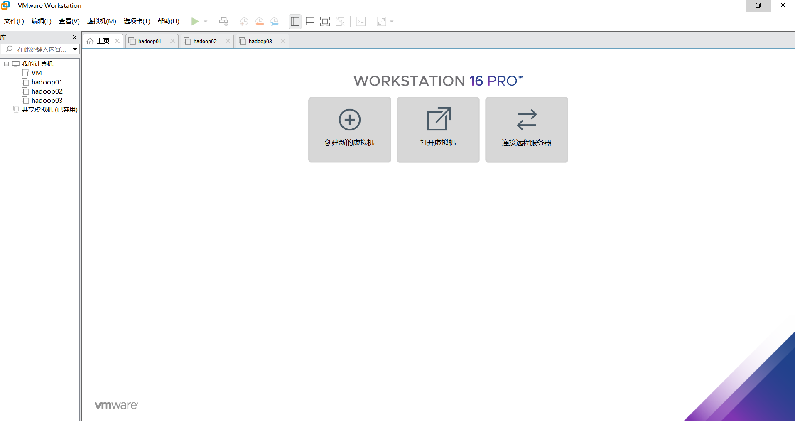

#  部署虚拟环境安装 Linux 系统 

## 👥准备工具 

|            *VM*             |            *CentOS7*             |
| :-------------------------: | :------------------------------: |
| VMware Wordkstation Pro(16) | CentOS-7-x86_64-Minimal-2009.iso |

*安装包已上传至百度网盘[点击下载链接](https://pan.baidu.com/s/1JQWAWRs8WoRqX77xq5Vk0w )*

*提取码：VMLM*

官网下载链接： 进入[VMware官网](https://www.vmware.com/cn.html)(地址：https://www.vmware.com/cn.html)，点击上方导航栏中的工作空间站，再点击图中标记的Workstation Pro，如下图所示： 


 *根据操作系统选择合适的产品，在这里以Windows系统为例，点击转至下载，如下图所示：* 


*选择WINDOWS版本，开始下载*


*开始下载VM软件*


## 🗜 安装配置 VM 虚拟机  

*VMware WorkStation 虚拟机软件是一款桌面计算机虚拟软件，让用户能够在单一主机 上同时运行多个不同的操作系统。每个虚拟操作系统的硬盘分区、数据配置都是独立的， 而且多台虚拟机可以构建为一个局域网。Linux 系统对硬件设备的要求很低，我们没有必 要再买一台电脑，课程实验用虚拟机完全可以搞定，而且 VM 还支持实时快照、虚拟网络、 拖曳文件以及 PXE（Preboot Execute Environment，预启动执行环境）网络安装等方便实 用的功能。* 

### 安装过程

1、运行下载完成的 Vmware Workstation 虚拟机软件包，将会看到如图所示的虚拟机程序安装向导初始界面(此处以上文准备工具为列)。 


2、 在虚拟机软件的安装向导界面单击“下一步”按钮 


3、 在最终用户许可协议界面选中“我接受许可协议中的条款”复选框，然后单击“下一步” 按钮 


4、选择虚拟机软件的安装位置（可选择默认位置），选中“增强型键盘驱动程序”复选框后 单击“下一步”按钮。 


5、根据自身情况适当选择“启动时检查产品更新”与“帮助完善 VMware Workstation Pro” 复选框，然后单击“下一步”按钮，如图所示。 


6、选中“桌面”和“开始菜单程序文件夹”复选框，然后单击“下一步”按钮，如图所示。  


7、点击开始安装


8、 一切准备就绪后，单击“安装”按钮 ，等待安装。 进入安装过程，此时要做的就是耐心等待虚拟机软件的安装过程结束 


9、输入许可证

**VM激活码**

```SQL
ZF3R0-FHED2-M80TY-8QYGC-NPKYF
YF390-0HF8P-M81RQ-2DXQE-M2UT6
ZF71R-DMX85-08DQY-8YMNC-PPHV8
```


10、完成安装


11、双击桌面上生成的虚拟机快捷图标，在弹出的如图的界面中，此时便看到了虚拟机软件的管理界面 



12、点击左上角·编辑·选择**虚拟网络编辑器**


13、在windows上配置vmnet8，点击控制面板 · 网络和Internet · 网络和共享中心 · 更改适配器


14、配置vmnet8，右键打开·选择属性，进入下一步配置


15、进入属性后，配置vmnet8


16、配置虚拟机虚拟网络设置


==注意==：可能出现子网IP和子网掩码不匹配的情况，解决方案为


## 🔑CentOS7参数配置

### 新建虚拟机

*注意，在安装完虚拟机之后，不能立即安装 Linux 系统，因为还要在虚拟机内设置操 1.2 安装配置 VM 虚拟机  7 作系统的硬件标准。只有把虚拟机内系统的硬件资源模拟出来后才可以正式步入 Linux系统安装之旅。VM 虚拟机的强大之处在于不仅可以调取真实的物理设备资源，还可以模拟出多网卡或硬盘等资源，因此完全可以满足对学习环境的需求* 。

1、单击“创建新的虚拟机”选项，并在弹出的“新建虚拟机向导”界面中选择“自定义”单选按钮，然后单击“下一步”按钮 


2、默认选择下一步


3、选择安装程序光盘映像，选中“稍后安装操作系统”单选按钮，然后单击“下一步”按钮 


4、 将客户机操作系统的类型选择为“Linux”，版本为“CentOS7 64 位”，然后单击“下一步”按钮。 


5、 填写“虚拟机名称”字段，并在选择安装位置之后单击“下一步”按钮 

6、处理器配置，完成①，②，选择下一步


7、配置虚拟机运行内存的大小，选择下一步


8、选择虚拟机网络连接类型，选择下一步


9、选择I/O控制器类型，默认即可，选择下一步


10、选择创建磁盘类型，默认即可，选择下一步


11、创建虚拟磁盘，默认即可，选择下一步


12、设置磁盘容量大小，选择下一步


13、设置磁盘容量存放位置，设置容量大小，选择下一步


14、完成虚拟机安装配置，点击完成


## 📖CentOS7安装教程

### 安装导向

*安装 RHEL 7 或 CentOS 7 系统时，电脑的 CPU 需要支持 VT（Virtualization  Technology，虚拟化技术）。所谓 VT，指的是让单台计算机能够分割出多个独立资源区，并让每个资源区按照需要模拟出系统的一项技术，其本质就是通过中间层实现计 算机资源的管理和再分配，让系统资源的利用率最大化。其实只要电脑不是五六年前买的，价格不低于三千元，它的 CPU 就肯定会支持 VT 的。如果开启虚拟机后依 然提示“CPU 不支持 VT 技术”等报错信息，请重启电脑并进入到 BIOS 中把 VT 虚拟 化功能开启即可。* 

1、上文对VM虚拟机软件进行了安装，配置好了CentOS7启动参数配置，新建的CentOS7虚拟机在左上方，接下来需要做一些前置工作，确定光盘文件是否连接上，双击选择。


2、选择开启虚拟机，进入安装界面


3、 在虚拟机管理界面中单击“开启此虚拟机”按钮后数秒就看到 CentOS7 系统安装界面， 如图所示。在界面中，Test this media & install CentOS 7.0 和 Troubleshooting 的作用分别是校验光盘完整性后再安装以及启动救援模式。此时通过键盘的方向键选择 Install CentOS 7.0 选项来直接安装Linux 系统。 双击进入屏幕，上箭头选择InStall CentOS 7，按一下enter


4、进入安装界面， 选择系统的安装语言后单击 Continue 按钮 


5、配置时区，选择DATE&TIME


6、选择键盘(Keybord)，输入为English


7、选择 INSTALLATION SOURCE，选择 Verify，然后点击Done，再点击左上方的Done


8、因为本教程为CentOS7的精简版，选择默认即可，如果镜像不是精简版，则需要自行选择安装。


9、为磁盘分区，选择INSTALL DESTINATION（Automation partioning selected）


①进行手动分区


②选择/biosboot


③选择/swap


④选择/var


⑤选择/boot


⑥选择/home


⑦选择/


10、选择NETWORK & HOST NAME，最后点击Done进行确认


11、点击Beign Installation，开始正式进行安装


12、安装过程中，设置root账号密码


**双击点击Done进行确认**

13、创建普通用户，并配置密码


14、结束配置后等待安装，最后reboot重启(出现点小意外，之前记得没有结束配置选择)


15、CentOS7精简版安装，完美结束，


