# 初探版本控制工具git

## 🍡什么是版本控制？

`版本控制`是一种记录一个或若干文件内容变化，以便将来查阅特定版本修订情况的系统。保存着软件源代码的文件作版本控制，但实际上，可以对任何类型的文件进行版本控制。 `采用版本控制系统`可以将选定的文件回溯到之前的状态，甚至将整个项目都回退到过去某个时间点的状态，可以比较文件的变化细节，查出最后是谁修改了哪个地方，从而找出导致怪异问题出现的原因，又是谁在何时报告了某个功能缺陷等等。 

使用版本控制系统通常还意味着，就算乱来一气把整个项目中的文件改的改删的删，也照样可以轻松恢复到原先的样子。 但额外增加的工作量却微乎其微。 

## 🍮本地版本控制系统

 Figure 1. 本地版本控制.

其中最流行的一种叫做 RCS，现今许多计算机系统上都还看得到它的踪影。 [RCS](https://www.gnu.org/software/rcs/) 的工作原理是在硬盘上保存补丁集(补丁是指文件修订前后的变化)；通过应用所有的补丁，可以重新计算出各个版本的文件内容。采用某种简单的数据库来记录文件的历次更新差异。 

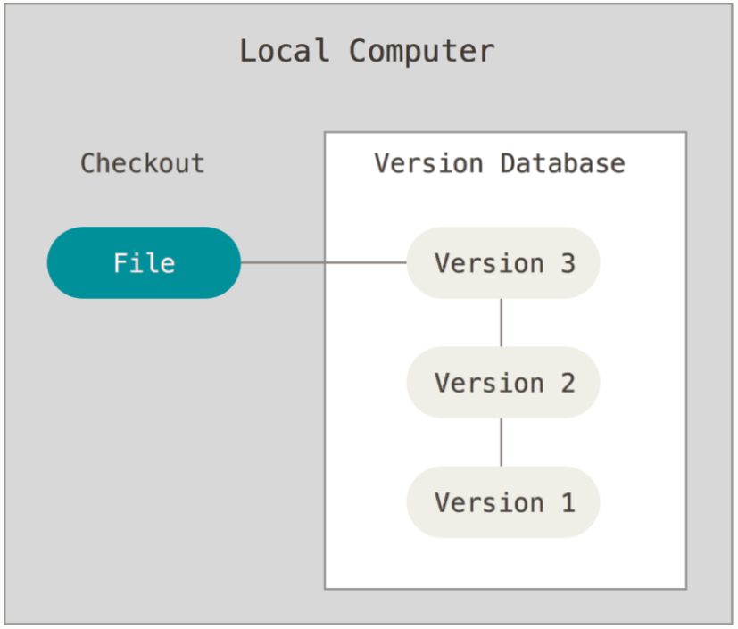

## 🥨集中化的版本控制系统

`集中化的版本控制系统`(Centralized Version Control Systems，简称 CVCS)应运而生。 这类系统，诸如 CVS、Subversion 以及 Perforce 等，都有一个单一的集中管理的服务器，保存所有文件的修订版本，而协同工作的人们都通过客户端连到这台服务器，取出最新的文件或者提交更新。

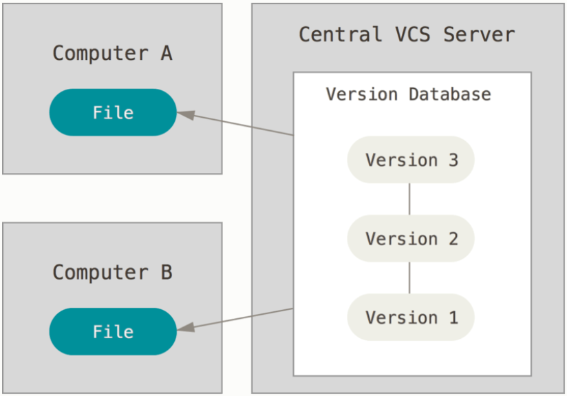

Figure 2. 集中化的版本控制.

这种做法带来了许多好处，特别是相较于老式的本地 VCS 来说。 现在，每个人都可以在一定程度上看到项目中的其他人正在做些什么。 而管理员也可以轻松掌控每个开发者的权限，并且管理一个 CVCS 要远比在各个客户端上维护本地数据库来得轻松容易。

*事分两面，有好有坏。 这么做最显而易见的缺点是中央服务器的单点故障。 如果宕机一小时，那么在这一小时内，谁都无法提交更新，也就无法协同工作。 如果中心数据库所在的磁盘发生损坏，又没有做恰当备份，毫无疑问你将丢失所有数据——包括项目的整个变更历史，只剩下人们在各自机器上保留的单独快照。* 

## 🍱分布式版本控制系统

分布式版本控制系统(Distributed Version Control System，简称 DVCS)面世了。 在这类系统中，像 Git、Mercurial、Bazaar 以及 Darcs 等，客户端并不只提取最新版本的文件快照， 而是把代码仓库完整地镜像下来，包括完整的历史记录。 这么一来，任何一处协同工作用的服务器发生故障，事后都可以用任何一个镜像出来的本地仓库恢复。 因为每一次的克隆操作，实际上都是一次对代码仓库的完整备份。 


Figure 3. 分布式版本控制.

更进一步，许多这类系统都可以指定和若干不同的远端代码仓库进行交互。籍此，就可以在同一个项目中，分别和不同工作小组的人相互协作。 可以根据需要设定不同的协作流程，比如层次模型式的工作流，而这在以前的集中式系统中是无法实现的。

## 🥓Git简史

Git 诞生于一个极富纷争大举创新的年代。

Linux 内核开源项目有着为数众多的参与者。 绝大多数的 Linux 内核维护工作都花在了提交补丁和保存归档的繁琐事务上(1991－2002年间)。 到 2002 年，整个项目组开始启用一个专有的分布式版本控制系统 BitKeeper 来管理和维护代码。

到了 2005 年，开发 BitKeeper 的商业公司同 Linux 内核开源社区的合作关系结束，他们收回了 Linux 内核社区免费使用 BitKeeper 的权力。 这就迫使 Linux 开源社区(特别是 Linux 的缔造者 Linus Torvalds)基于使用 BitKeeper 时的经验教训，开发出自己的版本系统。

### 优势

- 速度
- 简单的设计
- 对非线性开发模式的强力支持(允许成千上万个并行开发的分支)
- 完全分布式
- 有能力高效管理类似 Linux 内核一样的超大规模项目(速度和数据量)

自诞生于 2005 年以来，Git 日臻成熟完善，在高度易用的同时，仍然保留着初期设定的目标。 它的速度飞快，极其适合管理大项目，有着令人难以置信的非线性分支管理系统 

## 🍳Git是什么？

Git 和其它版本控制系统(包括 Subversion 和近似工具)的主要差别在于 Git 对待数据的方式。 从概念上来说，其它大部分系统以文件变更列表的方式存储信息，这类系统(CVS、Subversion、Perforce、Bazaar 等等)将它们存储的信息看作是一组基本文件和每个文件随时间逐步累积的差异(它们通常称作 **基于差异(delta-based)**的版本控制)，**直接记录快照，而非差异比较**。 


Figure 4. 存储每个文件与初始版本的差异.

Git 不按照以上方式对待或保存数据。反之，Git 更像是把数据看作是对小型文件系统的一系列快照。 在 Git 中，每当提交更新或保存项目状态时，它基本上就会对当时的全部文件创建一个快照并保存这个快照的索引。 为了效率，如果文件没有修改，Git 不再重新存储该文件，而是只保留一个链接指向之前存储的文件。 Git 对待数据更像是一个 **快照流**。


Figure 5. 存储项目随时间改变的快照.

这是 Git 与几乎所有其它版本控制系统的重要区别。 因此 Git 重新考虑了以前每一代版本控制系统延续下来的诸多方面。 Git 更像是一个小型的文件系统，提供了许多以此为基础构建的超强工具，而不只是一个简单的 VCS。 

**1、近乎所有操作都是本地执行**

举个例子，要浏览项目的历史，Git 不需外连到服务器去获取历史，然后再显示出来——它只需直接从本地数据库中读取。 能立即看到项目历史。如果想查看当前版本与一个月前的版本之间引入的修改， Git 会查找到一个月前的文件做一次本地的差异计算，而不是由远程服务器处理或从远程服务器拉回旧版本文件再来本地处理。 

**2、Git保证完整性**

Git 中所有的数据在存储前都计算校验和，然后以校验和来引用。 这意味着不可能在 Git 不知情时更改任何文件内容或目录内容。 这个功能建构在 Git 底层，是构成 Git 哲学不可或缺的部分。 

Git 用以计算校验和的机制叫做 SHA-1 散列(hash，哈希)。 这是一个由 40 个十六进制字符(0-9 和 a-f)组成的字符串，基于 Git 中文件的内容或目录结构计算出来。 SHA-1 哈希看起来是这样： 

```shell
# 实际上，Git 数据库中保存的信息都是以文件内容的哈希值来索引，而不是文件名。
24b9da6552252987aa493b52f8696cd6d3b00373
```

**3、Git一般只添加数据**

执行的 Git 操作，几乎只往 Git 数据库中 **添加** 数据。 很难使用 Git 从数据库中删除数据，也就是说 Git 几乎不会执行任何可能导致文件不可恢复的操作。 

### 三种状态

**1.已提交(committed)**

- 已修改表示修改了文件，但还没保存到数据库中。

**2.已修改(modified)** 

- 已暂存表示对一个已修改文件的当前版本做了标记，使之包含在下次提交的快照中。

**3.已暂存(staged)** 

- 已提交表示数据已经安全地保存在本地数据库中。

###  三个阶段

- **1.工作区**
  - 工作区是对项目的某个版本独立提取出来的内容。 这些从 Git 仓库的压缩数据库中提取出来的文件，放在磁盘上供使用或修改。 

- **2.暂存区**
  -  暂存区是一个文件，保存了下次将要提交的文件列表信息，一般在 Git 仓库目录中。 按照 Git 的术语叫做“索引”，不过一般说法还是叫“暂存区”。 

- **3.Git 目录** 
  - Git 仓库目录是 Git 用来保存项目的元数据和对象数据库的地方。 


###  基本的Git工作流程 

1. 在工作区中修改文件。
2. 将想要下次提交的更改选择性地暂存，这样只会将更改的部分添加到暂存区。
3. 提交更新，找到暂存区的文件，将快照永久性存储到 Git 目录。

**如果 Git 目录中保存着特定版本的文件，就属于 已提交 状态。 如果文件已修改并放入暂存区，就属于已暂存状态。 如果自上次检出后，作了修改但还没有放到暂存区域，就是已修改状态。**

## 🥚命令行

Git 有多种使用方式。 可以使用原生的命令行模式，也可以使用 GUI 模式，这些 GUI 软件也能提供多种功能。 

## 🥤安装git

### 在Linux上安装

在 Linux 上用二进制安装程序来安装基本的 Git 工具，可以使用发行版包含的基础软件包管理工具来安装。 

以 Fedora 为例，如果在使用它(或与之紧密相关的基于 RPM 的发行版，如 RHEL 或 CentOS)，可以使用 `dnf`： 

```shell
sudo dnf install git-all
```

在基于 Debian 的发行版上，如 Ubuntu，使用 `apt`： 

```shell
sudo apt install git-all
```

**查看版本**

```shell
git --version
```

### 在Windows上安装

 1）下载 git客户端安装包，下载地址为：[https://git-scm.com/download/win](https://links.jianshu.com/go?to=https%3A%2F%2Fgit-scm.com%2Fdownload%2Fwin) 

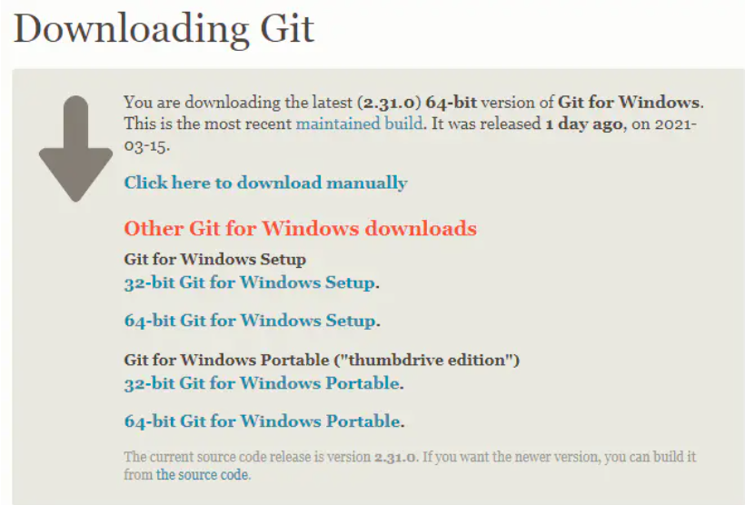2）运行安装包，打开 “使用许可声明”，点击 **Next**；

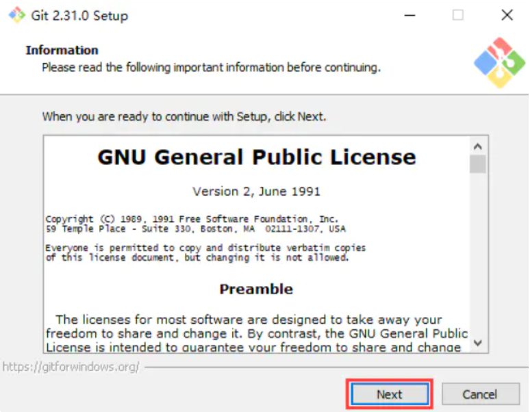3）选择安装路径，点击 **Next**；  

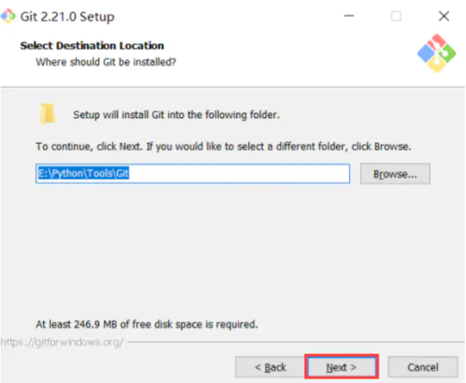

4）根据需要选择安装组件，点击 **Next**； 

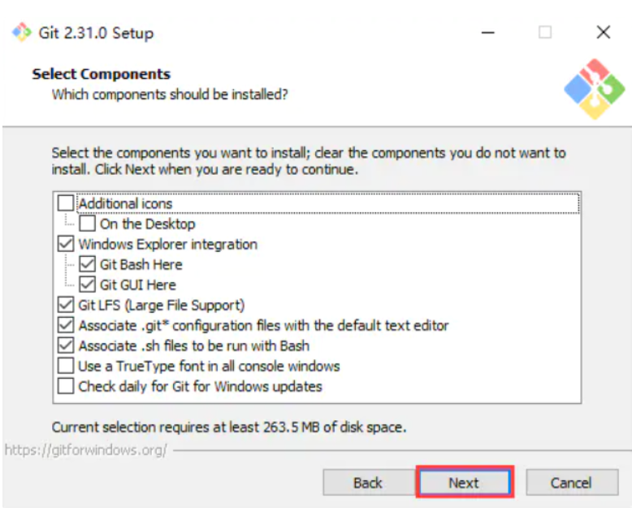

5）创建开始菜单的名称，点击 **Next**； 

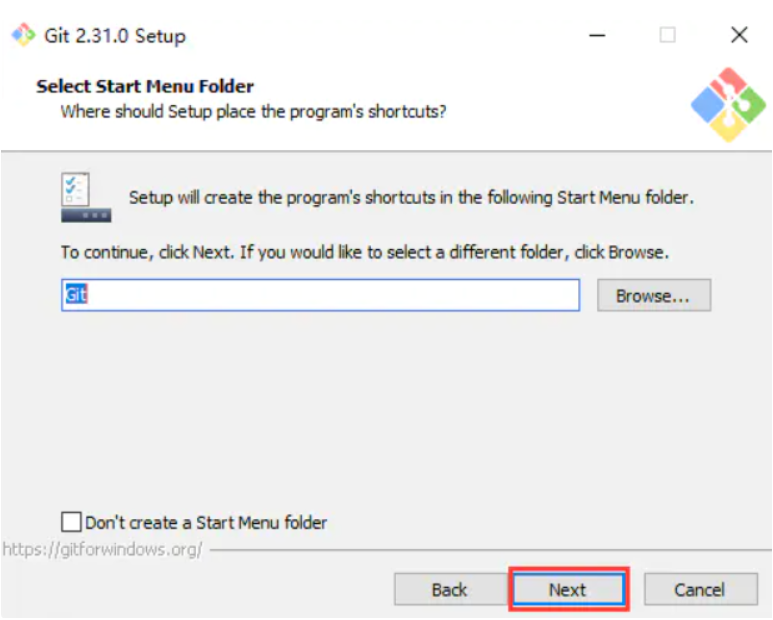


6）选择Git文件默认的编辑器，点击 **Next**； 

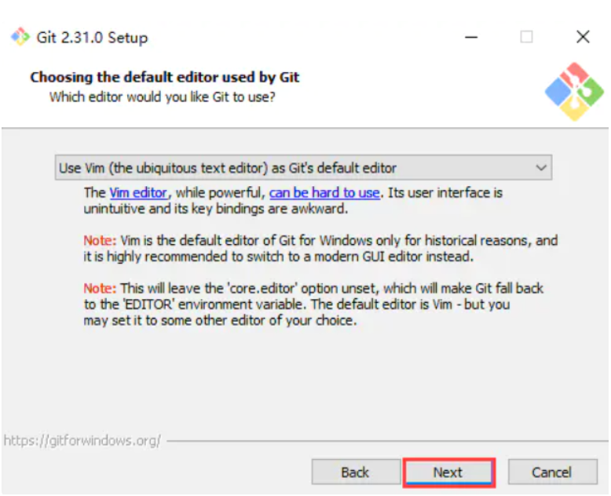

7）调整新存储库中初始分支的名称，如果需要修改，勾选第二项并输入分支名称；如果不需要修改，勾选第一项，点击 **Next**； 

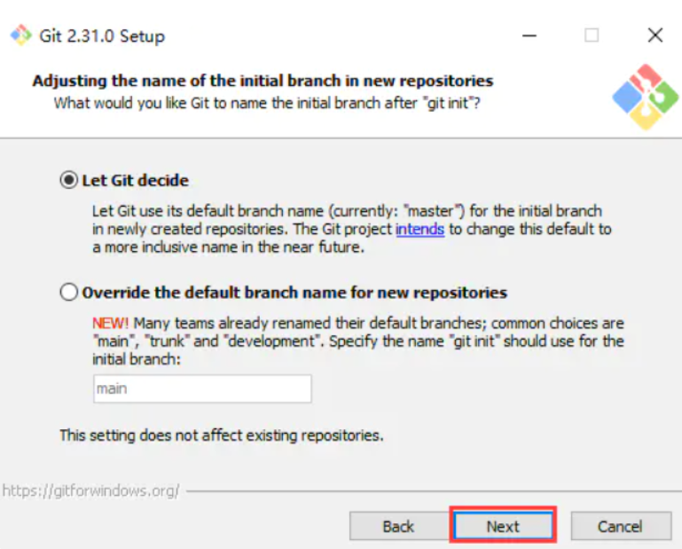8）选择路径环境（仅从Git Bash使用Git、从命令行以及第三方软件进行Git、从命令提示符使用Git和可选的Unix工具），点击 **Next**； 

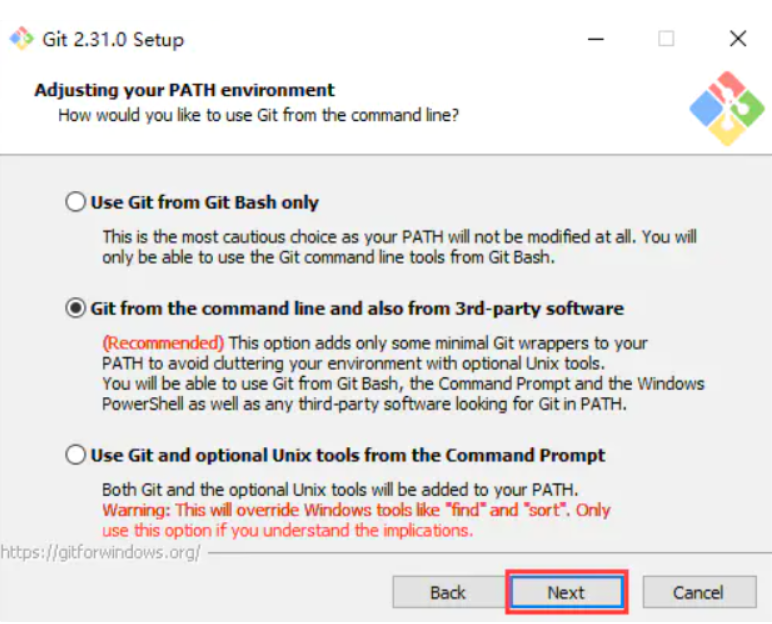

9）选择HTTPS后端传输（使用 OpenSSL 库、使用本地 Windows 安全通道库），点击 **Next**； 

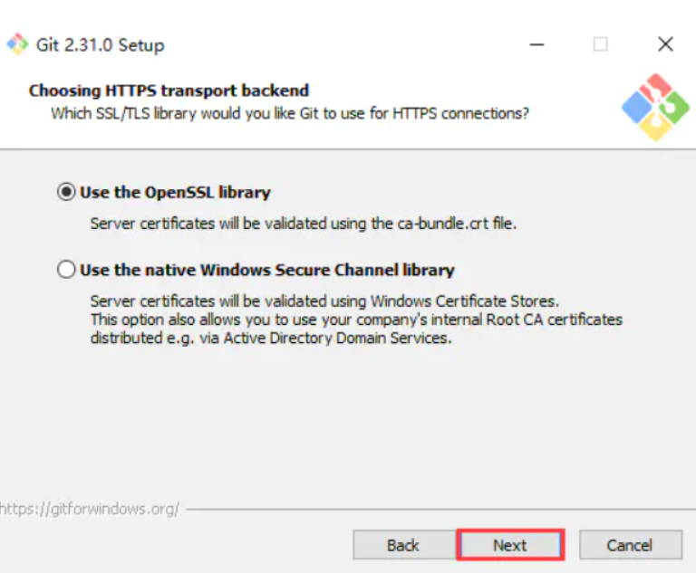

10）配置行尾符号转换(签出Windows风格，提交Unix风格的行尾、按原样签出，提交Unix样式的行尾、按原样签出，按原样提交)，点击 **Next**； 

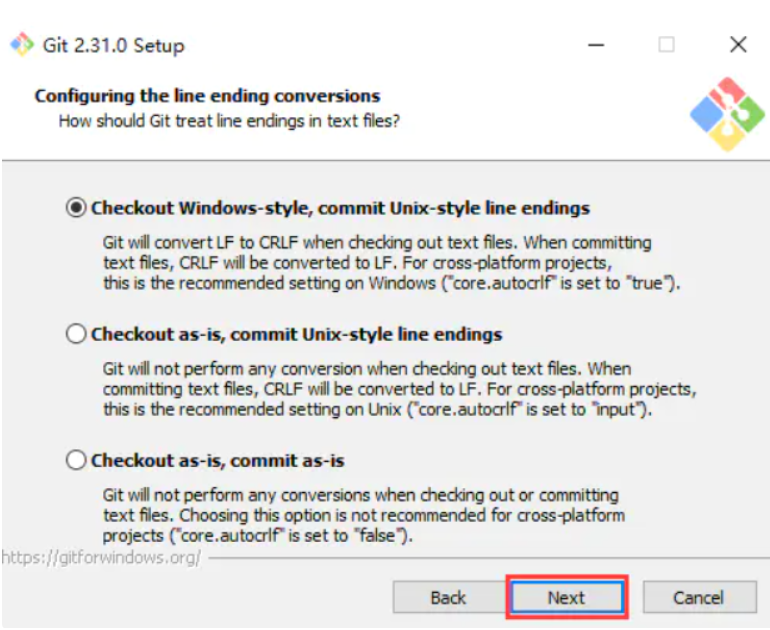

11）配置终端模拟器以与Git Bash一起使用(使用MinTTY（MSYS2的默认终端)、使用Windows的默认控制台窗口），点击 **Next**； 

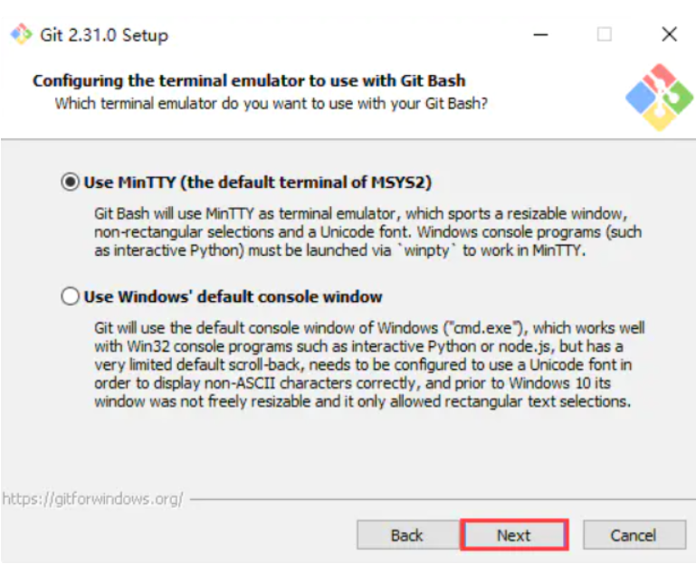

12）选择git推送的默认方式，点击 **Next**； 

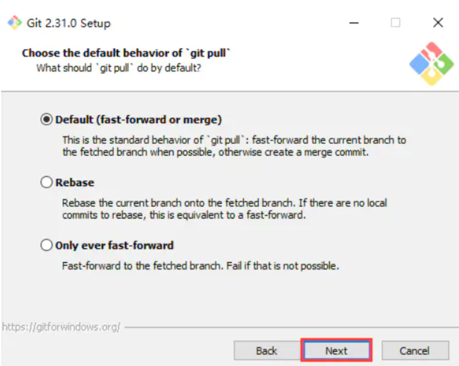

13）选择一个凭证存储模式，点击 **Next**； 

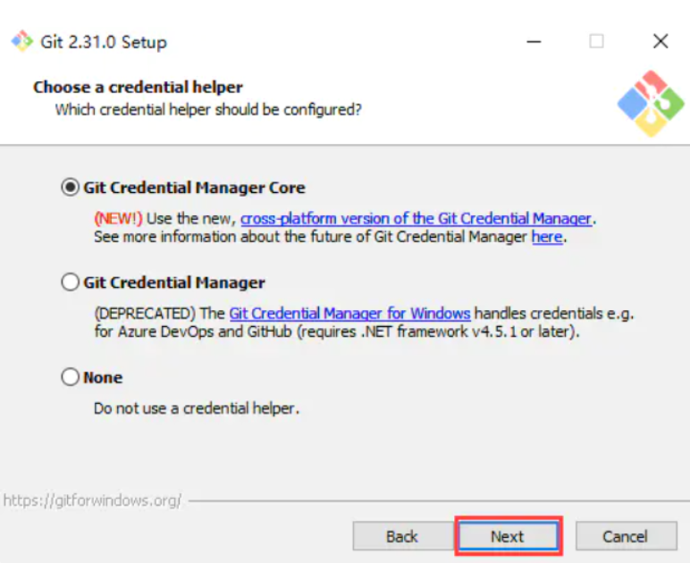

14）配置配置额外的选项(启用文件系统缓存、启用符号链接)，点击 **Next**； 

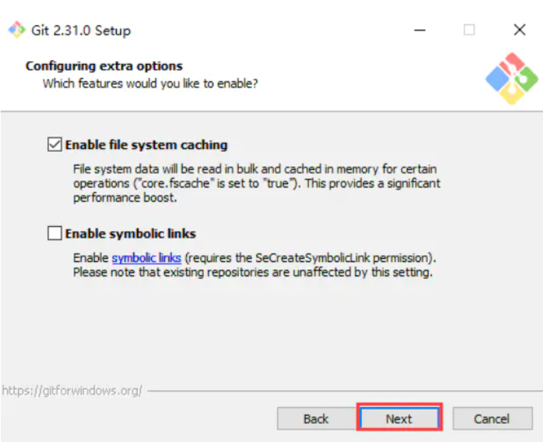

15）配置实验选项(启用实验性的内置添加 -i / -p)，点击 **Install**； 

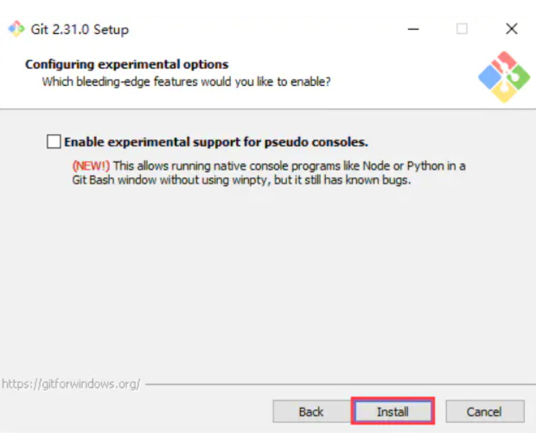

16）安装进度，等待安装； 

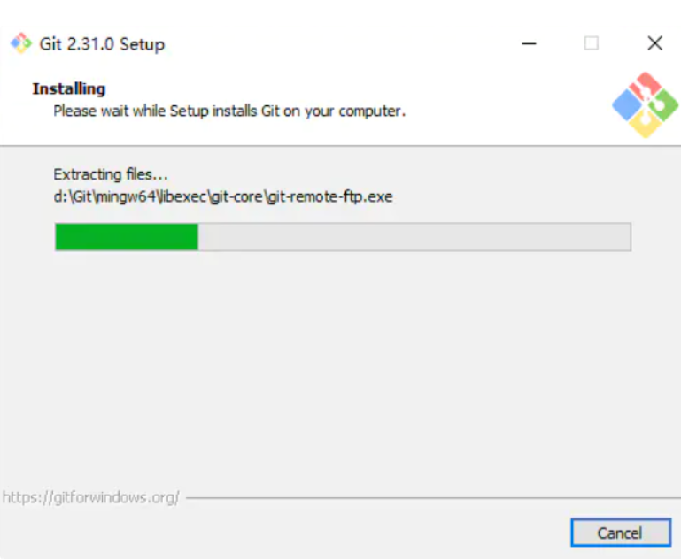

17）安装完成(启动Git Bash、查看发行说明)，点击 **Finish**； 

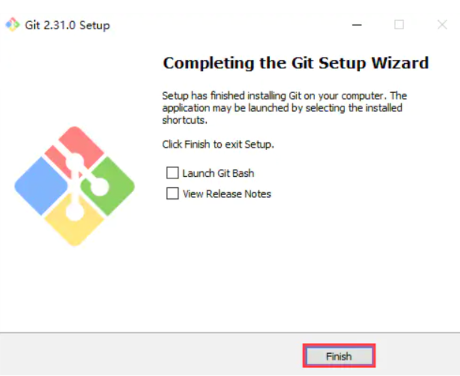

18）启动测试，运行`git-bash`，打开git控制台。 

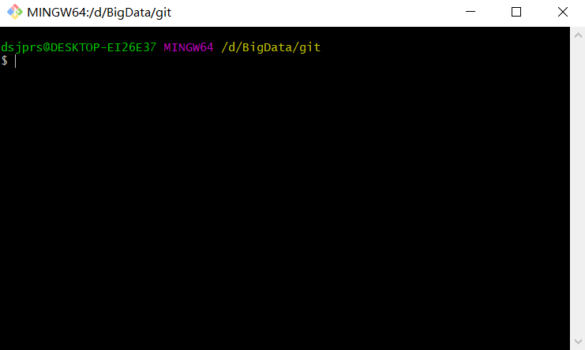

### 从源代码安装

想从源码安装 Git，需要安装 Git 依赖的库：autotools、curl、zlib、openssl、expat 和 libiconv。 如果系统上有 `dnf` (如 Fedora）或者 `apt`(如基于 Debian 的系统)， 可以使用对应的命令来安装最少的依赖以便编译并安装 Git 的二进制版： 

```shell
 sudo dnf install dh-autoreconf curl-devel expat-devel gettext-devel \
 openssl-devel perl-devel zlib-devel
  
 sudo apt-get install dh-autoreconf libcurl4-gnutls-dev libexpat1-dev \
 gettext libz-dev libssl-dev
```

为了添加文档的多种格式(doc、html、info)，需要以下附加的依赖： 

```shell
sudo dnf install asciidoc xmlto docbook2X
sudo apt-get install asciidoc xmlto docbook2x
```

如果使用基于 Debian 的发行版（Debian/Ubuntu/Ubuntu-derivatives），也需要 `install-info` 包： 

```shell
sudo apt-get install install-info
```

如果使用基于 RPM 的发行版(Fedora/RHEL/RHEL衍生版)，还需要 `getopt` 包(它已经在基于 Debian 的发行版中预装了)： 

```shell
 sudo dnf install getopt
```

此外，如果使用 Fedora/RHEL/RHEL衍生版，那么需要执行以下命令： 

```shell
# 以此来解决二进制文件名的不同
sudo ln -s /usr/bin/db2x_docbook2texi /usr/bin/docbook2x-texi
```

*当安装好所有的必要依赖，可以继续从几个地方来取得最新发布版本的 tar 包。 可以从 Kernel.org 网站获取，网址为 https://www.kernel.org/pub/software/scm/git， 或从 GitHub 网站上的镜像来获得，网址为 https://github.com/git/git/releases。 通常在 GitHub 上的是最新版本，但 kernel.org 上包含有文件下载签名，如果想验证下载正确性的话会用到。* 

接着，编译并安装： 

```shell
tar -zxf git-2.8.0.tar.gz

cd git-2.8.0

make configure

./configure --prefix=/usr

make all doc info

sudo make install install-doc install-html install-info
```

完成后，可以使用 Git 来获取 Git 的更新： 

```shell
git clone git://git.kernel.org/pub/scm/git/git.git
```

## 🍽初次运行git的配置

Git 自带一个 `git config` 的工具来帮助设置控制 Git 外观和行为的配置变量。 这些变量存储在三个不同的位置： 

1、`/etc/gitconfig` 文件: 包含系统上每一个用户及他们仓库的通用配置。 如果在执行 `git config` 时带上 `--system` 选项，那么它就会读写该文件中的配置变量。(由于它是系统配置文件，因此你需要管理员或超级用户权限来修改它)

2、`~/.gitconfig` 或 `~/.config/git/config` 文件：只针对当前用户。 可以传递 `--global` 选项让 Git 读写此文件，这会对系统上 **所有** 的仓库生效。

3、当前使用仓库的 Git 目录中的 `config` 文件(即 `.git/config`)：针对该仓库。 你可以传递 `--local` 选项让 Git 强制读写此文件，虽然默认情况下用的就是它(当然，需要进入某个 Git 仓库中才能让该选项生效)。

**每一个级别会覆盖上一级别的配置，所以 `.git/config` 的配置变量会覆盖 `/etc/gitconfig` 中的配置变量**

**通过以下命令查看所有的配置以及它们所在的文件 **

```shell
git config --list --show-origin
```

### 用户信息

安装完 Git 之后，要做的第一件事就是设置用户名和邮件地址。 

```shell
git config --global user.name "dsjprs"
git config --global user.email dsjprs@eamil.com
```

*如果使用了 `--global` 选项，那么该命令只需要运行一次，因为之后无论在该系统上做任何事情， Git 都会使用那些信息。* 

### 检查配置信息

可以使用 `git config --list` 命令来列出所有 Git 当时能找到的配置 

```shell
git config --list
user.name="dsjprs"
user.email=dsjprs@eamil.com
color.status=auto
color.branch=auto
color.interactive=auto
color.diff=auto
...
```

可能会看到重复的变量名，因为 Git 会从不同的文件中读取同一个配置(例如：`/etc/gitconfig` 与 `~/.gitconfig`)。 这种情况下，Git 会使用它找到的每一个变量的最后一个配置: 

通过输入 `git config `： 来检查 Git 的某一项配置 

```shell
git config user.name
dsjprs
```

### 获取帮助

使用 Git 时需要获取帮助，有三种等价的方法可以找到使用说明

```shell
git help <verb>
git <verb> --help
man git-<verb>
```

例如，要想获得 `git config` 命令的手册 

```shell
git help config
```

此外，如果不需要全面的手册，只需要可用选项的快速参考，那么可以用 `-h` 选项获得更简明的 “help” 输出： 

```shell
$ git add -h
usage: git add [<options>] [--] <pathspec>...

    -n, --dry-run         dry run
    -v, --verbose         be verbose

    -i, --interactive     interactive picking
    -p, --patch           select hunks interactively
    -e, --edit            edit current diff and apply
    -f, --force           allow adding otherwise ignored files
    -u, --update          update tracked files
    --renormalize         renormalize EOL of tracked files (implies -u)
    -N, --intent-to-add   record only the fact that the path will be added later
    -A, --all             add changes from all tracked and untracked files
    --ignore-removal      ignore paths removed in the working tree (same as --no-all)
    --refresh             don't add, only refresh the index
    --ignore-errors       just skip files which cannot be added because of errors
    --ignore-missing      check if - even missing - files are ignored in dry run
    --chmod (+|-)x        override the executable bit of the listed files
```

### 获取git仓库

通常有两种获取 Git 项目仓库的方式：

- 将尚未进行版本控制的本地目录转换为 Git 仓库

- 从其它服务器 **克隆** 一个已存在的 Git 仓库

**两种方式都会在本地机器上得到一个工作就绪的 Git 仓库**

### 在已存在目录中初始化仓库

首先需要进入该项目目录中，执行命令：

在 Linux 上：

```shell
cd /home/user/my_project
```

在 Windows 上：

```shell
cd /c/user/my_project
```

执行：

```shell
git init
```

*该命令将创建一个名为 `.git` 的子目录，这个子目录含有初始化的 Git 仓库中所有的必须文件，这些文件是 Git 仓库的骨干。 但是，在这个时候，仅仅是做了一个初始化的操作，项目里的文件还没有被跟踪。* 

如果在一个已存在文件的文件夹(而非空文件夹)中进行版本控制，应该开始追踪这些文件并进行初始提交。 可以通过 `git add` 命令来指定所需的文件来进行追踪，然后执行 `git commit` ： 

```shell
# 暂存当前目录下所有以.c结尾的文件
git add *.c 
git add LICENSE

# 提交文件
git commit -m 'initial project version'
```

### 克隆现有的仓库

克隆仓库的命令是 `git clone ` 。 比如，要克隆 Git 的链接库 `libgit2`，可以用下面的命令： 

```shell
# git clone <仓库地址>
git clone https://github.com/libgit2/libgit2
```

如果想在克隆远程仓库的时候，自定义本地仓库的名字，可以通过额外的参数指定新的目录名： 

```shell
 # 这会执行与上一条命令相同的操作，但目标目录名变为了 mylibgit。
 git clone https://github.com/libgit2/libgit2 mylibgit
```

### 记录每次更新到仓库

 一个 **真实项目** 的 Git 仓库，并从这个仓库中检出了所有文件的 **工作副本**。 工作目录下的每一个文件都不外乎这两种状态：**已跟踪** 或 **未跟踪**。 已跟踪的文件是指那些被纳入了版本控制的文件，在上一次快照中有它们的记录，在工作一段时间后， 它们的状态可能是未修改，已修改或已放入暂存区。简而言之，已跟踪的文件就是 Git 已经知道的文件。 

*工作目录中除已跟踪文件外的其它所有文件都属于未跟踪文件，它们既不存在于上次快照的记录中，也没有被放入暂存区。* 

**编辑过某些文件之后，由于自上次提交后对它们做了修改，Git 将它们标记为已修改文件。 在工作时，可以选择性地将这些修改过的文件放入暂存区，然后提交所有已暂存的修改，如此反复。 Figure 8. 文件的状态变化周期  **


### 检查当前文件状态

可以用 `git status` 命令查看哪些文件处于什么状态。 

```shell
git status
On branch master
Your branch is up-to-date with 'origin/master'.
nothing to commit, working directory clean
```

*这说明现在的工作目录相当干净。换句话说，所有已跟踪文件在上次提交后都未被更改过。 此外，上面的信息还表明，当前目录下没有出现任何处于未跟踪状态的新文件，否则 Git 会在这里列出来。* 

在项目下创建一个新的 `README` 文件。 如果之前并不存在这个文件，使用 `git status` 命令，将看到一个新的未跟踪文件： 

```shell
echo 'My Project' > README
git status
On branch master
Your branch is up-to-date with 'origin/master'.
Untracked files:
  (use "git add <file>..." to include in what will be committed)

    README

nothing added to commit but untracked files present (use "git add" to track)
```

*在状态报告中可以看到新建的 `README` 文件出现在 `Untracked files` 下面。 未跟踪的文件意味着 Git 在之前的快照(提交)中没有这些文件；Git 不会自动将之纳入跟踪范围，除非明明白白地告诉它“我需要跟踪该文件”。* 

### 跟踪新文件

使用命令 `git add` 开始跟踪一个文件。

```shell
git add README
```

此时再运行 `git status` 命令，会看到 `README` 文件已被跟踪，并处于暂存状态：

```shell
git status
On branch master
Your branch is up-to-date with 'origin/master'.
Changes to be committed:
  (use "git restore --staged <file>..." to unstage)

    new file:   README
```

*只要在 `Changes to be committed` 这行下面的，就说明是已暂存状态。 如果此时提交，那么该文件在运行 `git add` 时的版本将被留存在后续的历史记录中。* 

### 暂存已修改的文件

修改一个已被跟踪的文件。 如果修改了一个名为 `CONTRIBUTING.md` 的已被跟踪的文件，然后运行 `git status` 命令，会看到下面内容： 

```shell
git status
On branch master
Your branch is up-to-date with 'origin/master'.
Changes to be committed:
  (use "git reset HEAD <file>..." to unstage)

    new file:   README

Changes not staged for commit:
  (use "git add <file>..." to update what will be committed)
  (use "git checkout -- <file>..." to discard changes in working directory)

    modified:   CONTRIBUTING.md
```

*文件 `CONTRIBUTING.md` 出现在 `Changes not staged for commit` 这行下面，说明已跟踪文件的内容发生了变化，但还没有放到暂存区。* 

运行 `git add` 将“CONTRIBUTING.md”放到暂存区，然后再看看 `git status` 的输出： 

```shell
git add CONTRIBUTING.md
git status
On branch master
Your branch is up-to-date with 'origin/master'.
Changes to be committed:
  (use "git reset HEAD <file>..." to unstage)

    new file:   README
    modified:   CONTRIBUTING.md
```

现在两个文件都已暂存，下次提交时就会一并记录到仓库。 假设此时，想要在 `CONTRIBUTING.md` 里再加条注释。 重新编辑存盘后，准备好提交。 

### 状态简览

`git status` 命令的输出十分详细，但其用语有些繁琐。 

```shell
$ git status -s
 M README
MM Rakefile
A  lib/git.rb
M  lib/simplegit.rb
?? LICENSE.txt
```

*新添加的未跟踪文件前面有 `??` 标记，新添加到暂存区中的文件前面有 `A` 标记，修改过的文件前面有 `M` 标记。 输出中有两栏，左栏指明了暂存区的状态，右栏指明了工作区的状态。* 

### 忽略文件

有些文件无需纳入 Git 的管理，也不希望它们总出现在未跟踪文件列表。 

```shell
cat .gitignore
*.[oa]
*~
```

*第一行告诉 Git 忽略所有以 `.o` 或 `.a` 结尾的文件。一般这类对象文件和存档文件都是编译过程中出现的。 第二行告诉 Git 忽略所有名字以波浪符（~）结尾的文件，许多文本编辑软件(比如 Emacs)都用这样的文件名保存副本。* 

文件 `.gitignore` 的格式规范如下：

- 所有空行或者以 `#` 开头的行都会被 Git 忽略。
- 可以使用标准的 glob 模式匹配，它会递归地应用在整个工作区中。
- 匹配模式可以以（`/`）开头防止递归。
- 匹配模式可以以（`/`）结尾指定目录。
- 要忽略指定模式以外的文件或目录，可以在模式前加上叹号（`!`）取反。

所谓的 glob 模式是指 shell 所使用的简化了的正则表达式。 

1.星号（`*`）匹配零个或多个任意字符

2.`[abc]` 匹配任何一个列在方括号中的字符 (这个例子要么匹配一个 a，要么匹配一个 b，要么匹配一个 c)

3.问号（`?`）只匹配一个任意字符；如果在方括号中使用短划线分隔两个字符， 表示所有在这两个字符范围内的都可以匹配(比如 `[0-9]` 表示匹配所有 0 到 9 的数字) 

4.使用两个星号（`**`）表示匹配任意中间目录，比如 `a/**/z` 可以匹配 `a/z` 、 `a/b/z` 或 `a/b/c/z` 等。 

`.gitignore` 文件样例：

```shell
# 忽略所有的 .a 文件
*.a

# 但跟踪所有的 lib.a，即便你在前面忽略了 .a 文件
!lib.a

# 只忽略当前目录下的 TODO 文件，而不忽略 subdir/TODO
/TODO

# 忽略任何目录下名为 build 的文件夹
build/

# 忽略 doc/notes.txt，但不忽略 doc/server/arch.txt
doc/*.txt

# 忽略 doc/ 目录及其所有子目录下的 .pdf 文件
doc/**/*.pdf
```

### 查看已暂存和未暂存的修改

如果 `git status` 命令的输出对于来说过于简略，而想知道具体修改了什么地方，可以用 `git diff` 命令。 

假如再次修改 README 文件后暂存，然后编辑 `CONTRIBUTING.md` 文件后先不暂存， 运行 `status` 命令将会看到： 

```shell
git status
On branch master
Your branch is up-to-date with 'origin/master'.
Changes to be committed:
  (use "git reset HEAD <file>..." to unstage)

    modified:   README

Changes not staged for commit:
  (use "git add <file>..." to update what will be committed)
  (use "git checkout -- <file>..." to discard changes in working directory)

    modified:   CONTRIBUTING.md
```

查看尚未暂存的文件更新了哪些部分，不加参数直接输入 `git diff`： 

```shell
git diff
diff --git a/CONTRIBUTING.md b/CONTRIBUTING.md
index 8ebb991..643e24f 100644
--- a/CONTRIBUTING.md
+++ b/CONTRIBUTING.md
@@ -65,7 +65,8 @@ branch directly, things can get messy.
 Please include a nice description of your changes when you submit your PR;
 if we have to read the whole diff to figure out why you're contributing
 in the first place, you're less likely to get feedback and have your change
-merged in.
+merged in. Also, split your changes into comprehensive chunks if your patch is
+longer than a dozen lines.

 If you are starting to work on a particular area, feel free to submit a PR
 that highlights your work in progress (and note in the PR title that it's
```

*此命令比较的是工作目录中当前文件和暂存区域快照之间的差异。 也就是修改之后还没有暂存起来的变化内容。*

若要查看已暂存的将要添加到下次提交里的内容，可以用 `git diff --staged` 命令。 这条命令将比对已暂存文件与最后一次提交的文件差异：

```shell
git diff --staged
diff --git a/README b/README
new file mode 100644
index 0000000..03902a1
--- /dev/null
+++ b/README
@@ -0,0 +1 @@
+My Project
```

*git diff 本身只显示尚未暂存的改动，而不是自上次提交以来所做的所有改动。 所以有时候一下子暂存了所有更新过的文件，运行 `git diff` 后却什么也没有，就是这个原因。* 

```shell
git add CONTRIBUTING.md
echo '# test line' >> CONTRIBUTING.md
git status
On branch master
Your branch is up-to-date with 'origin/master'.
Changes to be committed:
  (use "git reset HEAD <file>..." to unstage)

    modified:   CONTRIBUTING.md

Changes not staged for commit:
  (use "git add <file>..." to update what will be committed)
  (use "git checkout -- <file>..." to discard changes in working directory)

    modified:   CONTRIBUTING.md
```

现在运行 `git diff` 看暂存前后的变化： 

```shell
git diff
diff --git a/CONTRIBUTING.md b/CONTRIBUTING.md
index 643e24f..87f08c8 100644
--- a/CONTRIBUTING.md
+++ b/CONTRIBUTING.md
@@ -119,3 +119,4 @@ at the
 ## Starter Projects

 See our [projects list](https://github.com/libgit2/libgit2/blob/development/PROJECTS.md).
+# test line
```

然后用 `git diff --cached` 查看已经暂存起来的变化(`--staged` 和 `--cached` 是同义词)： 

```shell
git diff --cached
diff --git a/CONTRIBUTING.md b/CONTRIBUTING.md
index 8ebb991..643e24f 100644
--- a/CONTRIBUTING.md
+++ b/CONTRIBUTING.md
@@ -65,7 +65,8 @@ branch directly, things can get messy.
 Please include a nice description of your changes when you submit your PR;
 if we have to read the whole diff to figure out why you're contributing
 in the first place, you're less likely to get feedback and have your change
-merged in.
+merged in. Also, split your changes into comprehensive chunks if your patch is
+longer than a dozen lines.

 If you are starting to work on a particular area, feel free to submit a PR
 that highlights your work in progress (and note in the PR title that it's
```

### 提交更新

现在的暂存区已经准备就绪，可以提交了。 在此之前，请务必确认还有什么已修改或新建的文件还没有 `git add` 过， 否则提交的时候不会记录这些尚未暂存的变化。

```shell
 git commit 
```

也可以在 `commit` 命令后添加 `-m` 选项，将提交信息与命令放在同一行，如下所示： 

```shell
# git commit -m "描述信息，第一次提交git"
git commit -m "Story 182: Fix benchmarks for speed"
[master 463dc4f] Story 182: Fix benchmarks for speed
 2 files changed, 2 insertions(+)
 create mode 100644 README
```

### 跳过使用暂存区域

尽管使用暂存区域的方式可以精心准备要提交的细节，但有时候这么做略显繁琐。 Git 提供了一个跳过使用暂存区域的方式， 只要在提交的时候，给 `git commit` 加上 `-a` 选项，Git 就会自动把所有已经跟踪过的文件暂存起来一并提交，从而跳过 `git add` 步骤： 

```shell
# 查看状态
git status
On branch master
Your branch is up-to-date with 'origin/master'.
Changes not staged for commit:
  (use "git add <file>..." to update what will be committed)
  (use "git checkout -- <file>..." to discard changes in working directory)

    modified:   CONTRIBUTING.md

no changes added to commit (use "git add" and/or "git commit -a")

# 提交
git commit -a -m 'added new benchmarks'
[master 83e38c7] added new benchmarks
 1 file changed, 5 insertions(+), 0 deletions(-)
```

### 移除文件

Git 中移除某个文件，就必须要从已跟踪文件清单中移除(确切地说，是从暂存区域移除)，然后提交。 可以用 `git rm` 命令完成此项工作，并连带从工作目录中删除指定的文件，这样以后就不会出现在未跟踪文件清单中。

运行 `git rm` 记录此次移除文件的操作 

```shell
git rm PROJECTS.md
rm 'PROJECTS.md'

git status
On branch master
Your branch is up-to-date with 'origin/master'.
Changes to be committed:
  (use "git reset HEAD <file>..." to unstage)

    deleted:    PROJECTS.md
```

*下一次提交时，该文件就不再纳入版本管理了。 如果要删除之前修改过或已经放到暂存区的文件，则必须使用强制删除选项 `-f`（译注：即 force 的首字母）。 这是一种安全特性，用于防止误删尚未添加到快照的数据，这样的数据不能被 Git 恢复。* 


另外一种情况是，把文件从 Git 仓库中删除(亦即从暂存区域移除)，但仍然希望保留在当前工作目录中。 换句话说，你想让文件保留在磁盘，但是并不想让 Git 继续跟踪。 当忘记添加 `.gitignore` 文件，不小心把一个很大的日志文件或一堆 `.a` 这样的编译生成文件添加到暂存区时，这一做法尤其有用。 为达到这一目的，使用 `--cached` 选项： 

```shell
git rm --cached README
```

`git rm` 命令后面可以列出文件或者目录的名字，也可以使用 `glob` 模式 

```shell
git rm log/\*.log
```

注意到星号 `*` 之前的反斜杠 `\`， 因为 Git 有它自己的文件模式扩展匹配方式，所以不用 shell 来帮忙展开。 此命令删除 `log/` 目录下扩展名为 `.log` 的所有文件。 

```shell
git rm \*~
```

*该命令会删除所有名字以 `~` 结尾的文件。* 

### 移动文件

不像其它的 VCS 系统，Git 并不显式跟踪文件移动操作。 如果在 Git 中重命名了某个文件，仓库中存储的元数据并不会体现出这是一次改名操作。  

**在 Git 中对文件改名** 

```shell
git mv file_from file_to
```

其实，运行 `git mv` 就相当于运行了下面三条命令： 

```shell
mv README.md README
git rm README.md
git add README
```

```shell
git mv README.md README
git status
On branch master
Your branch is up-to-date with 'origin/master'.
Changes to be committed:
  (use "git reset HEAD <file>..." to unstage)

    renamed:    README.md -> README
```

如此分开操作，Git 也会意识到这是一次重命名，所以不管何种方式结果都一样。 两者唯一的区别在于，`git mv` 是一条命令而非三条命令，直接使用 `git mv` 方便得多。 

*不过在使用其他工具重命名文件时，记得在提交前 `git rm` 删除旧文件名，再 `git add` 添加新文件名。* 


### 查看提交历史

在提交了若干更新，又或者克隆了某个项目之后，回顾下提交历史。 完成任务后想最简单而又有效的工具是 `git log` 命令。 

**`git log` 选项：**

- `-p` 
- `--patch` ，它会显示每次提交所引入的差异（按 **补丁** 的格式输出）。 

也可以限制显示的日志条目数量，例如使用 `-2` 选项来只显示最近的两次提交： 

```shell
git log -p -2
commit ca82a6dff817ec66f44342007202690a93763949
Author: Scott Chacon <schacon@gee-mail.com>
Date:   Mon Mar 17 21:52:11 2008 -0700

    changed the version number

diff --git a/Rakefile b/Rakefile
index a874b73..8f94139 100644
--- a/Rakefile
+++ b/Rakefile
@@ -5,7 +5,7 @@ require 'rake/gempackagetask'
 spec = Gem::Specification.new do |s|
     s.platform  =   Gem::Platform::RUBY
     s.name      =   "simplegit"
-    s.version   =   "0.1.0"
+    s.version   =   "0.1.1"
     s.author    =   "Scott Chacon"
     s.email     =   "schacon@gee-mail.com"
     s.summary   =   "A simple gem for using Git in Ruby code."

commit 085bb3bcb608e1e8451d4b2432f8ecbe6306e7e7
Author: Scott Chacon <schacon@gee-mail.com>
Date:   Sat Mar 15 16:40:33 2008 -0700

    removed unnecessary test

diff --git a/lib/simplegit.rb b/lib/simplegit.rb
index a0a60ae..47c6340 100644
--- a/lib/simplegit.rb
+++ b/lib/simplegit.rb
@@ -18,8 +18,3 @@ class SimpleGit
     end

 end
-
-if $0 == __FILE__
-  git = SimpleGit.new
-  puts git.show
-end
```

每次提交的简略统计信息，可以使用 `--stat` 选项 

```shell
git log --stat
commit ca82a6dff817ec66f44342007202690a93763949
Author: Scott Chacon <schacon@gee-mail.com>
Date:   Mon Mar 17 21:52:11 2008 -0700

    changed the version number

 Rakefile | 2 +-
 1 file changed, 1 insertion(+), 1 deletion(-)

commit 085bb3bcb608e1e8451d4b2432f8ecbe6306e7e7
Author: Scott Chacon <schacon@gee-mail.com>
Date:   Sat Mar 15 16:40:33 2008 -0700

    removed unnecessary test

 lib/simplegit.rb | 5 -----
 1 file changed, 5 deletions(-)

commit a11bef06a3f659402fe7563abf99ad00de2209e6
Author: Scott Chacon <schacon@gee-mail.com>
Date:   Sat Mar 15 10:31:28 2008 -0700

    first commit

 README           |  6 ++++++
 Rakefile         | 23 +++++++++++++++++++++++
 lib/simplegit.rb | 25 +++++++++++++++++++++++++
 3 files changed, 54 insertions(+)
```

 `--pretty`。 这个选项可以使用不同于默认格式的方式展示提交历史。 这个选项有一些内建的子选项供你使用。 比如 `oneline` 会将每个提交放在一行显示，在浏览大量的提交时非常有用。 另外还有 `short`，`full` 和 `fuller` 选项， 

```shell
git log --pretty=oneline
```

*最有意思的是 `format` ，可以定制记录的显示格式。* 

```shell
git log --pretty=format:"%h - %an, %ar : %s"
ca82a6d - Scott Chacon, 6 years ago : changed the version number
085bb3b - Scott Chacon, 6 years ago : removed unnecessary test
a11bef0 - Scott Chacon, 6 years ago : first commit
```

 **`git log --pretty=format` 常用的选项**

| 选项  |                     说明                      |
| :---: | :-------------------------------------------: |
| `%H`  |               提交的完整哈希值                |
| `%h`  |               提交的简写哈希值                |
| `%T`  |                树的完整哈希值                 |
| `%t`  |                树的简写哈希值                 |
| `%P`  |              父提交的完整哈希值               |
| `%p`  |              父提交的简写哈希值               |
| `%an` |                   作者名字                    |
| `%ae` |              作者的电子邮件地址               |
| `%ad` | 作者修订日期（可以用 --date=选项 来定制格式） |
| `%ar` |      作者修订日期，按多久以前的方式显示       |
| `%cn` |                 提交者的名字                  |
| `%ce` |             提交者的电子邮件地址              |
| `%cd` |                   提交日期                    |
| `%cr` |           提交日期（距今多长时间）            |
| `%s`  |                   提交说明                    |

当 `oneline` 或 `format` 与另一个 `log` 选项 `--graph` 结合使用时尤其有用。 这个选项添加了一些 ASCII 字符串来形象地展示分支、合并历史： 

```shell
git log --pretty=format:"%h %s" --graph
* 2d3acf9 ignore errors from SIGCHLD on trap
*  5e3ee11 Merge branch 'master' of git://github.com/dustin/grit
|\
| * 420eac9 Added a method for getting the current branch.
* | 30e367c timeout code and tests
* | 5a09431 add timeout protection to grit
* | e1193f8 support for heads with slashes in them
|/
* d6016bc require time for xmlschema
*  11d191e Merge branch 'defunkt' into local
```

**`git log` 的常用选项**

|       选项        |                             说明                             |
| :---------------: | :----------------------------------------------------------: |
|       `-p`        |              按补丁格式显示每个提交引入的差异。              |
|     `--stat`      |               显示每次提交的文件修改统计信息。               |
|   `--shortstat`   |         只显示 --stat 中最后的行数修改添加移除统计。         |
|   `--name-only`   |             仅在提交信息后显示已修改的文件清单。             |
|  `--name-status`  |               显示新增、修改、删除的文件清单。               |
| `--abbrev-commit` |      仅显示 SHA-1 校验和所有 40 个字符中的前几个字符。       |
| `--relative-date` | 使用较短的相对时间而不是完整格式显示日期（比如“2 weeks ago”）。 |
|     `--graph`     |          在日志旁以 ASCII 图形显示分支与合并历史。           |
|    `--pretty`     | 使用其他格式显示历史提交信息。可用的选项包括 oneline、short、full、fuller 和 format（用来定义自己的格式）。 |
|    `--oneline`    |       `--pretty=oneline --abbrev-commit` 合用的简写。        |

### 限制输出长度

除了定制输出格式的选项之外，`git log` 还有许多非常实用的限制输出长度的选项，也就是只输出一部分的提交。 使用类似 `-` 的选项，其中的 `n` 可以是任何整数，表示仅显示最近的 `n` 条提交。 

类似 `--since` 和 `--until` 这种按照时间作限制的选项很有用。 例如，下面的命令会列出最近两周的所有提交： 

```shell
git log --since=2.weeks
```

*该命令可用的格式十分丰富——可以是类似 `"2008-01-15"` 的具体的某一天，也可以是类似 `"2 years 1 day 3 minutes ago"` 的相对日期。* 

过滤器是 `-S`（俗称“pickaxe”选项，取“用鹤嘴锄在土里捡石头”之意）， 它接受一个字符串参数，并且只会显示那些添加或删除了该字符串的提交。 

```shell
git log -S function_name
```

最后一个很实用的 `git log` 选项是路径（path）， 如果只关心某些文件或者目录的历史提交，可以在 git log 选项的最后指定它们的路径。 因为是放在最后位置上的选项，所以用两个短划线（--）隔开之前的选项和后面限定的路径名。

限制 `git log` 输出常用的选项

|         选项          |                    说明                    |
| :-------------------: | :----------------------------------------: |
|          `-`          |          仅显示最近的 n 条提交。           |
| `--since`, `--after`  |         仅显示指定时间之后的提交。         |
| `--until`, `--before` |         仅显示指定时间之前的提交。         |
|      `--author`       |      仅显示作者匹配指定字符串的提交。      |
|     `--committer`     |     仅显示提交者匹配指定字符串的提交。     |
|       `--grep`        |   仅显示提交说明中包含指定字符串的提交。   |
|         `-S`          | 仅显示添加或删除内容匹配指定字符串的提交。 |

### 撤消操作

在任何一个阶段，都有可能想要撤消某些操作。 注意，有些撤消操作是不可逆的。 

### 取消暂存的文件

```shell
git add *
git status
On branch master
Changes to be committed:
  (use "git reset HEAD <file>..." to unstage)

    renamed:    README.md -> README
    modified:   CONTRIBUTING.md
```

*在 “Changes to be committed” 文字正下方，提示使用 `git reset HEAD ...` 来取消暂存。 可以这样来取消暂存 `CONTRIBUTING.md` 文件* 

```shell
git reset HEAD CONTRIBUTING.md
Unstaged changes after reset:
M	CONTRIBUTING.md
$ git status
On branch master
Changes to be committed:
  (use "git reset HEAD <file>..." to unstage)

    renamed:    README.md -> README

Changes not staged for commit:
  (use "git add <file>..." to update what will be committed)
  (use "git checkout -- <file>..." to discard changes in working directory)

    modified:   CONTRIBUTING.md
```

### 撤消对文件的修改

撤消之前所做的修改。

```shell
git checkout -- CONTRIBUTING.md
git status
On branch master
Changes to be committed:
  (use "git reset HEAD <file>..." to unstage)

    renamed:    README.md -> README
```

### 查看远程仓库

如果想查看已经配置的远程仓库服务器，可以运行 `git remote` 命令。 它会列出指定的每一个远程服务器的简写。 如果已经克隆了自己的仓库，那么至少应该能看到 origin ——这是 Git 给你克隆的仓库服务器的默认名字： 

```shell
git clone https://github.com/dsjprs/ticgit
Cloning into 'ticgit'...
remote: Reusing existing pack: 1857, done.
remote: Total 1857 (delta 0), reused 0 (delta 0)
Receiving objects: 100% (1857/1857), 374.35 KiB | 268.00 KiB/s, done.
Resolving deltas: 100% (772/772), done.
Checking connectivity... done.

cd ticgit

git remote
origin
```

**指定选项 `-v`，会显示需要读写远程仓库使用的 Git 保存的简写与其对应的 URL** 

```shell
git remote -v
origin	https://github.com/dsjprs (fetch)
origin	https://github.com/dsjprs (push)
```

*如果远程仓库不止一个，该命令会将它们全部列出。* 

### 添加远程仓库

运行 `git remote add  ` 添加一个新的远程 Git 仓库，同时指定一个方便使用的简写： 

```shell
git remote
origin

git remote add pb https://github.com/dsjprs/ticgit

git remote -v
origin	https://github.com/dsjprs/ticgit (fetch)
origin	https://github.com/dsjprs/ticgit (push)
pb	https://github.com/bigdata-dsjprs/ticgit (fetch)
pb	https://github.com/bigdata-dsjprs/ticgit (push)
```

在命令行中使用字符串 `pb` 来代替整个 URL。 例如，如果想拉取 Paul 的仓库中有但你没有的信息，可以运行 `git fetch pb`： 

```shell
git fetch pb
remote: Counting objects: 43, done.
remote: Compressing objects: 100% (36/36), done.
remote: Total 43 (delta 10), reused 31 (delta 5)
Unpacking objects: 100% (43/43), done.
From https://github.com/dsjprs/ticgit
 * [new branch]      master     -> pb/master
 * [new branch]      ticgit     -> pb/ticgit
```

### 从远程仓库中抓取与拉取

从远程仓库中获得数据, 这个命令会访问远程仓库，从中拉取所有还没有的数据。 执行完成后，将会拥有那个远程仓库中所有分支的引用，可以随时合并或查看。 

*如果使用 `clone` 命令克隆了一个仓库，命令会自动将其添加为远程仓库并默认以 “origin” 为简写。 所以，`git fetch origin` 会抓取克隆（或上一次抓取）后新推送的所有工作。 必须注意 `git fetch` 命令只会将数据下载到本地仓库——它并不会自动合并或修改当前的工作。* 

如果当前分支设置了跟踪远程分支，那么可以用 `git pull` 命令来自动抓取后合并该远程分支到当前分支。 这或许是个更加简单舒服的工作流程。默认情况下，`git clone` 命令会自动设置本地 master 分支跟踪克隆的远程仓库的 `master` 分支（或其它名字的默认分支）。 运行 `git pull` 通常会从最初克隆的服务器上抓取数据并自动尝试合并到当前所在的分支。 

### 推送到远程仓库

当想分享项目时，必须将其推送到上游。 这个命令很简单：`git push  `。 当想要将 `master` 分支推送到 `origin` 服务器时(再次说明，克隆时通常会自动帮你设置好那两个名字)， 那么运行这个命令就可以将所做的备份到服务器： 

```shell
git push origin master
```

### 查看某个远程仓库

如果想要查看某一个远程仓库的更多信息，可以使用 `git remote show ` 命令。 如果想以一个特定的缩写名运行这个命令，例如 `origin`，会得到像下面类似的信息： 

```shell
git remote show origin
* remote origin
  Fetch URL: https://github.com/dsjprs/ticgit
  Push  URL: https://github.com/dsjprs/ticgit
  HEAD branch: master
  Remote branches:
    master                               tracked
    dev-branch                           tracked
  Local branch configured for 'git pull':
    master merges with remote master
  Local ref configured for 'git push':
    master pushes to master (up to date)
```

### 远程仓库的重命名与移除

运行 `git remote rename` 来修改一个远程仓库的简写名。 例如，想要将 `pb` 重命名为 `paul`，可以用 `git remote rename` 这样做： 

```shell
git remote rename pb paul

git remote
origin
paul
```

如果因为一些原因想要移除一个远程仓库——已经从服务器上搬走了或不再想使用某一个特定的镜像了， 又或者某一个贡献者不再贡献了——可以使用 `git remote remove` 或 `git remote rm` ： 

```shell
git remote remove paul
git remote
origin
```

*一旦使用这种方式删除了一个远程仓库，那么所有和这个远程仓库相关的远程跟踪分支以及配置信息也会一起被删除。* 

### 列出标签

像其他版本控制系统（VCS）一样，Git 可以给仓库历史中的某一个提交打上标签，以示重要。 比较有代表性的是人们会使用这个功能来标记发布结点(`v1.0` 、 `v2.0` 等等)。

在 Git 中列出已有的标签非常简单，只需要输入 `git tag` （可带上可选的 `-l` 选项 `--list`）： 

```shell
git tag
v1.0
v2.0
```

也可以按照特定的模式查找标签。 例如，Git 自身的源代码仓库包含标签的数量超过 500 个。 如果只对 1.8.5 系列感兴趣，可以运行： 

```shell
git tag -l "v1.8.5*"
v1.8.5
v1.8.5-rc0
v1.8.5-rc1
v1.8.5-rc2
v1.8.5-rc3
v1.8.5.1
v1.8.5.2
v1.8.5.3
v1.8.5.4
v1.8.5.5
```

### 创建标签

Git 支持两种标签：轻量标签(lightweight)与附注标签(annotated)轻量标签很像一个不会改变的分支——它只是某个特定提交的引用。

而附注标签是存储在 Git 数据库中的一个完整对象， 它们是可以被校验的，其中包含打标签者的名字、电子邮件地址、日期时间， 此外还有一个标签信息，并且可以使用 GNU Privacy Guard （GPG）签名并验证。 通常会建议创建附注标签，这样你可以拥有以上所有信息。

### 附注标签

在 Git 中创建附注标签十分简单。 最简单的方式是当你在运行 `tag` 命令时指定 `-a` 选项：

```shell
git tag -a v1.4 -m "my version 1.4"
git tag
v0.1
v1.3
v1.4
```

`-m` 选项指定了一条将会存储在标签中的信息。 如果没有为附注标签指定一条信息，Git 会启动编辑器要求输入信息。

通过使用 `git show` 命令可以看到标签信息和与之对应的提交信息：

```shell
git show v1.4
tag v1.4
Tagger: Ben Straub <ben@straub.cc>
Date:   Sat May 3 20:19:12 2014 -0700

my version 1.4

commit ca82a6dff817ec66f44342007202690a93763949
Author: Scott Chacon <schacon@gee-mail.com>
Date:   Mon Mar 17 21:52:11 2008 -0700

    changed the version number
```

输出显示了打标签者的信息、打标签的日期时间、附注信息，然后显示具体的提交信息。 

### 轻量标签

另一种给提交打标签的方式是使用轻量标签。 轻量标签本质上是将提交校验和存储到一个文件中——没有保存任何其他信息。 创建轻量标签，不需要使用 `-a`、`-s` 或 `-m` 选项，只需要提供标签名字：

```shell
git tag v1.4-lw
git tag
v0.1
v1.3
v1.4
v1.4-lw
v1.5
```

这时，如果在标签上运行 `git show`，你不会看到额外的标签信息。 命令只会显示出提交信息：

```shell
git show v1.4-lw
commit ca82a6dff817ec66f44342007202690a93763949
Author: Scott Chacon <schacon@gee-mail.com>
Date:   Mon Mar 17 21:52:11 2008 -0700

    changed the version number
```

### 后期打标签

也可以对过去的提交打标签。 假设提交历史是这样的：

```shell
$ git log --pretty=oneline
15027957951b64cf874c3557a0f3547bd83b3ff6 Merge branch 'experiment'
a6b4c97498bd301d84096da251c98a07c7723e65 beginning write support
0d52aaab4479697da7686c15f77a3d64d9165190 one more thing
6d52a271eda8725415634dd79daabbc4d9b6008e Merge branch 'experiment'
0b7434d86859cc7b8c3d5e1dddfed66ff742fcbc added a commit function
4682c3261057305bdd616e23b64b0857d832627b added a todo file
166ae0c4d3f420721acbb115cc33848dfcc2121a started write support
9fceb02d0ae598e95dc970b74767f19372d61af8 updated rakefile
964f16d36dfccde844893cac5b347e7b3d44abbc commit the todo
8a5cbc430f1a9c3d00faaeffd07798508422908a updated readme
```

现在，假设在 v1.2 时忘记给项目打标签，也就是在 “updated rakefile” 提交。 可以在之后补上标签。 要在那个提交上打标签，你需要在命令的末尾指定提交的校验和（或部分校验和）：

```shell
git tag -a v1.2 9fceb02
```

可以看到已经在那次提交上打上标签了：

```shell
git tag
v0.1
v1.2
v1.3
v1.4
v1.4-lw
v1.5

git show v1.2
tag v1.2
Tagger: Scott Chacon <schacon@gee-mail.com>
Date:   Mon Feb 9 15:32:16 2009 -0800

version 1.2
commit 9fceb02d0ae598e95dc970b74767f19372d61af8
Author: Magnus Chacon <mchacon@gee-mail.com>
Date:   Sun Apr 27 20:43:35 2008 -0700

    updated rakefile
...
```

### 共享标签

默认情况下，`git push` 命令并不会传送标签到远程仓库服务器上。 在创建完标签后必须显式地推送标签到共享服务器上。 这个过程就像共享远程分支一样——你可以运行 `git push origin `。

```shell
git push origin v1.5
Counting objects: 14, done.
Delta compression using up to 8 threads.
Compressing objects: 100% (12/12), done.
Writing objects: 100% (14/14), 2.05 KiB | 0 bytes/s, done.
Total 14 (delta 3), reused 0 (delta 0)
To git@github.com:schacon/simplegit.git
 * [new tag]         v1.5 -> v1.5
```

如果想要一次性推送很多标签，也可以使用带有 `--tags` 选项的 `git push` 命令。 这将会把所有不在远程仓库服务器上的标签全部传送到那里。

```shell
 git push origin --tags
Counting objects: 1, done.
Writing objects: 100% (1/1), 160 bytes | 0 bytes/s, done.
Total 1 (delta 0), reused 0 (delta 0)
To git@github.com:schacon/simplegit.git
 * [new tag]         v1.4 -> v1.4
 * [new tag]         v1.4-lw -> v1.4-lw
```

现在，当其他人从仓库中克隆或拉取，他们也能得到你的那些标签。

`git push` 推送两种标签使用 `git push  --tags` 推送标签并不会区分轻量标签和附注标签， 没有简单的选项能够让你只选择推送一种标签。

### 删除标签

要删除掉本地仓库上的标签，可以使用命令 `git tag -d `。 例如，可以使用以下命令删除一个轻量标签：

```shell
git tag -d v1.4-lw
Deleted tag 'v1.4-lw' (was e7d5add)
```

注意上述命令并不会从任何远程仓库中移除这个标签，必须用 `git push  :refs/tags/` 来更新的远程仓库：

第一种变体是 `git push  :refs/tags/` ：

```shell
git push origin :refs/tags/v1.4-lw
To /git@github.com:schacon/simplegit.git
 - [deleted]         v1.4-lw
```

上面这种操作的含义是，将冒号前面的空值推送到远程标签名，从而高效地删除它。

第二种更直观的删除远程标签的方式是：

```shell
git push origin --delete <tagname>
```

### 检出标签

如果想查看某个标签所指向的文件版本，可以使用 `git checkout` 命令， 虽然这会使仓库处于“分离头指针（detached HEAD）”的状态——这个状态有些不好的副作用：

```shell
 git checkout 2.0.0
Note: checking out '2.0.0'.

You are in 'detached HEAD' state. You can look around, make experimental
changes and commit them, and you can discard any commits you make in this
state without impacting any branches by performing another checkout.

If you want to create a new branch to retain commits you create, you may
do so (now or later) by using -b with the checkout command again. Example:

  git checkout -b <new-branch>

HEAD is now at 99ada87... Merge pull request #89 from schacon/appendix-final

$ git checkout 2.0-beta-0.1
Previous HEAD position was 99ada87... Merge pull request #89 from schacon/appendix-final
HEAD is now at df3f601... add atlas.json and cover image
```

在“分离头指针”状态下，如果做了某些更改然后提交它们，标签不会发生变化， 但新提交将不属于任何分支，并且将无法访问，除非通过确切的提交哈希才能访问。 因此，如果需要进行更改，比如要修复旧版本中的错误，那么通常需要创建一个新分支：

```shell
git checkout -b version2 v2.0.0
Switched to a new branch 'version2'
```

### Git别名

Git 并不会在输入部分命令时自动推断出想要的命令。 如果不想每次都输入完整的 Git 命令，可以通过 `git config` 文件来轻松地为每一个命令设置一个别名。 这里有一些例子你可以试试：

```shell
git config --global alias.co checkout
git config --global alias.br branch
git config --global alias.ci commit
git config --global alias.st status
```

这意味着，当要输入 `git commit` 时，只需要输入 `git ci`。 随着继续不断地使用 Git，可能也会经常使用其他命令，所以创建别名时不要犹豫。

在创建认为应该存在的命令时这个技术会很有用。 例如，为了解决取消暂存文件的易用性问题，可以向 Git 中添加你自己的取消暂存别名：

```shell
git config --global alias.unstage 'reset HEAD --'
```

这会使下面的两个命令等价：

```shell
git unstage fileA
git reset HEAD -- fileA
```

这样看起来更清楚一些。 通常也会添加一个 `last` 命令，像这样：

```shell
git config --global alias.last 'log -1 HEAD'
```

这样，可以轻松地看到最后一次提交：

```shell
git last
commit 66938dae3329c7aebe598c2246a8e6af90d04646
Author: Josh Goebel <dreamer3@example.com>
Date:   Tue Aug 26 19:48:51 2008 +0800

    test for current head

    Signed-off-by: Scott Chacon <schacon@example.com>
```

可以看出，Git 只是简单地将别名替换为对应的命令。 然而，想要执行外部命令，而不是一个 Git 子命令。 如果是那样的话，可以在命令前面加入 `!` 符号。 如果自己要写一些与 Git 仓库协作的工具的话，那会很有用。 演示将 `git visual` 定义为 `gitk` 的别名：

```shell
git config --global alias.visual '!gitk'
```


