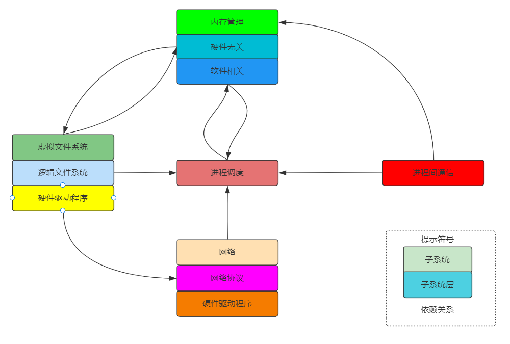
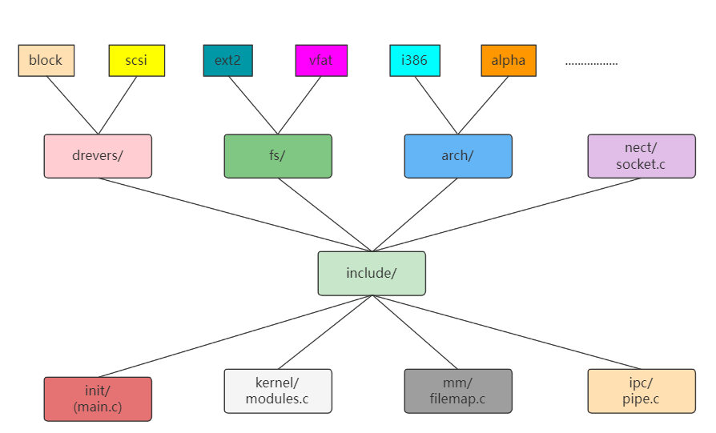

# 初探Linux内核

##  🚗走进Linux 

经常使用计算机的人来说 ，时常会感到操作系统是一个神奇、神秘而又几乎无所不 能的“上帝”。  打开计算机，首先看到的是操作系统，所有软件的运行都离不开它。 Linux 带着一股清新的风翩翩而来，它并不成熟，也不完美，甚至自身有很多缺点，可 Internet 的龙卷风把它吹遍世界，世界各地的计算机爱好者狂热地喜欢上 Linux。Linux 不再是一个孤单的个体，而成为软件发展史上的“自由女神”，很多的计算机高手和计算机爱 好者为之倾其了极大的热情。它在迅速地成长，短短几年功夫，从一个摇摇晃晃的婴儿成长 为脚步稳健的少年。这一切都源于什么？那就是 Linux 的创始人 Linus Torvalds 把 Linux 适时地放入到了 GNU 公共许可证下。 

##  🚘GNU与Linux的成长 

GNU 是自由软件之父 Richard Stallman 在 1984 年组织开发的一个完全基于自由软件的 软件体系，与此相应的有一份通用公共许可证（General Public License，简称 GPL）。Linux 以及与它有关的大量软件是在 GPL 的推动下开发和发布的。  

自由软件之父 Stallman 像一个神态庄严的传教士一样喋喋不休地到处传播自由软件的 福音，阐述他创立 GNU 的梦想：“自由的思想，而不是免费的午餐”。 

实际上，Linus 是一个理想主义者，又脚踏实地。当 Linux 的第一个“产品”版本Linux 1.0 问世的时候，是按完全自由扩散版权进行扩散的。要求 Linux 内核的所有源代码必须公开，而且任何人均不得从 Linux 交易中获利。这种纯粹的自由软件的理想实际上妨碍了 Linux 的扩散和发展，因为这限制了 Linux 以磁盘拷贝或者 CD-ROM 等媒体形式发行的可能，也限制了一些商业公司参与 Linux 的进一步开发并提供技术支持的良好愿望。于是 Linus 决定转向 GPL 版权，这一版权除了规定自由软件的各项许可权之外，还允许用户出售自己的程序拷贝。 

##  🛴Linux开发模式和运作机制 

自由软件的出现，改变了传统的以公司为主体的封闭的软件开发模式。采用了开放和协作的开发模式，无偿提供源代码，允许任何人取得、修改和重新发布自由软件的源代码。 商业 UNIX 开发过程中，整个系统的开发有严格的质量保证措施、完整的文挡、完善的源代码、全面的测试报告及相应的解决方案。开发者不能随意增加程序的特性和修改代码的 关键部分，如果要修改代码，他们得将其写入错误报告中才能使其有效，并随后接收源代码控制系统的检查，如果发现修改不合适，修改也可能作废。 

Linux 最初是由一群来自世界各地的自愿者通过 Internet 共同进行开发的。通过互联网和其他途径，任何人都有机会辅助开发和调试 Linux 的内核、链接新的软件、编写文档或帮 助新用户。 Linux 系统本身采用彻底开放、注重特性的方法进行设计。一般规律是大约隔几个月就发行一个 Linux 内核的新版本。 

##  🛵初探Linux内核 

如果说 CPU 是计算机硬件的心脏的话，那么，操作系统的内核则是整个计算机系统的心 脏，或者说，是最高管理机构。 

###  Linux内核包含：

-  进程调度
- 内存管理
- 进程间通信
- 虚拟文件系统及网络接口 

###  Linux内核特征 

 `Linux` 是个人计算机和工作站上的类` UNIX `操作系统。但是，它绝不是简化的 `UNIX`。相 反，`Linux `是强有力和具有创新意义的类 `UNIX` 操作系统。它不仅继承了` UNIX` 的特征，而且 在许多方面超过了 `UNIX`。作为类` UNIX`操作系统，`Linux `内核具有下列基本特征：

- Linux内核的组织形式为整体式结构。 
- Linux的进程调度方式简单而有效。 
- Linux支持内核线程(或称守护进程)。
- Linux支持多种平台的虚拟内存管理。 
- Linux内核另一个独具特色的部分是虚拟文件系统`(VFS Virtul File Systen)`。
- Linux的模块机制使得内核保持独立而又易于扩充。  
- 增加系统调用以满足特殊的需求。 
- 网络部分面向对象的设计思想使得 Linux 内核支持多种协议、多种网卡驱动程序变 得容易。 

##  🚄Linux内核版本变化 

自从 1991 年 9 月 17 日，Linus Torvals 正式宣布 Linux 的第一个正式版本—0.02 版本，到现在，Linux 的内核版本发生了一系列的变化，新旧版本之间的时间间隔为几个月甚至几个星期。

###  内核版本三个阶段

- 第一阶段为 0.02～0.99.15j
- 第二阶段为 1.0～1.2.x
- 第三阶段为 1.2.x～2.x.x。

### 内核版本具备特点

####  广泛的支持

- 处理器芯片的广泛支持 
- 对ISA即插即用设备的支持 
- 广泛的文件系统支持 
- 对软猫的支持 

####  新思路 

- 新型的设备管理方法 
- 对USB 总线的支持 
- 新型的二进制执行代码类型(Binary Types)
- 内核级的Web服务器  

####  高性能 

- 对虚拟文件系统(VFS)的修改 

- 对高端服务器的支持 
- 对高速网的支持 

####  小内核 

内核本来就很小：Linux 的整个内核源代码大概需要占用20多MB的硬盘空间，但是编译出来的二进制代码只占用 600KB 左右的空间，完全可以放在一张软盘上，随时可以使用这张软盘启动系统。 

##  🛫Linux内核结构 

Linux 是一个庞大、高效而复杂的操作系统，虽然它的开发起始于 Linus Torvalds个人，但随着时间的推移，越来越多的人加入了 Linux 的开发和对它的不断完善。如何从整体上把握 Linux 内核的体系结构，对于 Linux 的开发者和分析者都至关重要。 

###  Linux内核在整个操作系统中的位置 

 Linux 的内核不是孤立的，必须把它放在整个系统中去研究，如图显示Linux内核在整个操作系统的位置。 

####  Linux 操作系统由 4 个部分组成 

1、用户进程 

用户应用程序是运行在 Linux 操作系统最高层的一个庞大的软件集合。当一个用户程序在操作系统之上运行时，它成为操作系统中的一个进程。 

2、系统调用接口 

在应用程序中，可通过系统调用来调用操作系统内核中特定的过程，以实现特定的服务。系统调用本身也是由若干条指令构成的过程。但它与一般的过程不同，主要区别是：系统调用是运行在内核态或叫系统态，而一般过程是运行在用户态。在 Linux 中，系统调用是内核代码的一部分。  

3、Linux 内核 

内核是操作系统的灵魂，它负责管理磁盘上的文件、内存，负责启动并运行程序，负责从网络上接收和发送数据包等。简言之，内核实际是抽象的资源操 作到具体硬件操作细节之间的接口。 

4、硬件 

这个子系统包括了 Linux 安装时需要的所有可能的物理设备。例如，CPU、 内存、硬盘、 网络硬件等。 

##  🚁Linux内核作用  

从程序员的角度来讲，操作系统的内核提供了一个与计算机硬件等价的扩展或虚拟的计 算平台。它抽象了许多硬件细节，程序可以以某种统一的方式进行数据处理，而程序员则可 以避开许多硬件细节。从另一个角度讲，普通用户则把操作系统看成是一个资源管理者，在它的帮助下，用户可以以某种易于理解的方式组织自己的数据，完成自己的工作并和其他人共享资源。  

Linux 以统一的方式支持多任务，而这种方式对用户进程是透明的，每一个进程运行起来就好像只有它一个进程在计算机上运行一样，独占内存和其他的硬件资源，而实际上，内核在并发地运行几个进程，并且能够让几个进程公平合理地使用硬件资源，也能使各进程之 间互不干扰安全地运行。 

##  ⛵Linux内核抽象结构 

 Linux 内核由 5 个主要的子系统组成。 Linux内核子系统及其之间的关系。 

1、进程调度(SCHED)控制着进程对 CPU 的访问。当需要选择下一个进程运行时，由 调度程序选择最值得运行的进程。可运行进程实际是仅等待 CPU 资源的进程，如果某个进程在等待其他资源，则该进程是不可运行进程。Linux 使用了比较简单的基于优先级的进程调度算法选择新的进程。  

2、内存管理(MM)允许多个进程安全地共享主内存区域。Linux 的内存管理支持虚拟内存，即在计算机中运行的程序，其代码、数据和堆栈的总量可以超过实际内存的大小，操作系统只将当前使用的程序块保留在内存中，其余的程序块则保留在磁盘上。必要时，操作系统负责在磁盘和内存之间交换程序块。 

**内存管理从逻辑上可以分为硬件无关的部分和硬件相关的部分。硬件无关的部分提供了 进程的映射和虚拟内存的对换；硬件相关的部分为内存管理硬件提供了虚拟接口。**

3、虚拟文件系统(Virtul File System，VFS)隐藏了各种不同硬件的具体细节，为所有设备提供了统一的接口，VFS 还支持多达数十种不同的文件系统。 

**虚拟文件系统可分为逻辑文件系统和设备驱动程序。逻辑文件系统指 Linux 所支持的文 件系统，如 ext2，fat 等，设备驱动程序指为每一种硬件控制器所编写的设备驱动程序模块。**

4、网络接口(NET)提供了对各种网络标准协议的存取和各种网络硬件的支持。网络 接口可分为网络协议和网络驱动程序两部分。 

5、进程间通信(IPC)支持进程间各种通信机制。处于中心位置的是进程调度，所有其他的子系统都依赖于它，因为每个子系统都需要挂起或恢复进程。 一般情况下，当一个进程等待硬件操作完成时，它被挂起；当操作真正完成时，进程被恢复执行。 

###  各个子系统之间的依赖关系 

1.进程调度与内存管理之间的关系:这两个子系统互相依赖。在多道程序环境下，程序要运行必须为之创建进程，而创建进程的第一件事，就是要将程序和数据装入内存。  

2.进程间通信与内存管理的关系：进程间通信子系统要依赖内存管理支持共享内存通信机制，这种机制允许两个进程除了拥有自己的私有内存，还可存取共同的内存区域。 

3.虚拟文件系统与网络接口之间的关系：虚拟文件系统利用网络接口支持网络文件系统 (NFS)，也利用内存管理支持 RAMDISK 设备。 

4.内存管理与虚拟文件系统之间的关系：内存管理利用虚拟文件系统支持交换，交换进程(swapd)定期地由调度程序调度，这也是内存管理依赖于进程调度的唯一原因。当一个进程存取的内存映射被换出时，内存管理向文件系统发出请求，同时，挂起当前正在运行的进程。  

##  🚇Linux内核源代码 

### 多版本的内核源代码 

对不同的内核版本，系统调用一般是相同的。新版本也许可以增加一个新的系统调用， 但旧的系统调用将依然不变，这对于保持向后兼容是非常必要的，一个新的内核版本不能打破常规的过程。在大多数情况下，设备文件将仍然相同，而另一方面，版本之间的内部接口有所变化。 

**Linux 内核源代码有一个简单的数字系统，任何偶数内核(如 2.0.30)是一个稳定的版 本，而奇数内核是(如 2.1.42)正在发展中的内核。 **

###  Linux内核源代码结构 

Linux内核源代码位于/usr/src/linux 目录下，每一个目录 或子目录可以看作一个模块，其目录之间的连线表示“子目录或子模块”的关系。 

|   include/   | 目录包含了建立内核代码时所需的大部分包含文件，这个模块利用其他模块重建内核 |
| :----------: | :----------------------------------------------------------: |
|  **init/**   |   **子目录包含了内核的初始化代码，这是内核开始工作的起点**   |
|  **arch/**   | **子目录包含了所有硬件结构特定的内核代码，arch/子目录下有 i386 和 alpha 模块等** |
| **drivers/** | **目录包含了内核中所有的设备驱动程序，如块设备，scsi 设备驱动程序等** |
|   **fs/**    | **目录包含了所有文件系统的代码，如：ext2，vfat 模块的代码等** |
|   **net/**   |                 **目录包含了内核的连网代码**                 |
|   **mm/**    |               **目录包含了所有的内存管理代码**               |
|   **ipc/**   |                **目录包含了进程间通信的代码**                |
| **kernel/**  |                   **目录包含了主内核代码**                   |

显示8个目录，即 init、kernel、mm、ipc、drivers、fs、arch 及 net 的包 含文件都在“include/”目录下。在 Linux 内核中包含了 drivers、fs、arch 及 net 模块， 这就使得 Linux 内核既不是一个层次式结构，也不是一个微内核结构，而是一个“整体式” 结构。因为系统调用可以直接调用内核层，因此，该结构使得整个系统具有较高的性能，其缺点是内核修改起来比较困难，除非遵循严格的规则和编码标准。 

**所示的模块结构，代表了一种工作分配单元。利用这种结构，期望 Linus  Torvalds能维护和增强内核的核心服务，即 init/、kernel/、mm/及 ipc/，其他的模块 drivers、 fs、arch 及 net 也可以作为工作单元，例如，可以分配一组人对块文件系统进行维护和进一 步地开发，而另一组人对 scsi 文件系统进行完善。**

##  🚏如何阅读源代码 

###  1、系统的启动和初始化 

在基于Intel的系统上，当loadlin.exe或LILO把内核装入到内存并把控制权传递给内核时，内核开始启动。关于这一部分，看arch/i386/kernel/head.S ，head.S 进行特定结构的设置，然后跳转到init/main.c的 main()例程。  

### 2、内存管理 

 内存管理的代码主要在/mm，但特定结构的代码在arch/*/mm。缺页中断处理的代码在mm/memory.c ，而内存映射和页高速缓存器的代码在mm/filemap.c。缓冲器高速缓存是在mm/buffer.c中实现，而交换高速缓存是在 mm/swap_state.c和mm/swapfile.c中实现。   

### 3、内核   

内核中，特定结构的代码在arch/*/kernel，调度程序在kernel/sched.c，fork的代码在kernel/fork.c，task_struct数据结构在 include/linux/sched.h中。 

### 4、PCI  

PCI伪驱动程序在 drivers/pci/pci.c ，其定义在include/linux/pci.h。每一种结构都有一些特定的 PCI BIOS 代码，Intel的在 arch/alpha/kernel/bios32.c。 

### 5、进程间通信 

所有System V IPC对象权限都包含在 ipc_perm数据结构 中 ， 这可以在 include/linux/ipc.h中找到 System V 消息是在ipc/msg.c中实现, 共享内存在 ipc/shm.c中，信号量在ipc/sem.c 中，管道在ipc/pipe.c中实现。 

### 6、中断处理 

内核的中断处理代码是几乎所有的微处理器所特有的。中断处理代码在arch/i386/kernel/irq.c 中，其定义在 include/asm-i386/irq.h 中。 

### 7、设备驱动程序 

Linux内核源代码的很多行是设备驱动程序。Linux设备驱动程序的所有源代码都保存在/driver，根据类型可进一步划分为： 

|   /block   | 块设备驱动程序如 ide（在 ide.c）。如果想看包含文件系统的所有设备是如何被初始 化的，应当看 drivers/block/genhd.c 中的 device_setup()，device_setup()不仅初始 化了硬盘，当一个网络安装 nfs 文件系统时，它也初始化网络。块设备包含了基于 IDE 和 SCSI 的设备。 |
| :--------: | :----------------------------------------------------------: |
| **/char**  |   **这是看字符设备（如 tty，串口及鼠标等）驱动程序的地方**   |
| **/cdrom** | **Linux 的所有 CDROM 代码都在这里，如在这儿可以找到 Soundblaster CDROM 的驱动程序。 注意 ide CD 的驱动程序是 ide-cd.c，放在 drivers/block；SCSI CD 的驱动程序是 scsi.c， 放在 drivers/scsi。** |
|  **/pci**  | **这是 PCI 伪驱动程序的源代码，在这里可以看到 PCI 子系统是如何被映射和初始化** |
| **/scsi**  | **在这里可以找到所有的 SCSI 代码及 Linux 所支持的 scsi 设备的所有设备驱动程序** |
|  **/net**  | **在这里可以找到网络设备驱动程序，如 DECChip 21040 PCI 以太网驱动程序在 tulip.c** |
| **/sound** |               **这是所有声卡驱动程序的所在地**               |

### 8、文件系统  

EXT2文件系统的源代码全部在 fs/ext2/目录下，其数据结构的定义在 include/linux/ ext2_fs.h,ext2_fs_i.h 及 ext2_fs_sb.h 中。虚拟文件系统的数据结构在 include/linux/fs.h 中描述，而代码是在 fs/*中。缓冲区高速缓存与更新内核的守护进程的实现是在fs/buffer.c 中。 

### 9、网络 

网络代码保存在/net 中，大部分的include文件在 include/net 下，BSD 套节口代码在 net/socket.c 中，IP 第 4 版本的套节口代码在net/ipv4/af_inet.c。一般的协议支持代码(包括 sk_buff 处理例程)在 net/core下，TCP/IP 联网代码在 net/ipv4 下，网络设备驱动程序在/drivers/net 下。 

### 10、模块 

内核模块的代码部分在内核中，部分在模块包中，前者全部在 kernel/modules.c 中， 而 数 据 结 构 和 内 核 守 护 进 程 kerneld 的 信 息 分 别 在 include/linux/module.h 和 include/linux/kerneld.h 中。如果想看 ELF 目标文件的结构，它位于 include/linux/elf.h 中。  

